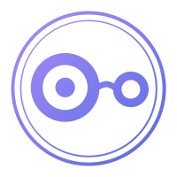
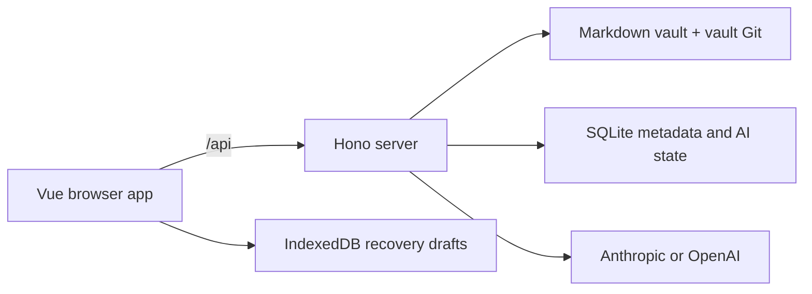

# Nuvyn — Personal OS

[简体中文](README.zh-CN.md) · [Documentation](docs/README.md) · [Product Model](docs/product.md) · [Getting Started](docs/getting-started/quick-start.md) · [Deployment](docs/deployment/overview.md)

Nuvyn is a Personal OS for your digital life.

It is a self-hosted, single-owner system whose first-level Workspaces are Note, Diary, Ledger, and Board: knowledge, experiences, finances, and visual thinking in one connected personal context. Your notes remain ordinary files; Nuvyn adds a Vue interface, safe server-side mutations, SQLite metadata, explicit Git versions, and browser draft recovery.



## Highlights

- **Personal OS Workspaces** — keep Note, Diary, Ledger, and Board specialized while giving them one owner context and shared system capabilities.
- **File-based Markdown vault** — keep readable `.md` files under `inbox`, `literature`, and `archive`.
- **Calendar-first Diary** — open one Markdown diary entry per local calendar date while keeping the normal editor, History, Recovery, and delete lifecycle.
- **Focused editor and reader** — Monaco editing, sanitized Markdown rendering, task lists, footnotes, Mermaid, Markmap, and Wiki links.
- **Resilient saves** — autosave, compare-and-swap conflict detection, atomic writes, lifecycle locks, and startup crash recovery.
- **Draft recovery** — bounded unsaved-buffer recovery in browser IndexedDB.
- **Metadata and search** — SQLite-backed titles, summaries, tags, stable document IDs, file-tree filters, and a command palette.
- **Links and backlinks** — resolve Wiki and relative Markdown links and keep references coordinated across supported renames and moves.
- **Explicit history** — create, compare, restore, and withdraw versions in the vault's own Git repository.
- **Optional AI** — Anthropic or OpenAI chat with live workspace context and validated file/metadata tools. Settings includes a manual connection test that validates the currently displayed provider, credential, Base URL, and model before use without saving transient test values; see the [AI guide](docs/user-guide/ai.md).
- **Self-hosted runtime** — one production process serves the Vue application and Hono API; Docker Compose is included.

## Quick Start

Requirements: Node.js 22 or 24, npm, and Git.

```bash
npm ci
mkdir -p src/content/inbox src/content/literature src/content/archive src/content/diary
npm run dev
```

Open the URL printed by Vite, normally `http://localhost:5173`.

The startup path creates or verifies the four initial roots (`inbox`, `literature`, `archive`, and `diary`) without overwriting a conflicting file. See [Installation](docs/getting-started/installation.md) and [Quick Start](docs/getting-started/quick-start.md) for details.

## Authentication

Nuvyn Authentication v1 protects a single-owner, single-vault instance with a server-side session. On first start, Nuvyn sends the browser to `/setup`; the operator supplies `NUVYN_SETUP_TOKEN` (or uses the one-time fallback token printed by the private server log) and creates the owner username and password. After setup, the owner uses `/login` to enter the workspace and Logout to revoke the current server session.

This is an instance access boundary, not a user-owned document model. Nuvyn has no public registration, multi-user accounts, team or collaboration accounts, RBAC, roles, permissions, or workspace sharing. The existing Markdown vault, SQLite metadata, AI settings, History, and recovery state remain scoped to the single Nuvyn instance.

See [Quick Start](docs/getting-started/quick-start.md), [Runtime Configuration](docs/deployment/configuration.md), [Deployment Security](docs/deployment/security.md), and [Backup and Restore](docs/deployment/backup-and-restore.md).

## How It Fits Together



The browser never writes vault files directly. The server owns path validation, archive rules, filesystem transactions, SQLite coordination, history, and provider credentials. The stores have different backup semantics; read [Architecture](docs/architecture/overview.md) and [Storage](docs/architecture/storage.md) before operating a production instance.

## Vault Model

The default vault is `src/content/`. Set `VAULT_DIR` for another location.

```text
src/content/
├── inbox/       active notes and new material
├── literature/  reading and source notes
├── archive/     recommended area for inactive notes
└── diary/       one date-addressed entry per local calendar date
```

The four roots are reserved by Nuvyn and cannot be renamed, deleted, or moved. `diary/` is the Calendar-first Diary scope: managed entries use the extensionless logical path `diary/YYYY-MM-DD`, one date maps to one Markdown file, and the Today/past date command can create missing entries while a missing future date remains unopened. Existing Diary entries use the normal editor, History, Recovery, and delete lifecycle; their identity cannot be renamed or moved. See [Vault, Diary, and Archive Protocol](docs/user-guide/vault.md).

`archive/` is a recommended organizational area whose descendants follow the same file and folder capabilities as ordinary Nuvyn content: files can be created, edited, renamed, deleted, and moved normally; folders can be created, renamed, and deleted normally. General folder re-parenting is not currently a Nuvyn capability. The built-in Archive action is a convenience workflow that defaults to `archive/<filename>`.

## Production Deployment

### Local / source-build deployment

The existing Compose file remains available for local or self-build
deployments:

```bash
docker compose up -d --build
curl --fail http://127.0.0.1:3000/api/health
```

By default, Compose binds only to `127.0.0.1:3000`, mounts `./src/content` as the vault, and stores SQLite plus the managed AI master key in the `nuvyn-data` volume. The first browser visit completes the token-protected owner setup; later visits require login.

### Production release-image deployment

Production hosts should use the reviewed immutable image published to GHCR and
do not need the Nuvyn source tree, Node.js, npm, or a Docker build toolchain.
Copy `compose.production.yml` and `deploy/.env.example` to the deployment host,
create an untracked `.env`, and set `NUVYN_IMAGE` to an exact release tag:

```bash
docker compose -f compose.production.yml pull
docker compose -f compose.production.yml up -d
curl --fail http://127.0.0.1:3000/api/health
```

The production Compose file uses `./content` as the default host vault path,
keeps SQLite in the `nuvyn-data` named volume, and never defaults the image to
`latest`. See the [Docker release deployment guide](docs/deployment/docker-release.md)
for first deploy, upgrade, rollback, and backup procedures.

Nuvyn provides single-owner authentication but does not terminate TLS. Keep direct HTTP access on loopback, or put an HTTPS reverse proxy in front of Nuvyn for remote access. Set the canonical browser-facing `NUVYN_PUBLIC_ORIGIN` for that proxy. Back up both the vault—including its hidden `.git`—and `data/`.

- [Deployment overview](docs/deployment/overview.md)
- [Docker guide](docs/deployment/docker.md)
- [Docker release deployment](docs/deployment/docker-release.md)
- [Runtime configuration](docs/deployment/configuration.md)
- [Security checklist](docs/deployment/security.md)
- [Backup and restore](docs/deployment/backup-and-restore.md)

## Configuration

Server settings include:

| Variable | Default | Purpose |
| --- | --- | --- |
| `VAULT_DIR` | `<cwd>/src/content` | Vault root |
| `HOST` | `127.0.0.1` | Bare-metal listener address |
| `PORT` | `3000` | Bare-metal listener port |
| `NUVYN_PUBLIC_ORIGIN` | Derived for loopback production; explicit for remote/HTTPS | Browser-facing origin and authentication cookie/Origin policy |
| `NUVYN_SETUP_TOKEN` | Generated once in memory when unset | Operator-held first-run setup secret; explicit values need at least 32 UTF-8 bytes |
| `NUVYN_AUTH_REVOKE_SESSIONS_ON_START` | `0` | Set to `1` for explicit startup re-authentication |
| `NUVYN_MASTER_KEY` | unset | Explicit 32-byte AI credential master key |
| `NUVYN_MASTER_KEY_FILE` | unset | File containing the master key |

AI provider, API key, model, and optional base URL are configured in application Settings, not through provider-specific environment variables. If no explicit master key is supplied, Nuvyn creates `data/.nuvyn-master-key` when an API key is first saved.

Docker additionally uses canonical `NUVYN_BIND_ADDRESS` and `NUVYN_PORT` for host publication; those values are not the browser-facing authentication origin. See [Configuration](docs/getting-started/configuration.md) and [Runtime Configuration](docs/deployment/configuration.md).

## Documentation

The [Documentation Hub](docs/README.md) is the canonical index.

- [Product model and design principles](docs/product.md)
- [User guide](docs/user-guide/overview.md)
- [Architecture](docs/architecture/overview.md)
- [Development setup](docs/development/setup.md)
- [Testing](docs/development/testing.md)
- [Design system](docs/design/icon-system.md)
- [Metadata migration](docs/migrations/document-metadata.md)
- [Historical archive](docs/archive/README.md)

Current behavior is documented outside `docs/archive/`. Dated plans, specifications, closure evidence, and implementation records are retained in the archive for traceability only.

## Development and Verification

```bash
npm run typecheck
npm run build
npm test
npm run lint:icons
```

Browser suites are available with:

```bash
npm run test:e2e
npm run test:e2e:draft-store
npm run test:e2e:auth
npm run test:deployment-auth
```

CI runs the canonical static, unit/integration, and application browser
verification once on Ubuntu with Node.js 24. Node.js 22 on Ubuntu and Node.js
24 on Windows/macOS run targeted platform-compatibility smoke tests; crash
recovery, Draft Store, authentication, visual, tags-scale, and Docker smoke
coverage remain explicit CI lanes.

## Project Status

`package.json` currently reports version `0.0.0`. Nuvyn is an actively developed application rather than a published stable compatibility contract. Back up real vaults before upgrading, review the [changelog](CHANGELOG.md), and validate deployment changes in a copy of your data.

## License

This repository does not currently include a license file. Do not assume rights to redistribute or reuse the project until the maintainers add explicit license terms.
