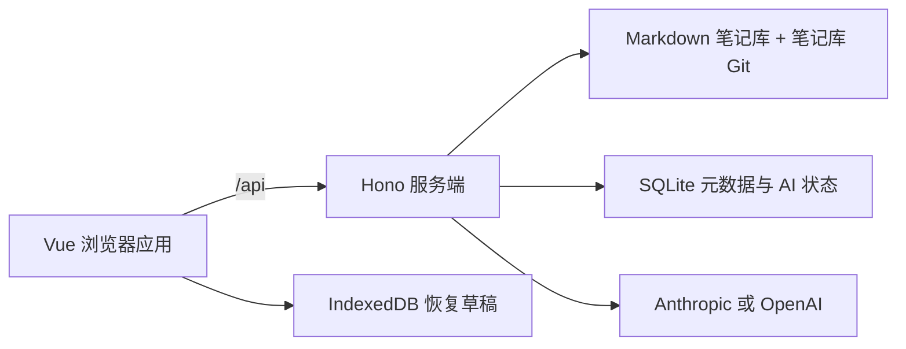

# Nuvyn — Personal OS

[English](README.md) · [文档中心](docs/README.md) · [产品定义](docs/product.md) · [快速开始](docs/getting-started/quick-start.md) · [部署指南](docs/deployment/overview.md)

Nuvyn 是面向个人数字生活的 Personal OS。

它是一个自托管、单 owner 的统一系统，包含 Note、Diary、Ledger、Board 四个一级 Workspace，分别承载知识、经历、财务和视觉化思考，并让它们处在同一个个人上下文中。属于你的数字生活空间。笔记始终是普通文件；Nuvyn 在此基础上提供 Vue 界面、安全的服务端文件操作、SQLite 元数据、显式 Git 版本和浏览器草稿恢复。


## 主要能力

- **Personal OS Workspaces**：让 Note、Diary、Ledger、Board 保持领域专业化，同时共享同一个 owner 上下文和系统级能力。
- **文件式 Markdown 笔记库**：在 `inbox`、`literature` 和 `archive` 中保留可独立读取的 `.md` 文件。
- **Calendar-first Diary**：按本地日历日期打开每天唯一的 Markdown 日记，同时复用现有编辑器、History、Recovery 和删除生命周期。
- **专注的编辑与阅读体验**：Monaco 编辑器、安全过滤的 Markdown、任务列表、脚注、Mermaid、Markmap 与 Wiki 链接。
- **可靠保存**：自动保存、比较基线冲突检测、原子写入、生命周期锁与启动时崩溃恢复。
- **草稿恢复**：使用浏览器 IndexedDB 保存有容量上限的未保存缓冲区。
- **元数据与搜索**：SQLite 管理标题、摘要、标签和稳定文档 ID，并提供文件树筛选和命令面板。
- **链接与反向链接**：解析 Wiki 链接和相对 Markdown 链接，在支持的重命名与移动中协调引用。
- **显式历史版本**：在笔记库自身的 Git 仓库中创建、比较、恢复和撤回版本。
- **可选 AI**：支持 Anthropic 或 OpenAI，提供实时工作区上下文以及受校验的文件/元数据工具。Settings 中提供真实连接测试，可在使用前验证当前显示的 Provider、API Key、Base URL 和模型配置；测试仅在用户手动触发时执行，不会保存测试中的临时配置。详见[AI 使用指南](docs/user-guide/ai.md)。
- **自托管运行时**：一个生产进程同时提供 Vue 应用与 Hono API，并附带 Docker Compose。

## 快速开始

需要 Node.js 22 或 24、npm 和 Git。

```bash
npm ci
mkdir -p src/content/inbox src/content/literature src/content/archive src/content/diary
npm run dev
```

打开 Vite 输出的地址，通常为 `http://localhost:5173`。

启动流程会创建或校验四个初始根目录（`inbox`、`literature`、`archive` 和 `diary`），不会覆盖同名冲突文件。详细说明见[安装](docs/getting-started/installation.md)和[快速开始](docs/getting-started/quick-start.md)。

## 身份认证

Nuvyn Authentication v1 使用服务端 session 保护一个单 owner、单 Vault 实例。首次启动时，Nuvyn 会将浏览器引导到 `/setup`；操作者需要提供 `NUVYN_SETUP_TOKEN`（或使用私有服务端日志中一次性输出的 fallback token），然后创建 owner 用户名和密码。完成 setup 后，通过 `/login` 进入工作区；Logout 会撤销当前服务端 session。

这是一层实例访问边界，不是按用户划分文档的数据模型。Nuvyn 没有公开注册、多用户账号、团队或协作账号、RBAC、角色、权限或工作区分享。现有 Markdown 笔记库、SQLite 元数据、AI 设置、History 和恢复状态仍然属于单个 Nuvyn 实例。

详见[快速开始](docs/getting-started/quick-start.md)、[运行时配置](docs/deployment/configuration.md)、[部署安全](docs/deployment/security.md)和[备份与恢复](docs/deployment/backup-and-restore.md)。

## 系统组成



浏览器不会直接写笔记文件。服务端统一负责路径校验、归档规则、文件事务、SQLite 协调、历史版本和 provider 凭据。不同存储的备份语义并不相同；生产使用前请阅读[架构概览](docs/architecture/overview.md)和[存储架构](docs/architecture/storage.md)。

## 笔记库模型

默认笔记库是 `src/content/`，也可通过 `VAULT_DIR` 指向其他路径。

```text
src/content/
├── inbox/       活跃笔记与新材料
├── literature/  阅读与来源笔记
├── archive/     建议用于存放不再活跃的内容
└── diary/       每个本地日历日期对应一篇日记
```

四个根目录由 Nuvyn 保留，不能重命名、删除或移动。`diary/` 是 Calendar-first Diary scope：受管日记使用不带扩展名的逻辑路径 `diary/YYYY-MM-DD`，一个日期对应一个 Markdown 文件；Today/过去日期可以创建缺失日记，未来缺失日期不会创建。现有日记继续复用编辑器、History、Recovery 和删除生命周期，但其身份不能重命名或移动。详见[笔记库、Diary 与归档协议](docs/user-guide/vault.md)。

`archive/` 是建议性归档区域，其中的内容遵循与普通 Nuvyn 内容相同的文件和文件夹操作能力：文件可以正常新建、编辑、重命名、删除和移动；文件夹可以正常新建、重命名和删除。Nuvyn 当前尚不提供通用的文件夹跨目录移动 / re-parent 能力。内置“归档”操作仍会默认将内容移到 `archive/<filename>`。

## 生产部署

### 本地 / 源码构建部署

现有 Compose 文件继续用于本地或自行构建镜像的部署：

```bash
docker compose up -d --build
curl --fail http://127.0.0.1:3000/api/health
```

Compose 默认只绑定 `127.0.0.1:3000`，将 `./src/content` 挂载为笔记库，并把 SQLite 与托管的 AI 主密钥保存在 `nuvyn-data` 卷中。首次打开浏览器时完成 token 保护的 owner setup；之后的访问需要登录。

### 生产发布镜像部署

生产主机应使用发布到 GHCR 的、带明确版本号的不可变镜像，不需要
Nuvyn 源码、Node.js、npm 或 Docker 构建工具链。将
`compose.production.yml` 与 `deploy/.env.example` 复制到生产目录，创建不纳入 Git
的 `.env`，并将 `NUVYN_IMAGE` 设置为明确的 release tag：

```bash
docker compose -f compose.production.yml pull
docker compose -f compose.production.yml up -d
curl --fail http://127.0.0.1:3000/api/health
```

生产 Compose 默认将 `./content` 作为宿主机笔记库目录，将 SQLite 保存在
`nuvyn-data` 命名卷中，并且不会静默回退到 `latest`。首次部署、升级、回滚与备份
请参阅 [Docker 发布部署指南](docs/deployment/docker-release.md)。

Nuvyn 提供单 owner 身份认证，但不负责 TLS 终止。直接 HTTP 访问应保持在回环地址；需要远程访问时，请在 Nuvyn 前配置 HTTPS 反向代理，并设置规范的、面向浏览器的 `NUVYN_PUBLIC_ORIGIN`。备份必须同时包含笔记库（包括隐藏的 `.git`）和持久化数据。

如果使用本地 / 源码构建 Compose，实际的浏览器访问地址应写入与
`docker-compose.yml` 同级的 `.env`；下面仅为占位示例，请替换为真实地址：

```dotenv
NUVYN_PUBLIC_ORIGIN=https://your-nuvyn.example.com
```

该值必须与用户实际打开的浏览器地址完全一致；修改后执行 `docker compose up -d --force-recreate nuvyn` 使容器重新读取配置。详见[Docker 部署指南](docs/deployment/docker.md)。

- [部署概览](docs/deployment/overview.md)
- [Docker 指南](docs/deployment/docker.md)
- [Docker 发布部署](docs/deployment/docker-release.md)
- [运行时配置](docs/deployment/configuration.md)
- [安全清单](docs/deployment/security.md)
- [备份与恢复](docs/deployment/backup-and-restore.md)

## 配置

主要服务端设置：

| 变量 | 默认值 | 用途 |
| --- | --- | --- |
| `VAULT_DIR` | `<cwd>/src/content` | 笔记库根目录 |
| `HOST` | `127.0.0.1` | 裸机监听地址 |
| `PORT` | `3000` | 裸机监听端口 |
| `NUVYN_PUBLIC_ORIGIN` | 回环生产模式下自动推导；远程/HTTPS 时显式设置 | 面向浏览器的 origin，以及认证 cookie/Origin 策略 |
| `NUVYN_SETUP_TOKEN` | 未设置时在内存中生成一次 | 首次 setup 的操作者 secret；显式值至少需要 32 个 UTF-8 字节 |
| `NUVYN_AUTH_REVOKE_SESSIONS_ON_START` | `0` | 设置为 `1`，在启动时强制重新登录 |
| `NUVYN_MASTER_KEY` | 未设置 | 显式的 32 字节 AI 凭据主密钥 |
| `NUVYN_MASTER_KEY_FILE` | 未设置 | 存放主密钥的文件 |

AI provider、API key、模型和可选 base URL 在应用 Settings 中配置，而不是使用 provider 专用环境变量。未提供显式主密钥时，Nuvyn 会在首次保存 API key 时创建 `data/.nuvyn-master-key`。

Docker 另外使用规范的 `NUVYN_BIND_ADDRESS` 和 `NUVYN_PORT` 控制宿主机端口发布；它们不是面向浏览器的认证 origin。完整行为见[配置说明](docs/getting-started/configuration.md)和[运行时配置](docs/deployment/configuration.md)。

## 文档导航

[文档中心](docs/README.md)是规范入口。

- [产品定义与设计原则](docs/product.md)
- [用户指南](docs/user-guide/overview.md)
- [架构文档](docs/architecture/overview.md)
- [开发环境](docs/development/setup.md)
- [测试说明](docs/development/testing.md)
- [设计系统](docs/design/icon-system.md)
- [元数据迁移](docs/migrations/document-metadata.md)
- [历史文档归档](docs/archive/README.md)

当前行为均记录在 `docs/archive/` 之外。带日期的计划、规格、验收证据和实现记录仅为追溯而保留，不代表当前规范。

## 开发与验证

```bash
npm run typecheck
npm run build
npm test
npm run lint:icons
```

浏览器测试：

```bash
npm run test:e2e
npm run test:e2e:draft-store
npm run test:e2e:auth
npm run test:deployment-auth
```

CI 使用 Node.js 22 在 Ubuntu 上验证生产版本兼容性，并使用 Node.js 24 在 Ubuntu、macOS 和 Windows 上进行跨平台验证，同时运行崩溃恢复、浏览器 E2E、视觉基线和 Docker smoke 测试。

## 项目状态

`package.json` 当前版本为 `0.0.0`。Nuvyn 仍是持续开发中的应用，而不是已经发布稳定兼容性承诺的产品。升级前请备份真实笔记库，阅读[变更日志](CHANGELOG.md)，并使用数据副本验证部署变更。

## 许可证

仓库当前没有许可证文件。在维护者补充明确许可条款之前，请不要默认拥有再分发或复用本项目的权利。
