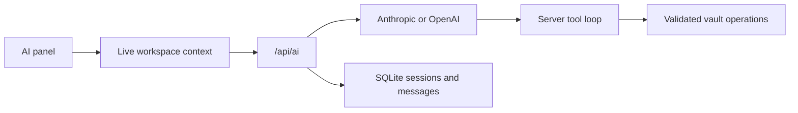
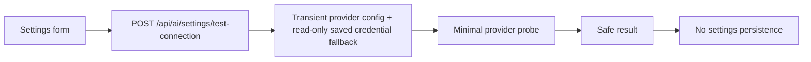

# AI Architecture

The browser streams conversations through server routes. The server owns provider credentials, builds live workspace context, calls Anthropic or OpenAI, executes tools, and persists sessions and messages.

## Role in the Personal OS

AI is not a separate first-level Workspace. It is part of the `Personal OS Intelligence Layer`: a system capability that can eventually understand the same owner's context across Note, Diary, Ledger, and Board. The current runtime is deliberately narrower and operates on protected live workspace context, validated files, and metadata tools.

The long-term product direction includes questions such as “Why did I decide not to use File Tree on the Board homepage?”, “How much did the Nuvyn project cost this month?”, and “What was I mainly working on this month?”. These may require Note, Diary, Board, Ledger, and history context together, but this document does not claim that cross-Workspace synthesis is implemented.

## Request path

Context may represent the current document, a comparison, or a recovery view. For an edited document it can include the unsaved browser buffer rather than only the disk copy. Attachments are identified by validated workspace paths.

## Tool execution

Nuvyn currently exposes eight model tools:

- `read_file`
- `update_metadata`
- `list_files`
- `create_file`
- `write_file`
- `patch_file`
- `delete_file`
- `rename_file`

Tool calls execute automatically. They reuse path validation, archive policy, and document mutation safeguards where applicable. A multi-step AI run is not an all-or-nothing database transaction: successful earlier calls remain applied if a later call fails.

## Credentials

Provider, model, base URL, and API key are configured in Settings and stored in SQLite. API keys are encrypted with AES-256-GCM using a 32-byte master key resolved in this order:

1. `NUVYN_MASTER_KEY`
2. `NUVYN_MASTER_KEY_FILE`
3. auto-created `data/.nuvyn-master-key` when a key is first saved

The canonical key sources are listed above; no compatibility aliases are read.

The master key is not stored in SQLite. Losing it makes stored provider keys unreadable; exposing it together with the database exposes those keys.

## Settings connection probe

The Settings connection test validates the exact provider, credential, Base URL,
and model currently displayed by the user without turning those values into a
saved configuration:

An unsaved API key, Base URL, or model is passed only to this request. If the
API Key field is empty, the route reads the selected provider's saved credential
without triggering credential migration or writing any `ai.*` settings rows.
The probe bypasses the normal chat session, streaming, and persistence flow and
does not execute workspace mutation tools. Its harmless tool definition exists
only to verify the tool/function-calling capability required by normal Nuvyn
workspace actions.

OpenAI uses a non-streaming Chat Completions-compatible request at the configured
API root; Nuvyn appends `/chat/completions`. Anthropic uses a non-streaming
Messages API request. Neither provider is tested by merely calling a Models API.
The probe disables SDK retries and has an approximately 10-second bound. OpenAI
starts with `max_tokens` and makes at most one compatibility retry with
`max_completion_tokens` when the provider explicitly rejects the former; other
provider failures are not retried by this compatibility path.
Provider errors are classified and sanitized before returning to the browser;
secrets in upstream messages are replaced with `[redacted]`.

## Trust boundary

AI output is untrusted input. Tool safety policy blocks unsupported or unsafe mutations, but users should still review results and keep backups. The AI Markdown renderer disables raw HTML. See [AI Assistant](../user-guide/ai.md) and [Security Model](security.md).
