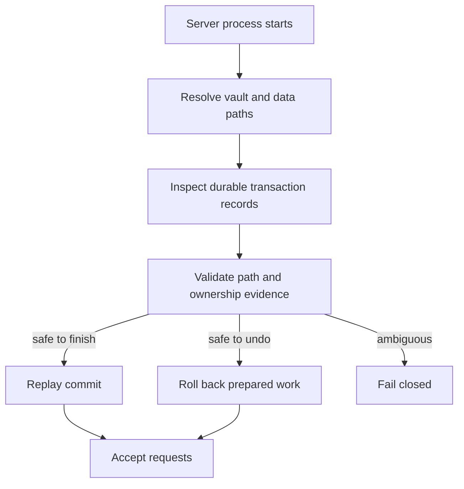

# Crash Recovery

Nuvyn uses durable journals and state-machine recovery for mutations that span more than one filesystem or metadata step.

## Covered operations

Recovery support includes atomic text writes, document lifecycle transactions, folder moves, metadata identity changes, and link-reference rewrites. The exact journal format is internal and may evolve; operators should not edit journal files manually.

## Startup sequence

Normal API service begins only after recovery has dealt with eligible records. Recovery checks source identity and journal ownership so stale or tampered records cannot blindly mutate unrelated paths.

## Guarantees and limits

The goal is an all-old or all-new durable state for coordinated operations, including process termination at tested fault points. Nuvyn cannot protect against storage hardware loss, arbitrary external edits to journals, removal of an entire volume, or restoring mismatched vault and database snapshots.

## Operator response

If startup fails during recovery:

1. stop all Nuvyn processes using that vault;
2. make a byte-for-byte backup of the vault and `data/`, including hidden files;
3. preserve server logs;
4. do not delete journals or run Git cleanup until the failure is understood.

Crash and recovery paths have dedicated integration and child-process fault-injection tests. See [Testing](../development/testing.md).

