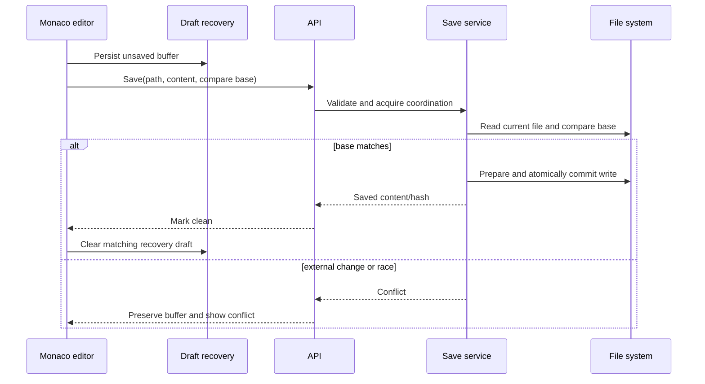

# Edit and Save Architecture

Editing is designed to preserve user input while preventing silent overwrites from concurrent or external changes.

## Save path

The editor schedules autosave after approximately 800 ms of inactivity. Manual save uses the same path. The client sends the raw content it last observed as a compare base; the server refuses to overwrite a different current value.

## Coordination

Server-side document write locks serialize operations that could otherwise race on the same document. Lifecycle barriers coordinate saves with rename, move, delete, folder operations, and history actions. File writes are prepared and committed atomically, with durable records available for startup recovery.

The server rechecks assumptions at commit time. A file changed between validation and replacement causes a failure rather than a last-writer-wins overwrite.

## External changes

The client watches for disk changes. A clean tab can refresh from disk; a dirty tab retains its buffer and presents a conflict workflow. Recovery records remain available until Nuvyn can safely conclude that the current buffer is durably represented.

## Browser recovery

IndexedDB protects against refreshes, browser crashes, and interrupted navigation. Primary and conflict drafts are stored separately. Recovery is bounded and best-effort; quota or browser-storage failures must not weaken server save rules.

For user-facing behavior, see [Editor and Draft Recovery](../user-guide/editor.md). For transaction recovery, see [Crash Recovery](crash-recovery.md).

