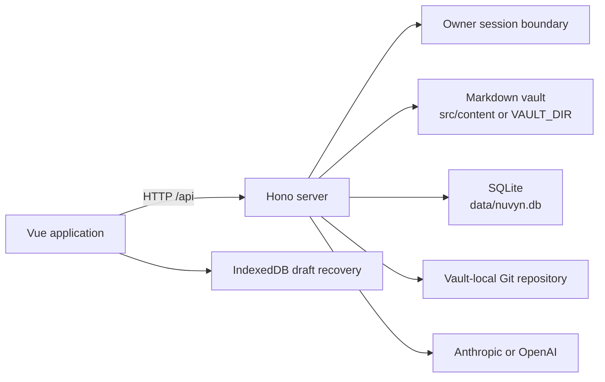

# Architecture Overview

Nuvyn is a Personal OS for your digital life. At runtime it is a local-first, self-hosted system: the browser provides the Vue user interface, while a Hono server owns authentication, file-system mutations, SQLite metadata, AI provider calls, and the vault's Git history. Authentication v1 is a single-owner access boundary around this one instance; it is not a user-owned document model. See the [system-level product definition](../product.md) for the product model and long-term design principles.

## Runtime shape



The development server is Vite with the API mounted as a plugin. Production uses `server/prod.ts`, which serves both the built client and the same API.

At the product level, the system is organized as shared `Core` capabilities, specialized `Workspaces`, and a future-facing `Intelligence Layer`. `Core` is not a shared domain data model: each Workspace may retain its own persistence model. This document describes the shipped runtime boundaries behind that model; the conceptual layers themselves are defined in [Nuvyn — Personal OS](../product.md) and do not imply an immediate code or database redesign.

## Main boundaries

- `src/` owns the Vue interface, browser state, Markdown rendering, editor tabs, and draft recovery.
- `server/` owns authentication, trusted file access, lifecycle transactions, SQLite, history, links, and AI integration.
- `shared/` contains rules needed on both sides, such as archive policy and link resolution.
- `src/content/` is the default vault. A production deployment can choose another path with `VAULT_DIR`.
- `data/` holds server-managed state. It is not part of the vault.

The browser does not write vault files directly. Mutations go through server routes so path validation, archive rules, compare-and-swap checks, locking, journaling, metadata updates, and reference rewrites stay coordinated.

## Authentication Request Boundary

The central Hono `/api/*` middleware protects the application before route
handlers run. Its exact public allowlist is `GET /api/health`, `GET
/api/auth/status`, `POST /api/auth/setup`, `POST /api/auth/login`, and `POST
/api/auth/logout`. Every other API route—including the protected
`GET /api/vault/identity` endpoint—is owner-session protected, and unknown
`/api/*` paths fail closed for anonymous callers.

The public health route is liveness-only and returns `{ "ok": true }`. Stable
instance identity is intentionally separate: an authenticated owner fetches
`/api/vault/identity` and receives the existing `vaultId` used to scope tabs,
Draft Store records, document identity, and recovery families. These remain
instance-scoped; Authentication v1 does not add per-user vaults or domain
`user_id` ownership.

The server is the authentication authority. The Vue router and auth coordinator
improve navigation and loading UX, but they cannot authorize an API request.
Protected and authentication JSON responses use `Cache-Control: no-store`.

## Frontend Startup Ordering

Workspace identity consumers do not start from a temporary/default value. The
browser follows this sequence:

```text
app startup
  → auth status hydration
  → setup-required / unauthenticated / authenticated
  → authenticated GET /api/vault/identity
  → VaultView mount
  → tab persistence, Draft Store, and recovery initialization
```

Only `401` with the top-level code `auth-session-required` represents a Nuvyn
session expiry. A provider response such as `401` with
`ai-authentication-failed` stays in the AI provider error flow and does not log
the owner out.

## Authentication Transitions and Recovery

Active Logout lets the workspace coordinate the last legal editor save, flushes
the browser Draft Store, then revokes the server session and navigates to
`/login`. If a tab is dirty, saving, conflicted, offline, or has a pending
recovery write, the user receives an explicit unsafe-state decision.

Session expiry or external revocation does not attempt an authenticated server
save. The workspace flushes and preserves browser-local primary/conflict draft
records, navigates to `/login` with the validated original route, and performs
normal recovery discovery after re-login. Authentication transitions never
silently clear the Draft Store.

## Data ownership

| Data | Owner | Persistence |
| --- | --- | --- |
| Markdown files and folders | User / vault | File system |
| Version history | Nuvyn history service | `.git` inside the vault |
| Titles, summaries, tags, stable document IDs | Metadata service | SQLite |
| AI settings, sessions, messages | AI service | SQLite |
| Owner metadata and auth singleton | Authentication service | `users`, `auth_instance` in SQLite |
| Server sessions | Authentication service | `auth_sessions` metadata and token hashes in SQLite |
| Unsaved recovery drafts | Browser | IndexedDB |
| UI preferences and tab state | Browser | Local storage / browser state |

These stores have different backup and recovery semantics. See [Storage](storage.md), [History](history.md), and [Backup and Restore](../deployment/backup-and-restore.md).

## Design principles

1. Markdown remains readable outside Nuvyn.
2. Durable mutations are coordinated on the server.
3. External edits are detected instead of silently overwritten.
4. History is explicit: autosave does not create a Git version.
5. Browser drafts are a recovery layer, not the authoritative copy.
6. Historical design records live under [`docs/archive/`](../archive/README.md); the architecture directory describes only shipped behavior.

## Related documentation

- [Storage](storage.md)
- [Edit and Save](edit-and-save.md)
- [Document Lifecycle](document-lifecycle.md)
- [Crash Recovery](crash-recovery.md)
- [Security Model](security.md)
