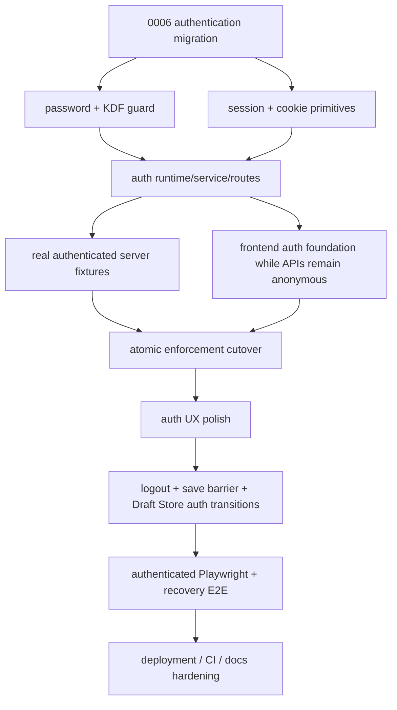
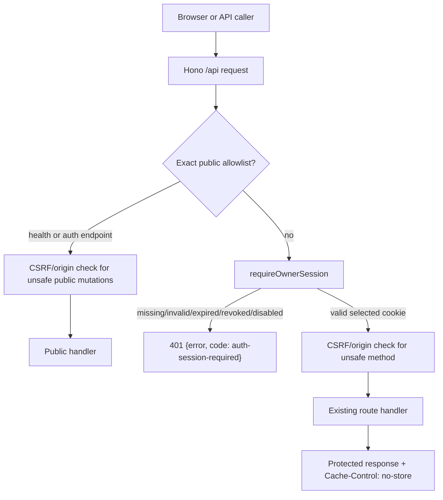
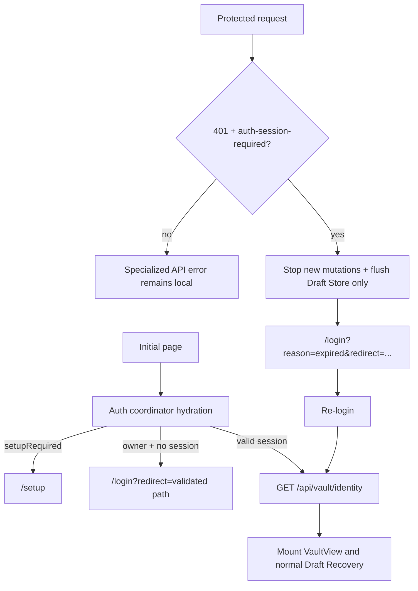

# Nuvyn Authentication v1 Implementation Plan

## Status

- **Status:** Implementation plan; no Authentication v1 production work is performed by this document.
- **Planning snapshot:** `main` at `f83b0ed` (`docs: finalize authentication v1 PRD boundaries`).
- **Primary design source:** [`docs/design/authentication-v1-prd.md`](./authentication-v1-prd.md), treated as approved and frozen for implementation planning.
- **Scope:** One owner, one existing Nuvyn instance, server-side sessions, first-run bootstrap, protected application APIs, frontend auth UX, and safe editor/draft transitions.
- **Change constraint for this task:** Create this document only. Do not modify production code, tests, migrations, package scripts, CI, Docker, environment files, README, deployment docs, or the frozen PRD.

## Source of Truth

The PRD defines the intended Authentication v1 security and product contract. The current `main` branch defines implementation facts: module names, startup ordering, SQLite conventions, route mounting, browser persistence APIs, test lanes, and deployment defaults. If implementation discovers a genuine contradiction, the implementation change must stop and the discrepancy must be recorded under [PRD-to-Code Conflicts](#prd-to-code-conflicts); the PRD must not be silently rewritten.

The implementation must preserve these boundaries:

- Authentication is an access boundary around the current single-vault runtime.
- There is exactly one owner in v1; there is no registration, collaboration, RBAC, or multi-vault model.
- Existing documents, metadata, settings, AI sessions/credentials, History, Git, Crash Recovery, and Draft Store data remain instance-scoped.
- No existing domain table receives a `user_id` column.
- Existing provider, History, Vault, atomic-write, and Crash Recovery semantics are unchanged for an authenticated owner.

## Planning Principles

1. Build and test cryptographic/session primitives before enforcing a route boundary.
2. Prepare real authenticated server and browser fixtures before enabling default protection.
3. Keep `server/index.ts` import-side-effect-free; runtime initialization belongs to production/dev startup and explicit test setup.
4. Use one central Hono `/api/*` boundary with a small public allowlist; do not scatter authentication checks through route handlers.
5. Treat `401` as session expiry only when the top-level response code is exactly `auth-session-required`.
6. Preserve current save barriers and browser Draft Store APIs instead of creating a second editor-save implementation.
7. Keep ordinary unit tests fast; preserve the existing History and Recovery integration lanes.
8. Land small, reviewable commits that keep typecheck, build, and the relevant test lanes green.
9. Enforce one rollout invariant across every phase and commit: either application authentication enforcement is not active and the legacy application remains operable, or enforcement is active and a complete browser Setup/Login path can establish an owner session. There must be no landed state where protected APIs are enabled but the browser cannot authenticate.
10. Enforce browser-visible feature atomicity: an authentication action must not become visible in a landed commit before the server/client transition contract required to complete it safely is available. Logout therefore lands together with save-before-revoke and Draft Store coordination.

## Current Architecture Reconnaissance

### Server and startup

- `server/index.ts` creates one Hono app, mounts the root route modules (`health`, `metadata`, `folders`, `posts`, `vault`, `links`) and mounts `/api/ai` and `/api/history`. It exports `__setMetadataDbForTesting`; route imports are expected to remain safe at import time.
- `server/routes/health.ts` currently hashes `CONTENT_DIR` at module load and returns `{ ok: true, vaultId }` from `GET /api/health`. Authentication v1 must move the stable identity to a protected endpoint while keeping liveness public.
- `server/db.ts` lazily opens `data/nuvyn.db`, enables `foreign_keys=ON` and WAL, and applies ordered `server/migrations/*.sql` files through `schema_version`. The current highest migration is `0005_drop_document_aliases.sql`; timestamps are integer milliseconds from `Date.now()`.
- `server/prod.ts` loads dotenv, imports the Hono app, resolves `HOST`/`PORT`, serves static assets, acquires vault writer ownership, seeds folders, runs Crash Recovery, runs metadata migration, and only then starts the Node listener.
- `server/vite-plugin.ts` loads dotenv before importing the app, performs the development startup recovery/metadata work, and mounts Hono into Vite's `/api/` middleware. `npm run dev` normally serves at Vite's `http://localhost:5173` origin.
- `server/prodConfig.ts` defaults bare-metal `HOST` to `127.0.0.1`. Docker intentionally sets the internal `HOST=0.0.0.0` while Compose publishes `127.0.0.1:${NUVYN_PORT}:3000` by default.

### Existing API surface

Current route families are:

- Public today: `GET /api/health`.
- Vault/files: `/api/tree`, `/api/files/state`, `/api/posts`, `/api/recover`, `/api/folders`.
- Metadata: `/api/metadata/*`.
- Links: `/api/links/index`, `/api/backlinks`, `/api/links/rename-impact`.
- AI: `/api/ai/*`, including settings, credential status, connection testing, sessions, chat, summaries, tools, and commit-message helpers.
- History: `/api/history/*`, including capability, status, log, diff, file, commits, repair, drop, and restore.

All current application API modules are mounted centrally; this is suitable for a default-protect middleware. Unknown future `/api/*` paths must be protected by the same boundary and may only become public through an explicit allowlist change.

### Frontend shell and routing

- `src/main.ts` mounts `App.vue` with `src/router/index.ts`.
- `src/App.vue` always renders `NavBar`, `RouterView`, and the global toast/confirm/prompt hosts. It owns application-shell providers such as view mode and search triggers.
- `src/router/index.ts` currently has `/`, `/vault`, `/vault/:pathMatch(.*)*`, and development preview routes. There are no auth routes or guards.
- `src/views/VaultView.vue` owns the workspace, Settings modal opening, `useEditorTabs`, `createDraftStore`, `createUnsavedDraftPersistence`, recovery discovery, History, and the main mutation barriers.
- `src/components/NavBar.vue` is the persistent application chrome and currently owns theme/view/search controls. It is the least invasive owner for a Logout action; it should emit a logout request rather than implement persistence or auth transitions itself.
- `src/components/vault/ActivityBar.vue` opens Settings; it should not become the auth owner.

### Browser API clients

- `src/lib/api.ts` contains the general Vault/posts/metadata/links wrappers and a private `jsonOrThrow()` parser. It has both JSON mutations and bodyless `DELETE` calls.
- `src/lib/ai-api.ts` defines `AiApiError`, provider-specific error codes, connection-test types, and its own JSON parser. AI provider `401` responses such as `ai-authentication-failed` must not trigger Nuvyn logout.
- `src/lib/history-api.ts` has a separate `HistoryApiError` parser and must retain its specialized status/code/details behavior.
- `src/lib/search.ts` has a direct `fetch()` for post lookup. All direct fetch users must participate in the shared `auth-session-required` observation rule without becoming a full HTTP-client rewrite.

### Vault identity and editor persistence

- `src/composables/vault/editor-tabs/useTabPersistence.ts` currently fetches `/api/health` once, extracts `vaultId`, and scopes `nuvyn:tabs:v1:<vaultId>` localStorage keys.
- `src/composables/vault/useEditorTabs.ts` calls `refresh()`, resolves the vault ID, restores persisted tabs, starts external polling, registers `beforeunload`, and disposes save/draft persistence on unmount.
- `src/composables/vault/editor-tabs/useDocumentSave.ts` schedules normal server saves after approximately 800 ms, tracks `savePromises`, uses `DocumentMutationBarrier`, and exposes `doSaveNow()` only for the active path today.
- `src/composables/vault/draft-recovery/useUnsavedDraftPersistence.ts` exposes `flush(vaultId, documentId)`, `flushAll()`, `dispose()`, and recovery ownership/invalidation APIs. `dispose()` flushes pending entries, but auth transitions need an explicit awaited `flushAll()` before navigation.
- `VaultView` uses the resolved `vaultId` for draft identity, AI live context, recovery discovery, document identity, and recovery-family scoping. The endpoint changes; the stable value and its semantics do not.

### Tests and deployment

- `package.json` defines `test:unit`, `test:history-integration`, and `test:recovery-integration`; `npm test` runs them sequentially.
- `vitest.history.config.ts` and `vitest.recovery.config.ts` isolate real Git/filesystem and Crash Recovery suites, with Windows serialization and lane-local timeouts.
- Server tests generally use `app.fetch()` with in-memory `better-sqlite3` databases and `applyMigrations()`. There is no auth fixture yet; many application-route tests assume anonymous access.
- Playwright general E2E uses `playwright.config.ts` and an isolated Vite server on port 4174. Draft Store E2E uses `playwright.draft-store.config.ts` and port 4175. Both use one worker and currently have no authenticated storage state.
- `Dockerfile` and `docker-compose.yml` preserve an internal `0.0.0.0` listener and default host-loopback publication. The Docker healthcheck must remain anonymous and use liveness only.
- `.github/workflows/ci.yml` runs typecheck, build, `npm test`, cross-platform browser tests, Draft Store E2E, visual tests, and a Docker smoke job on Ubuntu/macOS/Windows Node 22/24.

## PRD-to-Code Conflicts

No blocker makes the frozen PRD impossible to implement. The following are migrations of current behavior, not changes to the PRD:

| Current fact | Frozen target | Smallest implementation resolution |
| --- | --- | --- |
| `/api/health` returns `vaultId`; `useTabPersistence` and `VaultView` consume it. | Health is liveness-only; `GET /api/vault/identity` is protected. | Add the protected identity route and migrate `useTabPersistence` plus all VaultView/recovery consumers to a shared identity client. Keep the same stable hash algorithm/value unless a focused security review requires otherwise. |
| Every existing `app.fetch()` application test is effectively anonymous. | Sensitive APIs require a real owner session. | Add reusable test setup/session fixtures first; migrate application tests before enabling central middleware. Auth-specific and health tests remain intentionally anonymous. |
| `server/index.ts` has no auth runtime and is imported directly by tests. | Bootstrap/config/session state must be initialized before serving, without import-time DB side effects. | Add an explicit runtime dependency/configuration seam. Production and Vite startup initialize it before accepting requests; tests install a real in-memory runtime through helpers, never a bypass. |
| There is no `/login` or `/setup` route. | The SPA must hydrate auth before mounting VaultView. | Add views/routes and an app-level coordinator/guard; keep static SPA shell public and server APIs authoritative. |

If implementation discovers a behavior that cannot satisfy both the PRD and a current subsystem invariant, pause that change and add a dated entry here in the plan review rather than modifying the PRD or weakening the subsystem.

## Target Architecture

Authentication adds a server-side access boundary, not domain ownership:

```text
Browser
  │ same-origin cookie
  ▼
Hono /api boundary
  ├─ public allowlist: health + auth bootstrap/status/login/logout
  └─ requireOwnerSession
       ├─ selected cookie profile
       ├─ SHA-256 token lookup
       ├─ expiry/revocation/disabled-owner checks
       ├─ unsafe-method Origin/Fetch-Metadata policy
       └─ existing Vault / Metadata / AI / History handlers
```

The server stores only a SHA-256 hash of the raw session token. The frontend has a singleton auth coordinator with `unknown`, `setup-required`, `unauthenticated`, and `authenticated` states. The coordinator owns hydration, route transitions, login/setup/logout, `auth-session-required` handling, and a monotonic transition generation. It does not own Vault data or Draft Store records.

## Dependency Graph



The critical sequencing rules are `F` and `G` before `T`: existing application tests receive real sessions and a usable browser Setup/Login path exists before the middleware is made mandatory. `T` is one atomic cutover that includes enforcement, the health/identity split, every browser identity consumer migration, and the runtime configuration required for the selected cookie profile.

## Target Request Flow



Middleware registration should be centralized in `server/index.ts` using a `/api/*` `app.use()` installed before route mounts. The middleware must call `next()` for exact public paths and otherwise authenticate before any existing route handler executes. A request to an unknown `/api/*` route is still forced through authentication; authenticated unknown paths may then return the normal 404.

Ordering rules:

1. Resolve the API path/method and public allowlist.
2. For public unsafe auth mutations, run Origin/Fetch-Metadata checks before the handler; no session is required for login/setup, and logout remains idempotent.
3. For non-public APIs, run `requireOwnerSession` and attach only `{ id, username }` to Hono context.
4. For authenticated unsafe methods, run the same-origin/Fetch-Metadata/content-type policy.
5. Invoke the existing route handler, preserving its response contract.
6. Add `Cache-Control: no-store` to auth and protected API responses. Keep `/api/health` explicitly liveness-oriented.

## Frontend Authentication Flow



The coordinator must not infer auth expiry from status `401` alone. `401 + ai-authentication-failed`, `401 + openai-tools-unsupported`, and other provider/domain codes stay in their existing error flow.

## Proposed Module Map

### Server modules

| Path | One primary responsibility |
| --- | --- |
| `server/migrations/0006_authentication.sql` | Create `users`, `auth_instance`, `auth_sessions`, constraints, and indexes after migration 0005. |
| `server/auth/config.ts` | Parse and validate `NUVYN_PUBLIC_ORIGIN`, cookie profile, session lifetime, setup/revocation flags, and safe defaults. Never infer security from `HOST` or forwarded headers. |
| `server/auth/password.ts` | Username/password validation, versioned async `scrypt`, encoded hash parsing, malformed-hash handling, and constant-time comparison. |
| `server/auth/kdfGuard.ts` | Process-wide bounded KDF concurrency/queue, abort handling, bounded queue wait, and overload result. Shared by setup, known-user login, and dummy login. |
| `server/auth/session.ts` | Random token generation, SHA-256 token hashing, session insert/lookup/revocation/expiry pruning, coarse `last_seen_at`, and strict cookie-name lookup. |
| `server/auth/bootstrap.ts` | Explicit/fallback bootstrap token initialization, constant-time verification, one-time memory lifecycle, and safe operator logging. |
| `server/auth/rateLimit.ts` | In-memory username/optional trusted-peer failure buckets, setup-token bucket, bounded delay/Retry-After, and reset after successful verification. |
| `server/auth/service.ts` | Coordinate setup/login/logout/status using the modules above and the existing `better-sqlite3` instance. It owns safe error categories, not route rendering. |
| `server/auth/csrf.ts` | Same-origin Origin/Fetch-Metadata checks for unsafe methods and JSON content-type enforcement only where a request has a JSON body. |
| `server/auth/middleware.ts` | `requireOwnerSession`, context identity attachment, `auth-session-required` envelope, no-store headers, and default-protect behavior. |
| `server/auth/runtime.ts` | Explicit startup/test initialization of config, bootstrap state, and auth DB handle without opening the production DB during module import. |
| `server/auth/routes.ts` | Hono handlers for `/api/auth/status`, `/setup`, `/login`, and `/logout`; translate service results to the existing top-level `{ error, code }` envelope. |
| `server/routes/vaultIdentity.ts` | Protected `GET /api/vault/identity`, returning the existing stable instance identity only after middleware authentication. |
| `server/index.ts` | Mount auth routes and the central `/api/*` boundary in a verified order; keep existing route mounts and test injection exports. |
| `server/prod.ts` | Initialize auth runtime, apply startup session invalidation if configured, and start listening only after auth is ready. |
| `server/vite-plugin.ts` | Perform the equivalent auth runtime/bootstrap initialization before Vite starts forwarding API requests. |

`server/auth/service.ts` should not become a DB/crypto/router god module; each dependency is injected or imported from its single-responsibility module. Existing `server/db.ts`, `server/paths.ts`, `server/history/*`, `server/ai/*`, and vault lifecycle modules remain the owners of their current domains.

### Client modules

| Path | One primary responsibility |
| --- | --- |
| `src/lib/auth-api.ts` | Typed wrappers for auth status/setup/login/logout and protected vault identity. |
| `src/lib/auth-session.ts` | Shared response classifier/event bridge for exactly `401 + code === "auth-session-required"`; uses `Response.clone()` so specialized parsers can still consume the original response. |
| `src/composables/useAuth.ts` | Singleton auth coordinator, hydration, state transitions, route intent, generation guards, logout/expiry orchestration, and workspace transition registration. |
| `src/views/LoginView.vue` | Keyboard-accessible compact login form and safe generic/rate-limit errors. |
| `src/views/SetupView.vue` | Bootstrap-token owner setup; keeps `confirmPassword` client-only. |
| `src/router/index.ts` | Add `/login` and `/setup`, asynchronous auth guard, validated internal redirects, and protected workspace guard. |
| `src/App.vue` | Mount auth coordinator/provider before `RouterView`, suppress normal Vault chrome on auth routes, and connect the final workspace transition to NavBar logout requests. |
| `src/components/NavBar.vue` | Render the least-invasive Logout action only after the Phase 7 transition contract exists, and emit a logout request; no save/auth logic. |
| `src/views/VaultView.vue` | Register/unregister workspace save-and-draft transition callbacks with `useAuth`; preserve current editor/recovery ownership. |
| `src/composables/vault/editor-tabs/useDocumentSave.ts` | Expose a small auth-transition save barrier built on existing `savePromises`, `doSave`, and `DocumentMutationBarrier`; do not duplicate save logic. |
| `src/composables/vault/useEditorTabs.ts` | Expose the workspace transition hook and current tab/save state needed by VaultView. |
| `src/composables/vault/editor-tabs/useTabPersistence.ts` | Resolve vault identity through `GET /api/vault/identity`, not `/api/health`; preserve localStorage key semantics. |
| `src/lib/api.ts`, `src/lib/ai-api.ts`, `src/lib/history-api.ts`, `src/lib/search.ts` | Observe the shared auth-session classifier while retaining each client’s specialized error classes and body contracts. |

## SQLite Migration Plan

### Migration location and ordering

Add `server/migrations/0006_authentication.sql`. The existing migration runner sorts numeric filenames and records the highest version in `schema_version`; no migration renumbering or data rewrite is needed. `0006` runs after `0005_drop_document_aliases.sql` on both existing and fresh databases.

### Schema

```sql
CREATE TABLE users (
  id INTEGER PRIMARY KEY AUTOINCREMENT,
  username TEXT NOT NULL,
  username_normalized TEXT NOT NULL UNIQUE,
  password_hash TEXT NOT NULL,
  disabled INTEGER NOT NULL DEFAULT 0 CHECK (disabled IN (0, 1)),
  created_at INTEGER NOT NULL,
  updated_at INTEGER NOT NULL
);

CREATE TABLE auth_instance (
  id INTEGER PRIMARY KEY CHECK (id = 1),
  owner_user_id INTEGER NOT NULL UNIQUE REFERENCES users(id) ON DELETE RESTRICT,
  created_at INTEGER NOT NULL,
  updated_at INTEGER NOT NULL
);

CREATE TABLE auth_sessions (
  id INTEGER PRIMARY KEY AUTOINCREMENT,
  user_id INTEGER NOT NULL REFERENCES users(id) ON DELETE CASCADE,
  token_hash TEXT NOT NULL UNIQUE,
  created_at INTEGER NOT NULL,
  expires_at INTEGER NOT NULL,
  last_seen_at INTEGER NOT NULL,
  revoked_at INTEGER
);

CREATE INDEX idx_auth_sessions_user_expiry
  ON auth_sessions(user_id, expires_at);
CREATE INDEX idx_auth_sessions_expiry
  ON auth_sessions(expires_at);
```

Conventions and constraints:

- All timestamps are integer milliseconds, matching `server/db.ts`.
- `username_normalized` is trimmed/lowercase ASCII; store canonical `username` in the same form for v1. `Admin` and `admin` collide.
- `auth_instance.id = 1` is the singleton owner gate. `owner_user_id UNIQUE` prevents a second ownership row.
- Setup uses a `better-sqlite3` transaction with `tx.immediate()` (the repository already uses this API for `BEGIN IMMEDIATE` CAS work), and inserts the user plus singleton in one transaction. A uniqueness/race failure rolls the user insert back and maps to `409 already-initialized`.
- `token_hash` is the canonical SHA-256 encoding only; raw session tokens never enter SQLite.
- Foreign keys remain enabled through the existing DB connection. No existing `documents`, `settings`, `messages`, metadata, History, recovery, or AI tables gain auth columns.

### Existing-install upgrade

An existing database receives empty auth tables. `GET /api/auth/status` reports `setupRequired=true`; after setup the exact existing `CONTENT_DIR`/`VAULT_DIR`, `.git`, metadata, AI credentials/sessions, and browser Draft Store continue to be used. No Markdown, Git, or domain row migration occurs.

## Configuration Plan

### Public origin and cookie profile

`NUVYN_PUBLIC_ORIGIN` is the browser-facing security authority and the sole source of cookie mode:

- `https://example.com` → `Secure; HttpOnly; SameSite=Lax; Path=/;` no `Domain`; read only `__Host-nuvyn_session`.
- `http://localhost:<port>`, `http://127.0.0.1:<port>`, or `http://[::1]:<port>` → local HTTP profile; read only `nuvyn_session` with `HttpOnly; SameSite=Lax; Path=/`.
- Any other `http://` origin, malformed origin, or missing origin for a remotely reachable deployment fails fast. Do not derive it from `HOST`, `Host`, `X-Forwarded-Proto`, or `X-Forwarded-Host`.
- Logout clears both names, but authentication never accepts the alternate name as fallback.
- Docker can keep `HOST=0.0.0.0` internally while `NUVYN_PUBLIC_ORIGIN=http://127.0.0.1:<published-port>` selects the local profile. Internal listener binding is not public exposure.

### Configuration matrix

| Environment | `NUVYN_PUBLIC_ORIGIN` | Cookie | Listener/publish | Expected behavior |
| --- | --- | --- | --- | --- |
| `npm run dev` / normal Vite | `http://localhost:5173` (the current Vite default) | `nuvyn_session` | Vite host/default local middleware | Same auth state machine and setup token; no dev bypass. |
| Bare-metal local | `http://127.0.0.1:3000` or `http://localhost:3000` | `nuvyn_session` | `HOST=127.0.0.1` by default | Local browser can set up/login over HTTP. |
| Docker default | `http://127.0.0.1:${NUVYN_PORT:-3000}` | `nuvyn_session` | Container `0.0.0.0:3000`, host publishes loopback | `docker compose up` remains a safe local deployment; healthcheck remains public. |
| HTTPS reverse proxy | `https://nuvyn.example.com` | `__Host-nuvyn_session` | Proxy terminates TLS and forwards one Nuvyn port | Explicit origin, no forwarded-header inference, same-origin SPA/API. |
| Non-loopback HTTP | e.g. `http://192.168.1.10:3000` | invalid | Any | Startup fails fast; operator must use HTTPS. |

Other planned environment controls:

| Variable | Semantics |
| --- | --- |
| `NUVYN_SETUP_TOKEN` | Explicit one-time setup secret; never log or persist its value. |
| `NUVYN_AUTH_REVOKE_SESSIONS_ON_START=1` | On the next startup, after auth migration/runtime initialization and before serving requests, delete/revoke all `auth_sessions` rows. It is an operator convention/one-shot deployment setting; Nuvyn must not mutate the environment variable. Logs contain only a safe event, never token data. |
| `HOST`, `PORT`, `VAULT_DIR` | Preserve current listener/vault semantics; none controls cookie security. |

### Enforcement prerequisite wiring

The runtime configuration that makes the selected authentication profile usable must land before or with the enforcement cutover, not in the final documentation phase. The implementation must wire `NUVYN_PUBLIC_ORIGIN`, `NUVYN_SETUP_TOKEN`, and `NUVYN_AUTH_REVOKE_SESSIONS_ON_START` through the real startup and Docker paths before protected application APIs are enabled. The default Compose deployment must resolve its browser-facing origin as `http://127.0.0.1:${NUVYN_PORT:-3000}` while the container may still listen on `HOST=0.0.0.0`. `HOST` is only an internal listener binding and never selects cookie security.

Phase 8 may add examples, reverse-proxy guidance, and release documentation, but it must not be the first phase in which the default Docker/local runtime can boot with a valid authentication configuration.

### Runtime initialization

Implement `initializeAuthRuntime()` as an explicit startup step:

- Production: after the writer ownership/seed prerequisites and after the shared `getDb()` has applied migrations, initialize config/bootstrap/limiter/KDF guard, optionally revoke sessions, then run the existing recovery/metadata startup and start listening only after auth is ready. Preserve the existing writer, seed, Crash Recovery, metadata migration, and Git/Vault ordering.
- Vite development: in `server/vite-plugin.ts` `configureServer`, initialize the same runtime before installing the API middleware; use the browser-facing Vite origin and local cookie profile.
- Tests: `server/__tests__/helpers/auth.ts` creates an isolated in-memory DB, supplies a deterministic setup token/origin, installs the real runtime, and uses the actual setup/login route. No `NODE_ENV=test` branch skips middleware.
- Importing `server/index.ts` or any route module must not create `data/nuvyn.db`, generate a fallback token, or print setup output. Runtime initialization happens only in startup/test setup.

## Authentication API Plan

All auth responses use the existing top-level Nuvyn envelope `{ error, code }`, not a nested error object. Auth and protected responses are `Cache-Control: no-store`.

| Method | Path | Public/protected | Request | Success | Key errors / cookie effect |
| --- | --- | --- | --- | --- | --- |
| `GET` | `/api/health` | Public | none | `200 { ok: true }` | No `vaultId`; liveness only. |
| `GET` | `/api/vault/identity` | Protected | valid selected session cookie | `200 { vaultId }` | Missing/invalid session → `401`, `code=auth-session-required`. |
| `GET` | `/api/auth/status` | Public | none | `200 { authenticated, setupRequired, user? }` | No token or credential details; no-store. |
| `POST` | `/api/auth/setup` | Public handler + bootstrap token | `{ bootstrapToken, username, password }` | `201`, authenticated user + session cookie | `400 validation-error`, `401 bootstrap-invalid`, `409 already-initialized`, `429 auth-rate-limited`; creates a fresh session only after the transaction commits. |
| `POST` | `/api/auth/login` | Public handler | `{ username, password }` | `200`, authenticated user + fresh session cookie | Generic `401 invalid-credentials` for unknown/wrong/disabled; `429 auth-rate-limited`; no account enumeration. |
| `POST` | `/api/auth/logout` | Public/idempotent handler | no body required | `204` | Revokes current valid session if present and clears both cookie names; alternate cookie is never read as fallback. |
| `*` | protected `/api/*` | Protected by default | existing route request | Existing route response when authenticated | `401 { error: "Authentication required.", code: "auth-session-required" }` before handler execution. |

`GET /api/vault/identity` must use the same stable identity value currently derived from `CONTENT_DIR` (the existing 12-character SHA-256 prefix) unless a focused security review approves a separate identity change. It is an authenticated instance identity, not a user identity.

## Middleware / Protection Plan

### Central registration

The implementation should keep route modules unchanged and add a boundary in `server/index.ts` conceptually as:

```text
create Hono app
  app.use('/api/*', authBoundary)
  app.route('/', healthRoutes)
  app.route('/api/auth', authRoutes)
  app.route('/api/vault', vaultIdentityRoutes)
  app.route('/', metadata/folder/post/vault/link routes)
  app.route('/api/ai', aiRoutes)
  app.route('/api/history', historyRoutes)
```

`authBoundary` checks exact method/path allowlist entries for health and auth endpoints. It calls `next()` for those entries; every other `/api/*` request calls `requireOwnerSession`. Since the middleware is registered before route mounts, unknown API paths fail closed for anonymous callers. Static assets, SPA HTML, `/login`, and `/setup` remain transport-public; they contain no vault data and are protected by the frontend UX plus API enforcement.

### Session lookup

`requireOwnerSession`:

1. Selects the cookie name from the parsed `NUVYN_PUBLIC_ORIGIN` profile.
2. Reads only that name and rejects an empty/malformed raw token.
3. Hashes the raw token with SHA-256 and looks up `auth_sessions` joined to `users`.
4. Rejects revoked/expired sessions and disabled/missing owners; opportunistically prunes expired rows without delaying the request.
5. Updates `last_seen_at` no more than once per hour; it never changes `expires_at`.
6. Stores only safe `{ id, username }` in the Hono context.
7. Returns `401` with `auth-session-required` and no redirect/body data when validation fails.

### CSRF and cache behavior

For `POST`, `PUT`, `PATCH`, and `DELETE`, validate a present `Origin` against `NUVYN_PUBLIC_ORIGIN`; reject known `Sec-Fetch-Site: cross-site` mutations; do not trust arbitrary forwarded headers; keep CORS disabled. Require `application/json` only for endpoints that actually have a JSON body. Existing bodyless `DELETE` operations in `src/lib/api.ts` remain valid. Apply the policy to public auth mutations as well as authenticated mutations. Add `Cache-Control: no-store` to auth and protected API responses, including successful reads.

## Frontend Auth Plan

### Coordinator state

Implement a singleton `useAuth()`/coordinator without a new state-management dependency:

```text
AuthState = unknown | setup-required | unauthenticated | authenticated
UI flags = hydrating | submitting | logging-out | session-expired
```

Responsibilities:

- Cache one initial `/api/auth/status` promise and prevent VaultView mounting before it resolves.
- Preserve and validate internal `/vault` route intent; reject schemes, hosts, `//`, backslashes, control characters, and encoded second schemes; navigate only through Vue Router.
- Redirect authenticated users away from `/login`/`/setup`; remove the query after one validated redirect.
- Expose login/setup/logout actions and session-expired transition.
- Maintain a monotonically increasing auth generation. Each protected request records its generation; a late response from a pre-transition request cannot reset state, overwrite current data, or trigger a second logout.
- De-duplicate concurrent `auth-session-required` notifications.

### Shared 401 observation

Add a small `src/lib/auth-session.ts` classifier/event bridge. Each API wrapper captures the current auth generation before `fetch()`, inspects `response.clone().json()` for a top-level `code`, and notifies the coordinator only when `response.status === 401 && body.code === 'auth-session-required'`. The original `Response` remains available to `src/lib/api.ts`, `src/lib/ai-api.ts`, and `src/lib/history-api.ts` parsers. Streaming AI responses inspect only error responses before consuming the stream. Direct `src/lib/search.ts` fetches use the same helper.

Do not convert all clients to one generic error type: preserve `SavePostConflictError`, `HistoryApiError`, `AiApiError`, AI provider codes, 404s, resource limits, and edit conflicts.

### App and router integration

- `src/router/index.ts` adds `/login` and `/setup` and an async guard around `/vault*`.
- `src/App.vue` creates/provides the auth coordinator and renders the normal `NavBar`/workspace chrome only when the route is not an auth view. The guard, not a client-only condition, is responsible for deciding when VaultView mounts.
- `src/components/NavBar.vue` adds a compact Logout action and emits the request. App calls the coordinator; NavBar never saves files or revokes sessions directly.
- `src/views/LoginView.vue` and `SetupView.vue` use labeled inputs, `type="submit"`, `aria-busy`, focus management, keyboard Enter submission, generic login errors, safe retry messages, and no signup/social-login language.

## Login / Setup UI Plan

### Login

`LoginView.vue` renders a compact Nuvyn-themed panel with Username, Password, and Sign in. It posts only username/password, displays “Invalid username or password.” for unknown/wrong/disabled credentials, honors bounded `429 Retry-After`, and redirects only to a validated internal route.

### Setup

`SetupView.vue` renders Bootstrap token, Username, Password, Confirm password, and Create owner. `confirmPassword` is a client-only equality check; `POST /api/auth/setup` sends only `bootstrapToken`, `username`, and `password`. The screen explains that the token is the explicit operator secret or the one-time fallback printed by the server.

### Accessibility and styling

Reuse existing Nuvyn theme variables and compact controls. Do not mount NavBar, ActivityBar, Settings, or vault panels on auth routes. Every field has a label, errors use `role="alert"`, focus returns to the first invalid field, and loading controls are disabled with `aria-busy`.

## Vault Identity Migration

Implement this as an endpoint migration, not an identity redesign. The health change, protected endpoint, and every browser consumer migration are one atomic Phase 5 cutover; they must not land as separate commits:

1. Keep the existing stable `VAULT_ID` derivation in a shared server identity helper so health and identity do not duplicate it.
2. Change `/api/health` to `{ ok: true }` only.
3. Add protected `GET /api/vault/identity` returning `{ vaultId }`.
4. Reuse the Phase 4 auth API/coordinator contract and change `useTabPersistence.ts` plus every direct or indirect stable-identity consumer to call the protected endpoint in the same Phase 5 unit.
5. Keep the existing `nuvyn:tabs:v1:<vaultId>` key format and `vaultId` values passed into `useEditorTabs`, Draft Store, `VaultView` recovery, document identity, AI live context, and recovery-family logic.
6. Ensure auth hydration resolves identity before VaultView begins `refresh()`, tab restoration, and recovery discovery; no consumer may initialize with `vaultId=null` or a temporary default scope.
7. Add anonymous/protected identity tests and update the health mount test to assert no `vaultId`.

## Logout / Session Expiration Plan

### Workspace transition contract

`VaultView` registers a workspace transition adapter with `useAuth` on mount and unregisters it on unmount. It exposes:

- current tab/save/conflict state;
- an active-logout preparation method built from `useDocumentSave`'s existing save promises and `DocumentMutationBarrier`;
- `draftPersistence.flushAll()`;
- an expiry handler that never attempts a server save.

### Active logout

1. Coordinator requests workspace preparation while the session is still valid.
2. Workspace acquires the existing global `prepareDocumentMutation(..., lockAll=true)` barrier, cancels scheduled timers, waits for in-flight `savePromises`, and invokes the existing `doSave(path)` for saveable dirty tabs. No second save protocol is introduced.
3. Workspace awaits `draftPersistence.flushAll()` so pending primary/conflict records are durable.
4. If save, conflict, offline, or Draft Store failure remains, show an explicit confirmation naming what is unsafe. Cancel rolls back the barrier and resumes normal saves; confirm preserves Draft Store records and continues.
5. Coordinator calls `POST /api/auth/logout` while the session is still valid, then commits/unmounts the transition and navigates to `/login`.

### Session expiry/revocation

On one `401 + auth-session-required`:

1. Increment the auth generation and stop new protected mutations.
2. Do not call `savePost`, `doSave`, or any server save; the session is already unusable.
3. Await `draftPersistence.flushAll()` best-effort, preserving records even if IndexedDB reports a failure.
4. Keep in-memory editor state until the transition is safe, save the validated internal route, and navigate to `/login?reason=expired&redirect=...`.
5. After re-login, hydrate, call `/api/vault/identity`, mount VaultView, and run normal Draft Recovery discovery.

### Stale requests

Every auth transition increments a generation. The coordinator ignores completion/error callbacks from an older generation. API wrappers attach the generation captured before each fetch. A request started before expiry cannot re-authenticate the UI, overwrite new post data, or trigger a second logout after the owner has logged in again.

## Draft Recovery Integration

Use the existing `createUnsavedDraftPersistence` instance created by `VaultView`. Do not clear `nuvyn-draft-recovery`, change draft keys, add server draft rows, or reimplement IndexedDB writes.

- Active logout uses the final valid server-save opportunity first, then `flushAll()`.
- Expiry uses `flushAll()` only and preserves both primary and conflict records.
- `dispose()` remains a teardown safety net, not the only auth-transition flush.
- Re-login remounts VaultView with the same stable `vaultId`, so `draftRecovery.discover(vaultId)` finds the existing records and the current recovery UI decides adoption/conflict behavior.
- Draft Store flush failures remain visible to the transition UI; the coordinator must not claim work is safely server-saved.

## Test Infrastructure Strategy

### Server fixture before enforcement

Add `server/__tests__/helpers/auth.ts` before enabling the global middleware. It should provide:

- isolated in-memory `better-sqlite3` DB with `applyMigrations()`;
- deterministic `NUVYN_PUBLIC_ORIGIN` and setup token;
- real auth runtime installation/reset;
- helper that performs the real setup/login route and extracts the selected `Set-Cookie` header;
- `authenticatedRequest()`/`appFetchAsOwner()` helpers that send the cookie and optional Origin/content type;
- cleanup that closes DB/runtime without touching `data/nuvyn.db`.

Auth-specific tests intentionally use anonymous requests for public endpoints and invalid-session cases. Existing application tests use the helper-generated real session. There is no `NODE_ENV=test`, `VITE_DISABLE_AUTH`, query bypass, localStorage token, or hardcoded password path.

### Existing server test migration

Categorize current `server/__tests__` and `server/routes/*.test.ts`:

- Auth/health tests: remain intentionally anonymous where the contract requires it.
- Application route tests (`post`, `put`, `folders`, metadata, links, mount, AI, and History app-level tests): receive an authenticated fixture before middleware enforcement.
- Pure service/path/crypto tests that do not call `app.fetch()` need no session.
- Existing fake-provider OpenAI/Anthropic tests keep their local upstreams and add an owner cookie when exercising mounted `/api/ai` routes.

Migrate files in focused batches, not by putting credentials into every test. Preserve History/Recovery configs and temp-root isolation.

### Playwright fixture

Add a reusable authenticated fixture under `e2e/fixtures` (exact filename to match the suite's existing convention after implementation inspection). Start the isolated server/database/vault, perform setup once through the real endpoint or setup UI, capture the real session cookie, and use Playwright `storageState` or `context.addCookies` consistently with the current one-worker configs. Auth-specific specs exercise setup/login/logout screens; ordinary Vault/AI/History/Draft specs reuse the authenticated state. No production bypass is used.

## Test Impact Matrix

| Test area | Current behavior | Auth impact | Required fixture/change | Phase |
| --- | --- | --- | --- | --- |
| `server/__tests__` unit/service tests | Many use in-memory DB; route tests are anonymous | Protected app routes would return 401 | Add real auth helper; classify public/auth/pure tests; migrate route tests before middleware | 3, 5 |
| AI HTTP/provider tests | Local fake HTTP server; some call `aiRoutes` directly | Mounted `/api/ai/*` must require owner; provider 401 must remain local | Keep direct sub-router tests where appropriate; add authenticated mounted-route tests and AI-401 regression | 3–5 |
| History integration | Real Git/filesystem lane, Windows serialized | Route calls need session while Git semantics remain unchanged | Use app-level authenticated helper; do not move tests out of History lane | 3, 5 |
| Recovery integration | Real filesystem/SQLite/process lane | No auth in production recovery algorithms; any HTTP child route needs session | Keep lane/config and isolated temp roots; use authenticated fixture only for route children | 3, 5 |
| Playwright general | One isolated Vite server, one worker, no storage state | `/vault` is guarded | Reusable setup/login/session fixture; auth specs cover real UX | 3–7 |
| Draft Store E2E | Dedicated port 4175 and isolated vault | Auth hydration must precede recovery discovery | Seed owner/session in fixture; migrate identity startup in the cutover; add expiry/logout draft-preservation flows | 3, 5, 7–8 |
| Visual tests | Static preview/reading pages | Auth pages may need separate non-sensitive visual coverage | Keep existing visual baseline lane; avoid changing Vault baseline unless required | 4, 6–8 |
| Docker smoke | Anonymous `/api/health` check | Health must remain public; setup requires token | Keep health smoke; add optional authenticated smoke/setup path without weakening liveness | 5, 8 |

## Security Regression Matrix

| Area | Required coverage |
| --- | --- |
| Bootstrap | Missing/wrong/correct token, explicit vs generated fallback, token not repeated/logged, second setup, concurrent setup race, in-memory token cleared after commit. |
| Password | Username trim/lowercase/length, password 12–256 code points, paste/no normalization, valid hash, malformed hash, wrong password, unknown-user dummy KDF. |
| KDF guard | Setup/real/dummy share the same budget; max concurrency never exceeds 3; bounded queue/timeout/abort; 100+ attempt burst returns safe overload responses without unbounded scrypt. |
| Login limiter | Five-minute bucket, bounded exponential delay/Retry-After, setup-token limiter, restart reset, hot failure bucket still permits correct verification and clears on success, unknown/wrong responses indistinguishable. |
| Sessions | Fresh token after setup/login, SHA-256 hash only in DB, 30-day fixed expiry, revoked/expired/disabled owner, coarse last-seen update, repeated logout, startup invalidation. |
| Cookies | HTTPS `__Host-nuvyn_session`, loopback HTTP `nuvyn_session`, flags/expiry, logout clears both, alternate cookie never accepted as fallback. |
| Origin/CSRF | Matching origin, mismatched origin, `Sec-Fetch-Site: cross-site`, absent browser metadata policy, JSON-body content type, existing bodyless `DELETE`. |
| Routes | Public health/auth, protected vault identity/Vault/metadata/links/AI/History, unknown `/api/*` fails closed, no partial handler execution, no-store headers. |
| 401 classification | `401 + auth-session-required` triggers coordinator; `401 + ai-authentication-failed` remains AI error; 404/409/AI/provider errors remain specialized. |
| Redirect | `/vault`, deep paths, empty/root, schemes, hosts, `//`, backslash, encoded malicious target, stale redirect after login. |
| Draft/session transitions | Active logout with clean/dirty/saving/conflicted/offline/flush-failure states; expiry with no server save; Draft Store preservation; re-login recovery; late response after re-auth. |
| Secret/log safety | No password/hash/raw token/cookie/bootstrap/API/master key in response or logs; only server-generated fallback token is printed once before setup. |

## Production Startup Plan

The implementation must preserve current writer ownership, folder seeding, Crash Recovery, metadata migration, and Git/Vault invariants:

1. Resolve and validate `NUVYN_PUBLIC_ORIGIN` and listener configuration without trusting forwarded headers.
2. Acquire vault writer ownership as today.
3. Seed roots where the current startup path does so.
4. Obtain the shared DB; `applyMigrations()` creates `0006` auth tables in order.
5. Initialize auth runtime/config/bootstrap/KDF/limiter; apply `NUVYN_AUTH_REVOKE_SESSIONS_ON_START=1` before requests.
6. Run existing Crash Recovery and metadata migration against the same DB/content root.
7. Attach static/API routes and start the listener only after auth runtime is ready.

If the current production sequence needs `getDb()` for recovery before the explicit auth step, keep that call but initialize auth immediately after it and before serving. Never add top-level `getDb()` calls to `server/index.ts` or route modules.

`server/vite-plugin.ts` performs equivalent config/bootstrap initialization before registering its `/api/` middleware. `npm run dev` has no bypass and uses local HTTP cookie selection.

## Docker and Deployment Plan

- Preserve `HOST=0.0.0.0` inside the image and default Compose host publication `127.0.0.1:${NUVYN_PORT:-3000}:3000`.
- The Phase 5 implementation must wire `NUVYN_PUBLIC_ORIGIN`, `NUVYN_SETUP_TOKEN`, and `NUVYN_AUTH_REVOKE_SESSIONS_ON_START` through the runtime/Compose path before enforcement. Phase 8 may add or refine `.env.example`/Compose examples and deployment docs, but must not defer the required runtime configuration.
- Document local Docker origin as `http://127.0.0.1:<published-port>` and reverse-proxy origin as explicit `https://...`.
- Do not infer public exposure from container binding and do not auto-trust `X-Forwarded-Proto`, `X-Forwarded-Host`, or `X-Forwarded-For`.
- Keep `/api/health` anonymous and minimal so the existing Docker healthcheck remains valid. A separate authenticated smoke check should be added only with a real setup/session fixture.
- Deployment documentation must cover bootstrap token handling, cookie profile, HTTPS requirement for non-loopback access, database/master-key/session backup sensitivity, and one-shot restore invalidation.

## Documentation Plan

Reserve a final implementation phase for updates to the existing canonical surfaces (do not create new spec/archive/closure documents):

- `README.md`, `README.zh-CN.md`: concise first-run/auth mention and link to deployment/quick-start guidance.
- `docs/deployment/security.md`: owner boundary, cookie/origin policy, CSRF, protected APIs, no forwarded-header trust.
- `docs/deployment/configuration.md`: `NUVYN_PUBLIC_ORIGIN`, `NUVYN_SETUP_TOKEN`, session invalidation, local/Docker/HTTPS matrix.
- `docs/deployment/overview.md`, `docs/deployment/docker.md`, `docs/deployment/backup-and-restore.md`: setup, logs, Docker loopback publish, auth DB/session restore.
- `docs/getting-started/quick-start.md` and installation/configuration pages: setup/login first use.
- `docs/architecture/security.md`, `docs/architecture/overview.md`: Hono boundary and instance-scoped owner model.
- `docs/development/testing.md`: authenticated fixtures and route-lane impact.
- `CHANGELOG.md`: product-level Authentication v1 entry, without implementation transcript.

## Phase 1 — Authentication Foundation

### Goal

Create the migration, configuration parser, password/KDF primitives, KDF scheduler, session primitives, and runtime dependency seam without enforcing routes or adding auth UI.

### Why this phase comes now

Every later route and fixture depends on stable password, session, cookie, origin, and DB contracts. Keeping the boundary disabled lets the foundation land without breaking existing anonymous tests.

### Existing files affected

`server/db.ts`, `server/prod.ts`, `server/vite-plugin.ts`, `server/prodConfig.ts` only for narrow initialization seams; `package.json` is inspected but not changed in this plan.

### New files proposed

`server/migrations/0006_authentication.sql`, `server/auth/config.ts`, `server/auth/password.ts`, `server/auth/kdfGuard.ts`, `server/auth/session.ts`, `server/auth/bootstrap.ts`, `server/auth/runtime.ts`, and focused unit tests under `server/__tests__/`.

### Database changes

Apply the exact three-table schema and indexes described above. Verify migration idempotence, existing DB upgrade, foreign keys, singleton constraints, and integer-millisecond timestamps.

### Server changes

Implement parsing/validation, scrypt `N=32768,r=8,p=1,maxmem>=64MiB`, 16-byte salts/32-byte derived keys, versioned hashes, raw-token hashing, fixed 30-day expiry, strict cookie profile selection, and optional session pruning. Do not mount middleware yet.

### Client changes

None beyond type/contracts needed later; do not add login screens or alter API clients in this phase.

### Test changes

Test schema, setup transaction primitives, hash parsing, malformed hashes, constant-time verification wrapper, token entropy/hash storage, cookie attributes/names, origin validation, and KDF scheduler concurrency/queue/abort. Use injected clocks/schedulers instead of long sleeps.

### Security invariants

No plaintext/reversible password storage, no raw session token in DB/logs, no alternate cookie fallback, no security decision from `HOST`, and no unbounded KDF work.

### Compatibility risks

Migration runner ordering and `better-sqlite3` transaction behavior are the main risks. Use `tx.immediate()` for owner setup later; do not create/open the production DB from module imports.

### CI safety strategy

No global middleware or existing test fixture change. Existing `npm test`, typecheck, and build remain structurally unaffected; run focused foundation tests plus all required commands.

### Validation commands

`npm run typecheck`, `npm test`, `npm run build`.

### Acceptance criteria

Migration applies to fresh/existing DBs; password/session primitives satisfy PRD contracts; KDF concurrency is bounded; origin/cookie configuration rejects unsafe HTTP combinations; no route behavior changes.

### Suggested commit(s)

`feat(auth): add persistence and credential primitives` — schema/config/password/session/KDF tests only; green because no route protection is active.

## Phase 2 — Bootstrap and Authentication API

### Goal

Add the auth runtime, bootstrap lifecycle, owner setup/login/logout/status service, rate limiting, CSRF policy, and auth routes while leaving application routes unprotected.

### Why this phase comes now

The server API must be testable end-to-end before it becomes the mandatory boundary. It also establishes the real setup/login path used by later fixtures.

### Existing files affected

`server/index.ts`, `server/prod.ts`, `server/vite-plugin.ts`, and route mounting only; no existing application route logic changes.

### New files proposed

`server/auth/service.ts`, `server/auth/rateLimit.ts`, `server/auth/csrf.ts`, `server/auth/routes.ts`; auth API tests in `server/__tests__/auth-routes.test.ts` and runtime/config tests as needed.

### Database changes

Use the Phase 1 schema; setup inserts `users` and `auth_instance` under one `tx.immediate()` transaction and creates `auth_sessions` only after successful commit.

### Server changes

Initialize explicit/fallback setup tokens only at startup; compare constant-time; clear fallback token after setup; generic login errors; KDF guard/rate limiter integration; session creation/revocation; public cache-disabled responses; Origin/Fetch-Metadata checks for auth mutations.

### Client changes

None yet. Keep the existing app usable anonymously until fixtures and middleware are ready.

### Test changes

Cover setup/login/status/logout, wrong/missing token, second/concurrent setup, unknown/wrong/disabled login equivalence, sessions/expiry/revocation, cookie profiles, CSRF/bodyless DELETE policy, limiter/KDF load, cache headers, safe logs, and `NUVYN_AUTH_REVOKE_SESSIONS_ON_START` semantics.

### Security invariants

The new auth routes are public by intent, while existing application routes remain legacy-anonymous until the Phase 5 cutover; setup closes permanently after the first owner; no raw secret or nested error envelope is introduced; provider `401` codes are not involved in this phase.

### Compatibility risks

Bootstrap runtime must not be initialized by importing `server/index.ts`; logout must clear both names but only read the active profile; CSRF must not require JSON for bodyless DELETE.

### CI safety strategy

Mount `/api/auth` and keep the application boundary disabled. Auth tests call the new routes explicitly with an isolated runtime; existing route tests remain green unchanged.

### Validation commands

`npm run typecheck`, focused auth Vitest files, `npm test`, `npm run build`.

### Acceptance criteria

All public auth contracts are green; concurrent setup yields one owner; correct credentials create a fresh session; invalid/missing sessions are classified safely; config/cookie/CSRF tests pass.

### Suggested commit(s)

`feat(auth): add owner setup and session endpoints` — routes/service/limiter/CSRF and API tests; app routes remain unprotected so it is independently green.

## Phase 3 — Authenticated Test Infrastructure

### Goal

Create reusable server and Playwright fixtures that produce real owner/session state before protection is enabled.

### Why this phase comes now

The PRD explicitly requires no test bypass. Fixtures must exist before central middleware would turn existing route tests into false failures.

### Existing files affected

`server/__tests__` route tests in batches, `playwright.config.ts`, `playwright.cross-platform.config.ts`, `playwright.draft-store.config.ts`, and E2E helpers only as needed.

### New files proposed

`server/__tests__/helpers/auth.ts` and a reusable Playwright auth fixture under `e2e/fixtures/` following the current suite convention.

### Database changes

None beyond using the migration in isolated in-memory/test databases.

### Server changes

Add a test-only dependency injection/configuration seam for the real auth runtime. It must exercise setup/login/session middleware and must never skip auth based on test environment.

### Client changes

None; browser fixture setup may call the real auth API/UI.

### Test changes

Classify tests into auth/public/pure/application; convert application `app.fetch()` tests to an authenticated cookie helper; create browser storage state/session fixture; keep fake provider servers local.

### Security invariants

Fixtures use real owner rows, real session rows, real cookie names, and the same middleware as production. No hardcoded default password or localStorage token.

### Compatibility risks

Tests that mock `server/db.ts` or import `server/index.ts` may capture runtime state; reset runtime and DB explicitly in `beforeEach`/`afterEach`. Child-process fixtures need an explicit isolated auth environment if they call HTTP routes.

### CI safety strategy

Protection remains disabled while fixture migration lands. Run server unit, History, Recovery, Playwright, and Draft Store lanes after each fixture batch.

### Validation commands

`npm run typecheck`, `npm run test:unit`, `npm run test:history-integration`, `npm run test:recovery-integration`, `npm run test:e2e`, `npm run test:e2e:draft-store`.

### Acceptance criteria

Every application route test that will be protected has a reusable real session; auth/health tests remain intentionally anonymous; general/Draft Store Playwright fixtures can open `/vault` without typing credentials per test.

### Suggested commit(s)

`test(auth): add real authenticated server and browser fixtures` — helper infrastructure and fixture migration; middleware still disabled, so existing behavior remains green.

## Phase 4 — Frontend Authentication Foundation

### Goal

Prepare a complete, minimum viable browser Setup/Login path, auth coordinator, and routing foundation while application APIs remain anonymously usable. This phase makes the browser ready for enforcement; it does not enable the global protected `/api/*` boundary.

### Why this phase comes now

The Phase 2 auth endpoints are already real and Phase 3 fixtures are available. Building the client path now prevents any later main commit from enforcing APIs before a normal user can establish an owner session. The legacy application remains operable at the end of this phase because no application route is protected yet.

### Existing files affected

`src/main.ts`, `src/App.vue`, `src/router/index.ts`, existing API wrappers/direct fetch consumers only for the shared observation seam, and the existing locale/style/test conventions.

### New files proposed

`src/lib/auth-api.ts`, `src/lib/auth-session.ts`, `src/composables/useAuth.ts`, `src/views/LoginView.vue`, `src/views/SetupView.vue`, and focused component/composable tests.

### Database changes

None. Use the Phase 2 API; do not add client-side auth persistence or a browser token store.

### Server changes

None to application protection. `/api/auth/*` remains public by the Phase 2 allowlist, while existing Vault/Metadata/AI/History APIs remain anonymously accessible until the atomic Phase 5 cutover.

### Client changes

Implement the singleton auth coordinator, hydration states (`unknown`, `setup-required`, `unauthenticated`, `authenticated`), `/login` and `/setup` routes, safe internal redirect validation, compact accessible forms, client-only `confirmPassword`, loading/focus/error states, exact `401 + auth-session-required` observation infrastructure, and generation/stale-response guards. The coordinator may expose a protected-identity request contract, but it must not start VaultView or change the current anonymous identity consumer before Phase 5.

### Test changes

Add unit/component tests for hydration, setup-required and unauthenticated routing, valid-session routing, login/setup submission, malformed redirect rejection, generic errors, rate-limit messaging, Enter/focus/ARIA behavior, no duplicate `confirmPassword` wire field, exact session-expiry classification, AI/provider `401` isolation, and late-response generation guards. Add a browser smoke that can complete the real Phase 2 setup/login path while the workspace API remains anonymous.

### Security invariants

No bearer token, localStorage auth token, signup, social login, or `NODE_ENV=test` bypass. Frontend state is UX only; the server remains authoritative. Only the top-level `auth-session-required` code is observed as Nuvyn session expiry.

### Compatibility risks

`Response` bodies are single-consumption; use `Response.clone()` before shared auth observation and preserve AI/History/SSE parsers. Keep the existing Vault shell operable for anonymous callers in this phase, and do not mount `VaultView` through the new guard until the identity ordering is cut over atomically.

### CI safety strategy

This commit is independently safe because global application enforcement is still off and the current anonymous workspace path remains available. Run the existing unit, History, Recovery, build, and browser lanes plus focused auth UI/API tests. A green fixture alone is insufficient: the browser-visible legacy application must remain usable at this commit.

### Validation commands

`npm run typecheck`, focused auth client tests, `npm run test:unit`, `npm run test:history-integration`, `npm run test:recovery-integration`, `npm run build`, `npm run test:e2e`, and `npm run test:e2e:draft-store`.

### Acceptance criteria

An operator can reach `/setup`, create the single owner through the real Phase 2 API, log in through `/login`, and return to the current workspace path; unauthenticated users do not see a broken auth loop; no global protection is active; no client auth secret is persisted.

### Suggested commit(s)

`feat(auth): add browser authentication foundation` — auth API/coordinator, routes/views, response observation, and focused client/browser tests; application APIs remain anonymous.

## Phase 5 — Authentication Enforcement Cutover

### Goal

Perform the one explicit atomic cutover from legacy anonymous application APIs to authenticated application APIs. This phase simultaneously enables the server boundary, splits public liveness from protected vault identity, migrates every browser identity consumer, and wires the runtime configuration required for the selected cookie profile. It does not re-land the Phase 3 fixtures or Phase 4 browser foundation.

### Why this phase comes now

This phase may begin only after Phase 3 authenticated fixtures are landed and green, and Phase 4's real browser Setup/Login foundation is landed and usable. Phase 2 provides the underlying setup/login endpoints. The rollout invariant is now satisfiable: this phase may turn enforcement on because a normal browser can immediately establish an owner session. Phase 5 depends on those earlier phases; it does not reimplement or duplicate them.

### Existing files affected

`server/index.ts`, `server/routes/health.ts`, shared vault identity helpers, `server/prod.ts`, `server/vite-plugin.ts`, `server/prodConfig.ts` only where required by runtime wiring, `src/App.vue`, `src/router/index.ts`, `src/views/VaultView.vue`, `src/composables/vault/editor-tabs/useTabPersistence.ts`, `src/composables/vault/useEditorTabs.ts`, Draft Store/recovery startup consumers, all protected server tests, `Dockerfile`, `docker-compose.yml`, and `.env.example` only for the required runtime configuration.

### New files proposed

`server/auth/middleware.ts`, `server/routes/vaultIdentity.ts`, a shared server identity helper if needed, and focused middleware/identity/mount/cutover tests. Reuse the Phase 4 client auth modules; do not create a second client auth coordinator.

### Database changes

None beyond the Phase 1 migration and Phase 2 runtime. The stable vault identity value and all existing instance-scoped rows remain unchanged.

### Server changes

Register `app.use('/api/*', authBoundary)` before route mounts. Allow only exact public `/api/auth/*` endpoints and liveness `/api/health`; unknown `/api/*` paths fail closed. Protected requests return the existing top-level envelope `401 { error: "Authentication required.", code: "auth-session-required" }` with `Cache-Control: no-store`; provider/domain `401` codes remain untouched. Change `/api/health` to `{ ok: true }` only and add protected `GET /api/vault/identity` returning the existing stable identity. Apply the existing CSRF/Origin/Fetch-Metadata policy without breaking bodyless DELETE.

### Client changes

Complete the identity-before-workspace sequence: auth hydration → authenticated state → `GET /api/vault/identity` → VaultView mount → tab persistence/Draft Store/recovery initialization. Migrate `useTabPersistence` and every direct or indirect stable-identity consumer to the protected identity client in this same cutover. Preserve the `nuvyn:tabs:v1:<vaultId>` localStorage key/value semantics and never start a consumer with `vaultId=null` or a temporary default scope. Keep exact `auth-session-required` handling and generation guards from Phase 4.

### Test changes

In one reviewable implementation unit, assert anonymous failure before handlers for every current sensitive route family and unknown `/api/*`, authenticated compatibility using the already-landed real fixtures, exact public allowlist, health without `vaultId`, protected identity, no-store, cookie profile selection, AI/provider-401 isolation, and mount ordering. Add tests proving every tab/Draft/Recovery/workspace identity consumer uses the protected identity and that an authenticated browser reaches Vault immediately after cutover. Add Docker/default-origin and custom-`NUVYN_PORT` checks using the real runtime configuration.

### Security invariants

This is the only enforcement boundary. There is no intermediate state with protected APIs and no usable browser Setup/Login path. Only `401 + auth-session-required` triggers Nuvyn session expiry; AI/provider authentication errors remain local. Public health is liveness-only, stable identity is protected, unknown APIs fail closed, no forwarded headers are trusted, and no test bypass exists.

### Compatibility risks

Hono middleware ordering, route sub-app matching, direct subrouter tests, Docker health checks, and workspace startup races are cutover risks. Removing `vaultId` from health and migrating all consumers to `/api/vault/identity` must be one atomic change; splitting them would create a broken localStorage/Draft scope. Verify the mount before broad route migration.

### CI safety strategy

Do not call this commit safe merely because fixtures make CI green. Gate C must already confirm the real authenticated fixtures, and Phase 4 must already confirm that the browser Setup/Login path is usable. The Phase 5 commit itself must atomically include the enforcement boundary, health/identity split, every client identity consumer migration, identity-before-workspace ordering, required Docker/origin wiring, and cutover regression coverage, while leaving the browser-visible application operable through setup/login/workspace. Run all Vitest lanes, build, browser/Draft Store, and Docker smoke checks without global timeout/worker changes.

### Validation commands

`npm run typecheck`, `npm run test:unit`, `npm run test:history-integration`, `npm run test:recovery-integration`, `npm run build`, `npm run test:e2e`, `npm run test:e2e:draft-store`, and the existing Docker smoke command.

### Acceptance criteria

Prerequisites are already landed: Phase 3 real authenticated fixtures are green and Phase 4 provides a usable browser Setup/Login path while enforcement is still off. The cutover then lands as one reviewable unit: middleware enforcement, exact public allowlist, liveness-only health, protected identity, every `vaultId` consumer migration, identity-before-workspace startup, auth-session handling, runtime `NUVYN_PUBLIC_ORIGIN`/setup/revocation wiring, and corresponding tests are all present. An unauthenticated request cannot reach protected handlers; an authenticated browser can set up/login and enter Vault immediately; tab and Draft/Recovery scopes remain stable.

### Suggested commit(s)

`feat(auth): enforce authentication boundary and vault identity` — the atomic cutover containing middleware enforcement, health/identity split, every client identity migration, identity-before-workspace ordering, runtime Docker/origin wiring, and security/browser tests. It depends on the already-landed Phase 3 fixtures and Phase 4 browser foundation; do not split the cutover concerns across independently landed commits.

## Phase 6 — Authentication UX Polish

### Goal

Polish the already-functional authentication pages and coordinator without exposing a Logout action before the workspace transition contract exists.

### Why this phase comes now

After the Phase 5 cutover, the coordinator, protected routes, and browser Setup/Login path are real. This phase improves the authentication experience without introducing a half-built browser action; complete Logout remains in Phase 7 with its save-before-revoke and Draft Store contract.

### Existing files affected

`src/views/LoginView.vue`, `src/views/SetupView.vue`, `src/composables/useAuth.ts`, `src/router/index.ts`, `src/App.vue` only for auth-page chrome/redirect plumbing, locale/style sources, and auth component/browser tests. Do not add `src/components/NavBar.vue` for Logout in this phase.

### New files proposed

No new auth architecture; extend the Phase 4 views/coordinator and add focused UI tests only.

### Database changes

None.

### Server changes

None beyond narrow fixes exposed by the cutover tests. Do not change provider, Vault, History, or session semantics.

### Client changes

Add compact auth-page visual polish, focus/loading/error/rate-limit states, authenticated redirects away from `/login`/`/setup`, and any necessary coordinator presentation refinements. Do not expose a clickable Logout affordance in this phase; no coordinator logout request or partial workspace transition seam should be browser-visible before Phase 7.

### Test changes

Test auth-page keyboard/accessibility behavior, coordinator loading and error states, rate-limit messaging, authenticated redirects, stale-response protection, and idempotent auth-page behavior. Include a regression that no Logout affordance is exposed by this phase.

### Security invariants

No public signup/social login, no token in URL/localStorage, no password logging, and all mutations continue through the server CSRF/session policy. Browser-visible authentication actions must not outpace the transition contract that makes them safe; Logout is intentionally absent until Phase 7.

### Compatibility risks

`NavBar` is rendered globally while VaultView owns editor state. Adding Logout here would create a visible action without a safe save/draft transition; keep that affordance in Phase 7, where the coordinator/workspace adapter is completed.

### CI safety strategy

Run focused auth component/browser tests plus all existing unit, integration, build, and browser lanes. The application remains operable at this phase because the cutover is complete, the auth pages are functional, and no incomplete Logout affordance is exposed.

### Validation commands

`npm run typecheck`, `npm run test:unit`, `npm run test:history-integration`, `npm run test:recovery-integration`, `npm run build`, `npm run test:e2e`.

### Acceptance criteria

Auth pages and redirects are polished and accessible; loading/focus/error behavior is consistent; no Logout affordance is exposed yet; provider/domain behavior is unchanged.

### Suggested commit(s)

`style(auth): polish authentication experience` — auth-page polish, coordinator presentation states, redirects, and focused UI/E2E tests; no Logout affordance is introduced.

## Phase 7 — Logout, Editor Save, and Draft Recovery Auth Transitions

### Goal

Introduce the complete Logout action together with active save-before-revoke and session-expiry transitions, integrating them with current save barriers, `useDocumentSave`, `useEditorTabs`, and Draft Store recovery.

### Why this phase comes now

Only after the Phase 6 auth-page polish is complete should the workspace expose the complete Logout action. This phase owns the entire browser-visible Logout contract and must preserve existing editor/recovery protocols.

### Existing files affected

`src/components/NavBar.vue`, `src/App.vue`, `src/composables/useAuth.ts`, `src/views/VaultView.vue`, `src/composables/vault/useEditorTabs.ts`, `src/composables/vault/editor-tabs/useDocumentSave.ts`, `src/composables/vault/draft-recovery/useUnsavedDraftPersistence.ts` only for exported transition seams, and relevant Draft Store/E2E tests.

### New files proposed

No new production subsystem; add focused tests under existing editor/draft-recovery/component/E2E locations.

### Database changes

None.

### Server changes

None to save semantics, document mutation barriers, History/CAS, or recovery protocols.

### Client changes

Add the NavBar Logout affordance and have NavBar emit only a Logout intent. App/coordinator invokes the registered Vault workspace transition, which uses a save-all-for-active-logout adapter built from current `savePromises`, `doSave`, and `prepareDocumentMutation`; inspect dirty/saving/conflict/offline state, wait for legal in-flight work, perform the final normal server save, explicitly await `draftPersistence.flushAll()`, warn/confirm on unsafe state, then call `POST /api/auth/logout` and navigate to login. Expiry skips all server saves, preserves drafts, and follows the protected identity/recovery path after re-login. Release/cancel barriers deterministically.

### Test changes

Logout affordance/keyboard behavior, NavBar intent emission, coordinator/workspace handoff, clean/dirty/saving/conflict/offline active logout, save failure confirmation, Draft Store flush failure, session expiry without server save, preserved primary/conflict records, re-login recovery, route restoration, duplicate expiry, and stale pre-login response tests. Add Playwright coverage using revoked/expired sessions.

### Security invariants

The Logout affordance is introduced only with its complete transition contract. Active logout uses the last valid server-save opportunity before revoke; expiry never sends data with an invalid session; Draft Store is never silently cleared; stale requests cannot overwrite new auth state.

### Compatibility risks

`NavBar` must not fetch `/api/auth/logout`, revoke directly, or own save logic. Holding a `DocumentMutationBarrier` across a user confirmation can deadlock or resume timers incorrectly. Use the existing barrier's `commit()`/`rollback()` paths and ensure cancel resumes saves. Do not rely solely on component unmount/dispose for flush.

### CI safety strategy

Keep the existing Recovery integration lane untouched. Run focused logout/editor/Draft Store tests first, then full unit/History/Recovery and both Playwright lanes before merging. The application remains operable because the first commit exposing Logout also contains the complete workspace transition.

### Validation commands

`npm run typecheck`, `npm run test:unit`, `npm run test:history-integration`, `npm run test:recovery-integration`, `npm run build`, `npm run test:e2e`, `npm run test:e2e:draft-store`.

### Acceptance criteria

Logout is visible only when the coordinator, workspace transition adapter, save barrier, Draft Store flush, revoke, and route transition are all present. Active logout never revokes before the legal save/flush decision; expiry never attempts server save; Draft Store survives both transitions; re-login restores route and normal recovery; existing editor save/conflict behavior is unchanged.

### Suggested commit(s)

`feat(auth): integrate logout with editor saves and draft recovery` — first browser-visible Logout affordance, coordinator/workspace transition adapter, save-before-revoke, Draft Store flush/expiry wiring, and focused editor/Draft Store/E2E coverage.

## Phase 8 — Deployment, CI, Documentation, and Release Hardening

### Goal

Make the implementation operable in dev, bare-metal, Docker, reverse-proxy, backup/restore, and CI environments, then update canonical documentation.

### Why this phase comes now

Deployment documentation and final verification depend on the cookie/runtime contract and all test fixtures. The actual configuration wiring needed for authentication already lands with the Phase 5 cutover; this phase documents and verifies that shipped behavior rather than deferring runtime readiness.

### Existing files affected

`Dockerfile`, `docker-compose.yml`, `.env.example`, `docs/deployment/*`, `docs/getting-started/*`, `docs/architecture/security.md`, `docs/architecture/overview.md`, `docs/development/testing.md`, `README.md`, `README.zh-CN.md`, `CHANGELOG.md`, `.github/workflows/ci.yml` only where the final implementation genuinely requires configuration/test steps.

### New files proposed

No new documentation tree or auth archive/spec document. Add only canonical-file edits.

### Database changes

None beyond migration already shipped; validate backup/restore and session invalidation against the real auth tables.

### Server changes

Finalize startup origin validation, fallback-token console behavior, one-shot session revocation, safe structured auth events, and health/Docker smoke behavior.

### Client changes

None expected; verify auth routes and workspace transition E2E in packaged/dev servers.

### Test changes

Docker setup/session smoke, health no-identity assertion, reverse-proxy/origin configuration tests, restore invalidation, full cross-platform matrix, and no-secret log checks.

### Security invariants

Docker `0.0.0.0` is never treated as public origin; non-loopback HTTP fails; production reads only `__Host-nuvyn_session`; protected JSON is no-store; no forwarded-header trust or test bypass.

### Compatibility risks

The existing Docker healthcheck must remain anonymous. Environment examples must not accidentally make an explicit setup token appear in logs or `.env` commits. CI timeout/worker lanes must not be globally widened.

### CI safety strategy

Run the complete existing matrix unchanged in structure: typecheck, build, `npm test`, Playwright cross-platform, Draft Store, visual, Docker smoke on all current Node/OS combinations. Do not skip or add `continue-on-error`.

### Validation commands

`npm run typecheck`, `npm test`, `npm run build`, `npm run test:e2e`, `npm run test:e2e:draft-store`, plus the existing CI/visual/Docker commands from `.github/workflows/ci.yml`.

### Acceptance criteria

Fresh/existing Docker and dev installs bootstrap correctly; HTTPS/loopback cookies are strict; restore invalidation is safe; documentation matches implementation; full CI remains green.

### Suggested commit(s)

`docs(auth): document owner authentication and deployment` — canonical docs only after code is stable. If Docker/CI changes are required, land a separate `chore(auth): harden deployment verification` commit with its own tests.

## Commit Sequence

Each commit should remain independently reviewable and avoid a giant `feat: add authentication` change:

1. `feat(auth): add persistence and credential primitives` — `0006` migration, config, password/session/KDF primitives and tests; no route enforcement.
2. `feat(auth): add owner setup and session endpoints` — bootstrap/runtime/service/rate-limit/CSRF/auth routes and API tests; application APIs still public temporarily.
3. `test(auth): add real authenticated server and browser fixtures` — reusable in-memory owner/session helpers, Playwright storage fixture, and application-test migration; no bypass.
4. `feat(auth): add browser authentication foundation` — auth API/coordinator, `/login`/`/setup`, routing/observation, and focused client/browser tests while application APIs remain anonymous.
5. `feat(auth): enforce authentication boundary and vault identity` — the single atomic cutover: central middleware, health split, protected identity route, every client `vaultId` consumer migration, identity-before-workspace ordering, required Docker/origin runtime wiring, and server/browser security tests. It depends on the already-landed Phase 3 fixtures and Phase 4 browser foundation.
6. `style(auth): polish authentication experience` — auth-page polish, coordinator presentation states, redirects, and focused UI/E2E tests; no Logout affordance is introduced.
7. `feat(auth): integrate logout with editor saves and draft recovery` — first browser-visible Logout affordance, coordinator/workspace transition adapter, save-before-revoke, Draft Store flush/expiry wiring, and recovery E2E.
8. `chore(auth): harden deployment verification` — only if real deployment/health/CI verification changes remain after the Phase 5 runtime wiring; never defer a required origin/setup configuration to this commit.
9. `docs(auth): document owner authentication and deployment` — canonical README/deployment/architecture/testing/changelog updates.

Rollout invariant for every commit: before commit 5, enforcement is inactive and the legacy application remains operable; commit 5 and every later commit have a complete browser Setup/Login path and an authenticated workspace path. Commit 5 is the only enforcement boundary and must include the health/identity changes, every client identity migration, identity-before-workspace ordering, and required runtime configuration in one reviewable unit; Phase 3 fixtures and the Phase 4 browser foundation are prerequisites, not duplicate work in commit 5. Browser-visible feature atomicity is separate but equally mandatory: commit 6 exposes auth-page polish only, and commit 7 is the first commit that may expose Logout because it includes the complete save-before-revoke and Draft Store transition contract. Commit 9 is documentation-only and must not modify the frozen PRD.

## Review Gates

### Gate A — Auth foundation

- `0006` schema applies to fresh and existing DBs.
- scrypt encoding/verification and malformed-hash handling are covered.
- KDF concurrency/queue/abort is bounded.
- Session DB stores only token hashes; cookie profiles are strict.

### Gate B — Auth API

- Setup/login/logout/status pass with real transaction/session tests.
- Concurrent setup yields exactly one owner.
- Bootstrap fallback/explicit token handling and safe logs are verified.
- Cookie profiles, Origin/Fetch-Metadata checks, bodyless DELETE, and no-store pass.

### Gate C — Pre-cutover fixture readiness

- Authenticated fixtures exist before middleware enforcement.
- Real owner rows, sessions, cookies, and Playwright storage state are used; no test bypass exists.
- The browser can complete the Phase 2 setup/login flow while application APIs remain anonymous.
- CI is green and the legacy browser-visible application remains operable.

### Gate D — Atomic enforcement cutover

- Phase 3 authenticated fixtures are already landed and green, and the Phase 4 browser Setup/Login path is already landed and usable; Phase 5 does not re-land either one.
- Middleware is registered before route mounts; exact public allowlist and unknown-route fail-closed behavior pass.
- `/api/health` exposes only `{ ok: true }`; `/api/vault/identity` is protected and all `vaultId` consumers use it.
- Auth hydration precedes identity fetch, VaultView mount, tab persistence, and Draft Recovery; no null/default scope occurs.
- Required `NUVYN_PUBLIC_ORIGIN`, setup-token, session-revocation, and Docker-origin wiring is active in the same unit.
- Anonymous protected APIs fail before handlers; authenticated browser setup/login enters Vault immediately.
- `401 + auth-session-required` is the only Nuvyn expiry signal; AI/provider `401` remains local.

### Gate E — Authentication UX polish

- Auth-page redirects, focus/loading/error states, accessibility behavior, and rate-limit presentation pass.
- No Logout affordance is exposed by the polish-only phase.

### Gate F — Logout and Recovery

- Logout appears only with the complete workspace transition contract.
- NavBar emits intent only; the coordinator/workspace adapter performs the save/draft decision before revoke.
- Active logout uses final legal server save and then Draft Store flush.
- Session expiry skips server save and preserves Draft Store.
- Re-login restores route and normal recovery discovery.
- Stale pre-transition requests cannot overwrite new state.

### Gate G — Release

- Dev, bare-metal, Docker, loopback HTTP, HTTPS proxy, and restore invalidation are verified.
- Canonical documentation is updated.
- Ubuntu/macOS/Windows Node 22/24, browser, visual, and Docker jobs remain green.

## Risk Register

| Risk | Mitigation | Test | Phase |
| --- | --- | --- | --- |
| Import-time DB side effects | Keep route imports lazy; initialize runtime only in prod/Vite/test setup | Import `server/index.ts` without creating `data/nuvyn.db` | 1–2 |
| Setup race | `tx.immediate()` plus singleton/unique constraints and one transaction | Concurrent setup requests | 1–2 |
| Unlimited scrypt concurrency | Shared KDF scheduler with max 3, bounded queue/wait, abort, overload | 100+ concurrent setup/login/dummy attempts | 1–2 |
| Owner throttling DoS | Account failures after verification; hot bucket cannot reject a correct password solely | Hot bucket valid-login regression | 2 |
| Bootstrap-token leakage | Explicit token never logged; fallback generated token printed once only; no DB/response exposure | Captured logs and response-body assertions | 2 |
| AI 401 mistaken for Nuvyn expiry | Classify exact top-level `auth-session-required` only | AI `401 + ai-authentication-failed` through client | 4–5 |
| Hono middleware ordering mistake | Mount `/api/*` boundary before route modules and test unknown/public/protected paths | Mount/security matrix | 5 |
| Accidental public future API | Default-protect unknown `/api/*` | Anonymous request to unknown route | 5 |
| Existing tests break after global auth | Prepare real fixtures before enforcement; migrate in batches | Full three Vitest lanes | 3–5 |
| VaultView mounts before hydration | Async router guard/coordinator and identity request before component mount | Reload with valid/no/first-run state | 4–5 |
| `vaultId` scoping regression | Preserve hash/value and key format; protected identity before restore | Tabs/Draft/Recovery identity tests | 5 |
| Premature Logout affordance | Do not expose Logout before the Phase 7 save-before-revoke and Draft Store transition contract is complete | Phase 6 absence and Phase 7 full-transition browser tests | 6–7 |
| Draft loss during logout | Existing save barrier + explicit `flushAll()` + confirmation on unsafe state | Dirty/conflict/offline/flush-failure E2E | 7 |
| Stale API response after re-login | Monotonic auth generation on coordinator and request observation | Delayed response race test | 5–7 |
| Docker `0.0.0.0`/public-origin confusion | Validate browser-facing origin only; retain loopback host publish | Compose/default and config tests | 5, 8 |
| Insecure cookie fallback | Read only profile-selected name; clear alternate only on logout | Cross-profile cookie tests | 1–2 |
| Origin validation breaks bodyless DELETE | Require JSON content type only for body-bearing routes | Existing `DELETE /api/posts/*`, `/folders/*`, AI key clear | 2, 4 |
| Reverse proxy caches sensitive JSON | `Cache-Control: no-store` on auth/protected responses | Header assertions and proxy review | 2, 4 |
| Health identity disclosure | Remove `vaultId` from health; protect identity route | Health/identity API tests | 5 |
| Startup invalidates sessions unintentionally | Revocation flag is explicit operator convention and never self-mutates | Restart with/without flag | 5, 8 |

## Validation Matrix

| Scope | Command/check | When |
| --- | --- | --- |
| Client/server types | `npm run typecheck` | Every phase after code changes |
| Fast tests | `npm run test:unit` | Every code phase |
| History lane | `npm run test:history-integration` | Phases 3, 5; preserve Windows serialization |
| Recovery lane | `npm run test:recovery-integration` | Phases 3, 5; preserve lane-local stress timeout |
| Build | `npm run build` | Every phase after client/server build changes |
| General browser | `npm run test:e2e` | Phases 3–7 |
| Draft Store browser | `npm run test:e2e:draft-store` | Phases 3, 5, 7–8 |
| CI browser | Existing cross-platform command in `.github/workflows/ci.yml` | Phases 3–7 and release |
| Visual | Existing macOS visual job | Phases 4, 6–8; avoid unrelated baseline changes |
| Docker | Existing `docker build` + anonymous `/api/health` smoke plus authenticated/default-origin checks | Phases 5 and 8 |
| Security review | Route matrix, cookie/origin, logs, backup/session invalidation | Gates B–G |

`npm test` remains the aggregate command and must continue to run `test:unit`, `test:history-integration`, and `test:recovery-integration` in sequence. No global Vitest timeout, CI timeout, worker policy, or lane exclusion should be widened or bypassed for auth.

## Definition of Done

- Existing installations apply `0006` without vault rewrite or domain ownership changes.
- Every landed phase satisfies the rollout invariant: before enforcement the legacy application remains operable; once enforcement is active a complete browser Setup/Login path and authenticated workspace path are available.
- Fresh installations require bootstrap-protected setup; exactly one owner can exist, including under concurrent setup.
- Passwords use versioned asynchronous scrypt; KDF work is globally bounded; raw passwords/secrets never persist or log.
- Sessions use fresh opaque high-entropy tokens, store only SHA-256 hashes, expire after a fixed 30 days, and support revocation/disabled owners/startup invalidation.
- Cookie profile derives only from `NUVYN_PUBLIC_ORIGIN`; HTTPS reads only `__Host-nuvyn_session`; loopback HTTP reads only `nuvyn_session`; no alternate fallback; public non-loopback HTTP fails fast; Docker internal `0.0.0.0` remains compatible with loopback publishing.
- `/api/health` is public liveness with no stable `vaultId`; `/api/vault/identity` is protected and supplies the existing stable instance ID for tabs/Draft Store/document/recovery scoping.
- The health/identity split and every `vaultId` consumer migration land together in the Phase 5 atomic cutover; auth hydration and identity resolution complete before VaultView, tabs, or Draft Recovery initialize.
- Auth status/setup/login/logout are public only by explicit allowlist; all sensitive and unknown `/api/*` routes fail closed with top-level `auth-session-required` JSON 401.
- Unsafe methods have SameSite/Origin/Fetch-Metadata protection without breaking bodyless DELETE; protected/auth responses are no-store.
- The frontend hydrates before VaultView, validates redirects, distinguishes Nuvyn session expiry from provider/domain 401s, and protects against stale responses.
- Active logout uses the final legal server save opportunity and then Draft Store flush; session expiry never attempts server save and preserves drafts; re-login restores route/recovery.
- Existing Vault, metadata, AI, History, Git, and Crash Recovery behavior is unchanged for an authenticated owner.
- Server and Playwright tests use real authenticated fixtures; no test/dev authentication bypass exists.
- Current unit, History, Recovery, Playwright, visual, Docker, Ubuntu/macOS/Windows CI lanes pass.
- Canonical security/deployment/getting-started/architecture/testing/README/changelog documentation reflects shipped behavior; no new archive/spec/closure document was created.
