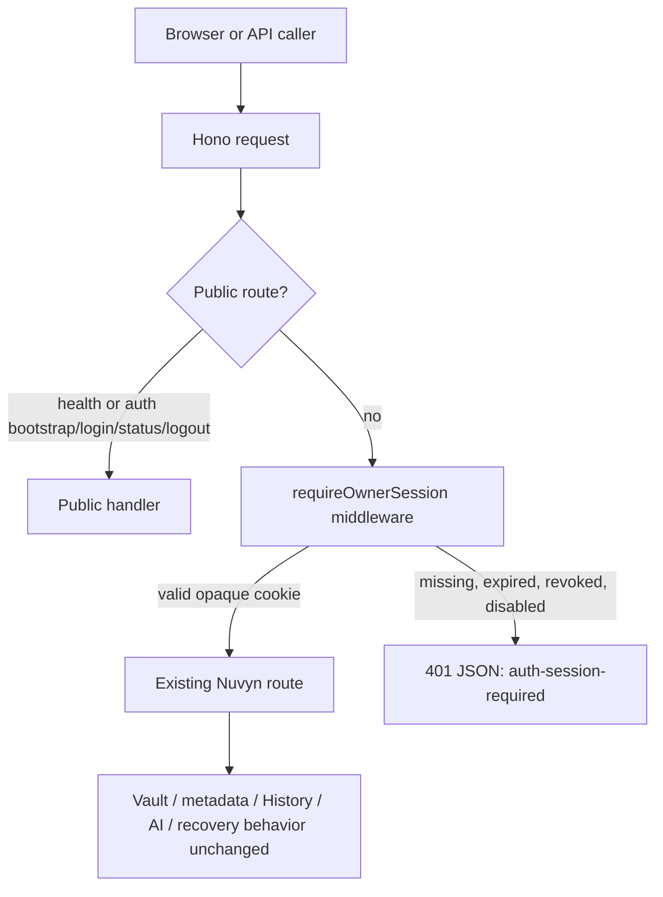
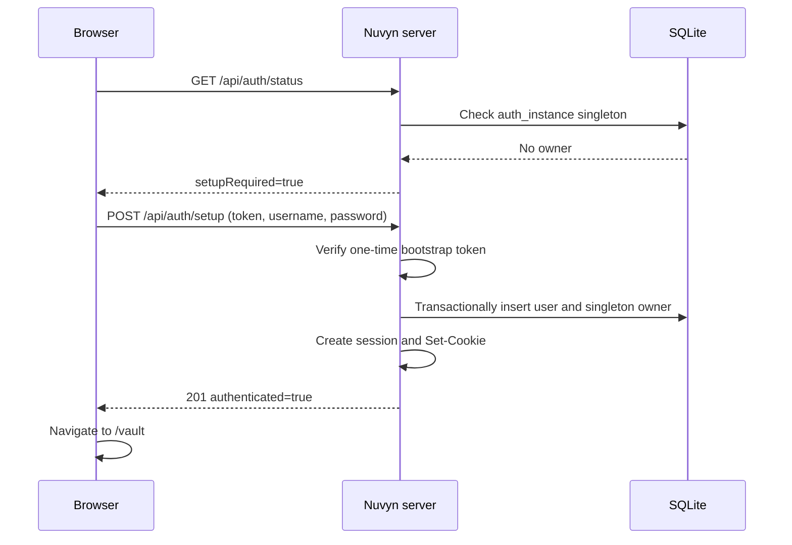
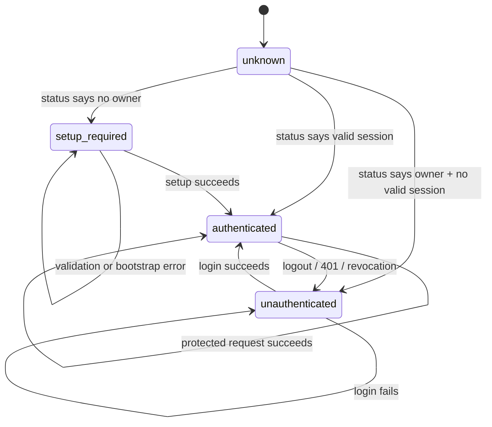

# Nuvyn Authentication v1 PRD

## Status

- **Status:** Proposed design; authentication is not implemented on the current `main` branch.
- **Date:** 2026-08-09
- **Scope:** First-run owner setup, login, server-side sessions, logout, and protection of the existing Nuvyn instance.
- **Implementation constraint:** This document is design-only. It does not change production code, migrations, tests, package scripts, or CI.
- **Source of truth used for this proposal:** `server/index.ts`, `server/prod.ts`, `server/db.ts`, `server/migrations/*`, `server/vite-plugin.ts`, `src/main.ts`, `src/router/index.ts`, `src/App.vue`, the current API clients/composables, deployment/security documentation, and the current Vitest/Playwright configuration.

## Executive Summary

Within Nuvyn's self-hosted Personal OS runtime, the existing single-vault Markdown workspace is the document foundation. Authentication v1 adds a new access boundary around that existing instance:

```text
one Nuvyn instance
  ├── one owner account
  ├── one Markdown vault
  ├── one vault Git repository
  ├── instance-level SQLite metadata and AI settings
  └── server-side owner sessions
```

The feature is **single owner, not multi-user**. It answers “who may operate this Nuvyn instance?” It does not answer “which user owns this document?” and does not add `user_id` to notes, metadata, AI sessions, credentials, Git history, or recovery records.

The browser receives only an opaque, high-entropy, `HttpOnly` session cookie. SQLite stores a hash of the token, not the token itself. Hono middleware protects every sensitive `/api` route; Vue route guards are only a navigation aid.

The first owner is created through a one-time bootstrap token. An explicit `NUVYN_SETUP_TOKEN` is preferred for deployments; when absent, Nuvyn generates a process-local token and prints it once to the private server log. The setup token is required even for local setup, so a reverse proxy cannot accidentally turn a public first-run page into an owner-takeover path. Once the owner exists, setup is permanently closed.

The existing Vault, filesystem mutations, Git History, metadata, AI providers and credentials, Crash Recovery, and browser Draft Store retain their current instance-level semantics.

## Current Architecture

### Verified current system shape

- The frontend is a Vue SPA mounted by `src/main.ts` and `src/App.vue`.
- `src/router/index.ts` currently redirects `/` to `/vault`, serves `/vault` and `/vault/*`, and redirects unknown routes back to `/vault`.
- The server is a Hono application in `server/index.ts`.
- Development mounts Hono through `server/vite-plugin.ts`; production serves the built SPA and the same Hono app from `server/prod.ts`.
- Browser and API are normally same-origin. In development, Vite mounts the API middleware under the Vite origin; in production, one Node HTTP listener serves the SPA and `/api`.
- `server/db.ts` lazily opens `data/nuvyn.db`, enables SQLite foreign keys and WAL mode, and applies ordered SQL migrations.
- Existing database timestamps are integer milliseconds from `Date.now()`.
- Markdown lives in `CONTENT_DIR`, resolved from `VAULT_DIR` or the default `src/content` directory. The vault's `.git` remains the History repository.
- AI settings, encrypted provider credentials, AI sessions, and messages are instance-level rows in SQLite.
- Unsaved editor drafts are browser-local IndexedDB records in `nuvyn-draft-recovery`, not server records.
- Startup performs vault writer ownership, initial-folder seeding, Crash Recovery, and metadata migration before production requests are accepted.
- `HOST` defaults to `127.0.0.1` for bare-metal production. Docker listens on `0.0.0.0` inside the container but publishes `127.0.0.1:3000` by default.

### Request boundary proposed by v1



The middleware is the security boundary. The login and setup screens are not a security boundary on their own.

### Existing route families

The current server exposes these families, which must remain behaviorally unchanged after auth is added:

- Health: `/api/health`
- Vault tree and file state: `/api/tree`, `/api/files/state`
- Posts and recovery writes: `/api/posts`, `/api/posts/*`, `/api/recover/*`
- Folders: `/api/folders`, `/api/folders/*`
- Metadata and frontmatter operations: `/api/metadata/*`
- Links: `/api/links/index`, `/api/backlinks`, `/api/links/rename-impact`
- AI: `/api/ai/*` including settings, credential status, connection testing, sessions, summaries, commit messages, and chat
- History: `/api/history/*` including capability, log, diff, commits, repair, drop, and restore

## Problem Statement

Today, any client that can reach Nuvyn can read notes, mutate the vault and metadata, use History, and invoke configured AI credentials through server routes. The deployment security guide therefore requires loopback/private-network exposure or a separately operated authenticated TLS reverse proxy.

Authentication v1 should provide a first-party owner access boundary without turning the single-vault application into a multi-tenant system or moving credentials and ownership into every subsystem.

## Goals

1. Let an operator securely create exactly one Nuvyn owner.
2. Let the owner log in, remain authenticated for a bounded period, and log out.
3. Reject unauthenticated access to all sensitive Nuvyn APIs with JSON `401` responses.
4. Keep the existing vault, Git, metadata, AI, and recovery data model instance-scoped.
5. Preserve unsaved editor work across session expiry and logout through the existing browser Draft Store behavior.
6. Make the same authentication model testable in local development, Docker, production, and Playwright.
7. Provide a migration path for existing no-auth installations without moving or rewriting vault content.

## Non-Goals

Authentication v1 does not include:

- Multi-user registration or public signup.
- Email accounts, email verification, email password reset, OAuth, OIDC, SAML, GitHub login, or Google login.
- WebAuthn/passkeys, MFA, or recovery codes.
- Roles, RBAC, admin dashboards, sharing, invitations, or collaboration.
- Per-user vaults, document ACLs, per-user AI keys, per-user AI sessions, per-user Git history, or Git author mapping.
- Refresh tokens, public API tokens, or a JWT stored in browser storage.
- Changes to ChatBackend, `runChat`, streaming/tool execution, History/CAS semantics, Vault storage, or Crash Recovery protocols.
- A browser “forgot password” flow in v1.

## Product Principles

- **Protect access, not ownership:** authentication wraps the existing runtime; it does not rewrite domain ownership.
- **Server enforcement first:** a Vue guard improves UX, but every protected API must enforce the session independently.
- **One owner, one vault:** the owner operates the existing instance; no user-scoped rows are introduced into existing domain tables.
- **Safe bootstrap:** a public setup page may exist, but the setup mutation requires a one-time operator-held secret.
- **Opaque browser credentials:** raw session tokens and saved provider keys never enter browser JavaScript or SQLite in raw form.
- **Fail closed:** missing, invalid, expired, revoked, or disabled sessions receive `401` and never fall through to an existing handler.
- **Preserve recovery:** authentication transitions must not silently discard in-memory edits or IndexedDB recovery drafts.
- **Small, explicit security surface:** use a proven password KDF, a single session cookie, same-origin browser requests, and bounded login throttling rather than an elaborate identity platform.

## Personas

| Persona | Need | v1 behavior |
| --- | --- | --- |
| Instance owner | Operate one private Nuvyn vault | Creates the only owner, logs in, edits notes, uses AI/History, logs out |
| Self-hosting operator | Bootstrap and deploy securely | Supplies `NUVYN_SETUP_TOKEN`, configures HTTPS/proxy cookie settings, backs up auth data |
| Maintainer | Verify security without network dependencies | Uses explicit test fixtures and authenticated sessions; no production test bypass |

## User Journeys

### Flow A — First run



1. The browser loads the public SPA shell and asks `/api/auth/status`.
2. If no owner exists, the frontend routes to `/setup`.
3. The setup form collects a bootstrap token, username, password, and confirmation. The token is pasted from the private startup log or supplied by the operator.
4. The server validates the token and password, then creates the user and owner singleton in one SQLite transaction.
5. The server creates an authenticated session and redirects the owner to `/vault`.
6. Further setup attempts return `409 already-initialized`, regardless of token validity.

### Flow B — Normal login

1. A request to `/`, `/vault`, or `/vault/*` without a valid session is sent to `/login` by the frontend.
2. The internal intended path is encoded in `redirect`; only a validated Nuvyn-internal path is accepted.
3. The login form posts username and password to `/api/auth/login`.
4. Successful login creates a fresh server session and redirects to the intended path, or `/vault` when no valid redirect exists.
5. Invalid credentials, disabled owner, and unknown username use the same generic authentication response.

### Flow C — Existing authenticated session

The app performs one auth-status hydration before mounting the workspace. A valid cookie returns the owner identity, so `/login` is never shown as an intermediate flash. Reloading `/vault/*` keeps the requested route after status succeeds.

### Flow D — Logout

1. The owner chooses Logout from the application chrome.
2. If any editor tab is dirty, saving, externally conflicted, or has a pending recovery write, Nuvyn asks for confirmation. The confirmation explains that browser-local recovery drafts will be kept; it does not silently discard them.
3. While the session is still valid, the workspace waits for an in-flight save and makes a best-effort final server save when the current editor state is otherwise saveable. It then flushes pending browser Draft Store writes.
4. If there is an offline state, conflict, failed save, or failed Draft Store flush, Nuvyn explains what could not be saved and asks for explicit confirmation before revoking the session. It never claims a failed server save succeeded.
5. After confirmation (or immediately when there is nothing pending), the server revokes the current session and clears the cookie. Logout is idempotent when no valid session exists.
6. The browser navigates to `/login` and preserves recovery drafts for the next authenticated visit.

### Flow E — Session expired or revoked

1. A protected API returns JSON `401` with the Nuvyn-specific `code: "auth-session-required"`.
2. The client auth coordinator changes state to `unauthenticated`, stops issuing new protected mutations, and records the current internal route.
3. The workspace shows a session-expired message rather than a generic document error.
4. Because the session is no longer valid, the workspace does not attempt a server save. Before navigating to `/login?redirect=...&reason=expired`, it calls the existing browser Draft Store persistence flush. Drafts remain in IndexedDB even if a server save cannot complete.
5. The login page explains that unsaved browser drafts were kept for recovery. It never clears `nuvyn-draft-recovery`.
6. After successful login, the original internal route is restored. `VaultView` performs its normal startup recovery discovery; the owner can restore or review any draft instead of losing it.
7. A late response from the pre-expiry request cannot overwrite the new authenticated state. Auth state transitions are generation-guarded.

### Flow F — Direct API access

An unauthenticated caller that requests any protected `/api` route receives a
top-level Nuvyn error envelope such as `{ "error": "Authentication required.",
"code": "auth-session-required" }` with HTTP `401`. There is no HTML redirect,
no partial route execution, and no information about the owner or stored
credentials. A provider-originated `401` with a non-auth-session code is not a
Nuvyn session-expiry signal.

## Authentication State Machine

The main auth state is intentionally small and separate from request-level loading states:



Operational substates (`hydrating`, `submitting`, `logging-out`, and `session-expired`) are UI flags and must not be confused with the four durable navigation states.

## Secure First-Run Bootstrap

### Decision

Every setup mutation requires a high-entropy, one-time bootstrap token. The preferred operator path is an explicit `NUVYN_SETUP_TOKEN` supplied through the environment or secret manager. If it is absent and no owner exists at startup, Nuvyn generates a cryptographically random 32-byte token, keeps it in memory, and prints it once to the private server log. The token is accepted only in the setup request body, never in a URL or query string.

This is preferred over a pure loopback-only rule because a reverse proxy reaches Nuvyn over a local socket; the application cannot safely infer the original browser's network location from arbitrary forwarded headers. Requiring a token works for direct local, Docker, and proxied deployments without trusting `X-Forwarded-*` headers.

### Token lifecycle

- Generate or load the token before serving requests.
- Compare supplied tokens in constant time.
- Rate-limit failed setup-token attempts.
- Do not expose token presence or token value through `/api/auth/status`.
- Never log request bodies, submitted tokens, cookies, or token hashes. The only
  exception is the fallback token generated by the server itself when no
  `NUVYN_SETUP_TOKEN` is configured: print that value once to the private
  operator console before setup, and never repeat it. An explicit
  `NUVYN_SETUP_TOKEN` and every user-supplied token must never be printed or
  recorded.
- Clear the in-memory token after the owner transaction commits.
- A restart before setup generates a new token when no explicit token is configured.
- After the owner exists, `/api/auth/setup` returns `409 already-initialized` even if the old token is supplied.
- The token is not stored in SQLite and is not part of a normal vault backup.

### Deployment behavior

| Environment | Required operator action | Expected behavior |
| --- | --- | --- |
| `npm run dev` | Read the one-time token from the terminal, or set `NUVYN_SETUP_TOKEN` | The same setup form and server checks are used; development does not silently bypass auth. |
| Bare metal | Prefer a secret-managed `NUVYN_SETUP_TOKEN`; keep the default listener on `127.0.0.1` | Local browser still supplies the token. Remote exposure requires the operator to deliberately configure a token and HTTPS boundary. |
| Docker | Set `NUVYN_SETUP_TOKEN` through the Compose environment/secret mechanism; do not commit it to `.env` | `docker compose logs nuvyn` is the fallback location for a generated token. The published port remains loopback by default. |
| Reverse proxy | Set `NUVYN_SETUP_TOKEN` and the canonical `NUVYN_PUBLIC_ORIGIN`, then route `/setup`, `/login`, `/api/auth/*`, and the rest of the SPA to the same Nuvyn port | The proxy must not rely on local socket origin as bootstrap authorization. An `https://` public origin automatically selects the secure `__Host-` cookie profile. |

### Takeover prevention

The setup screen being public is not sufficient to create an owner. The server rejects setup without a valid token, the owner singleton is transactionally enforced, and setup is permanently closed after the first owner is committed. Hiding `/setup` in the frontend is only a convenience.

## UX Specification

### Shared auth layout

- Use the existing Nuvyn dark/light theme variables and compact desktop-tool style.
- Do not introduce a marketing landing page, hero graphics, social-login buttons, registration links, or multi-user language.
- Keep the form centered in a small panel with the Nuvyn wordmark/name, a clear heading, labels, compact controls, and one primary action.
- Use the existing button/input conventions: visible focus ring, keyboard navigation, `type="submit"`, and explicit loading/disabled state.
- Auth pages are not part of the vault chrome; `App.vue` should not mount the normal NavBar or vault controls while the route is `/login` or `/setup`.

### Login screen

Copy and intent:

```text
Nuvyn
Welcome back
Sign in to your Nuvyn workspace.

Username
[                         ]

Password
[                         ]

[ Sign in ]
```

- Username and password are both required.
- Enter submits from either field.
- A password visibility toggle is optional only if it matches an existing Nuvyn icon pattern; it must not copy the password into another storage location.
- Use one generic error: “Invalid username or password.” Do not reveal whether the owner name exists or is disabled.
- `429` displays a bounded retry message without exposing server internals.

### Setup screen

```text
Nuvyn
Set up this Nuvyn instance
This account controls access to this Nuvyn instance.

Bootstrap token
[                         ]

Username
[                         ]

Password
[                         ]

Confirm password
[                         ]

[ Create owner ]
```

- Explain where the bootstrap token comes from: the operator-provided secret or the one-time server log value.
- Use “Create owner” or “Set up Nuvyn”, not “Register” or “Sign up”.
- Client-side validation is for feedback only; the server repeats every validation and the token check.
- After a successful setup, the page cannot be revisited as an owner-creation form.

### Accessibility and error behavior

- Every control has an associated label and accessible name.
- Focus is placed on the first invalid field or the first form field on entry.
- The submit button exposes `aria-busy` while the request is pending.
- Errors use `role="alert"` and do not include password, token, session, hash, or provider credentials.
- Auth pages support keyboard-only navigation, screen-reader labels, and theme contrast.

## Frontend Routing

### Proposed routes

Add:

- `/login`
- `/setup`

Keep:

- `/` → `/vault`
- `/vault`
- `/vault/:pathMatch(.*)*`

The server continues to serve the SPA shell for non-API paths. The router guard decides whether the requested workspace route is usable.

### Hydration and guard rules

Implement one app-level auth coordinator/composable with:

```ts
type AuthState = 'unknown' | 'setup-required' | 'unauthenticated' | 'authenticated'
```

1. Start one `GET /api/auth/status` request during app initialization.
2. Cache the in-flight promise so small navigations do not issue duplicate status requests.
3. Keep the router in a loading state until the first status result is known; do not mount `VaultView` before a protected state is established.
4. On `setup-required`, protected routes go to `/setup`.
5. On `unauthenticated`, protected routes go to `/login?redirect=<encoded internal path>`.
6. An authenticated owner visiting `/login` or `/setup` is redirected to a valid internal redirect or `/vault`.
7. After login/setup, use the intended route once, then remove the query string.

### Redirect validation

Only accept a redirect that:

- is a relative path beginning with `/vault` or exactly `/`;
- has no scheme, host, `//`, backslash, control character, or encoded second scheme;
- is decoded and normalized before use;
- is resolved by the router, never assigned to `window.location` as an arbitrary URL.

Anything else falls back to `/vault`. This applies to login, setup, and session-expiration redirects.

### API 401 handling

All browser API wrappers should pass a protected `401` through the auth coordinator only when the response has the Nuvyn auth envelope `code: "auth-session-required"`. HTTP status alone is not sufficient: AI provider authentication failures may also use `401` with a provider-specific code such as `ai-authentication-failed` and must remain in the AI error flow. The coordinator de-duplicates concurrent expiry notifications and guards against stale responses after a new login.

## Server Authentication Boundary

### Hono mounting strategy

Add a dedicated auth sub-application mounted at `/api/auth`. Register the public health route and auth handlers before a centralized `/api/*` session middleware. The middleware has an explicit public allowlist for:

- `/api/health`
- `GET /api/auth/status`
- `POST /api/auth/setup`
- `POST /api/auth/login`
- `POST /api/auth/logout`

Every other `/api/*` request calls `requireOwnerSession`. The current route modules remain mounted after this boundary; they do not each implement user ownership checks.

Logout is public in the routing sense so a stale or partially missing cookie can always be cleared, but it still validates the current cookie when present and applies the unsafe-method Origin policy.

### Middleware contract

- Read the configured session cookie.
- Hash the raw cookie value and look up an unrevoked, unexpired session.
- Load the owner user and reject disabled or missing users.
- Attach only a safe owner identity (`id`, `username`) to the Hono context.
- Never attach password hashes, token hashes, provider credentials, or encryption keys.
- Return `401` JSON for a missing or invalid Nuvyn session with `code: "auth-session-required"`; never redirect an API caller to HTML.
- Set `Cache-Control: no-store` on every auth response and every protected `/api/*` response, including successful reads and mutations. Public liveness responses may use their own explicit cache policy.

Example failure shape:

```json
{
  "error": "Authentication required.",
  "code": "auth-session-required"
}
```

## API Contract

All auth responses are JSON except the cookie header. Error responses follow the
existing Nuvyn API convention with top-level `error` and `code` fields; they do
not introduce a nested `{ error: { ... } }` envelope. Responses do not include
raw session identifiers, hashes, password hashes, bootstrap tokens, or
credentials. The auth coordinator must key session-expiry handling on
`code: "auth-session-required"`, never on HTTP status alone.

### `GET /api/health`

This remains a public liveness endpoint for Docker and operator checks. Its
anonymous response is deliberately minimal—`{ "ok": true }` plus only a safe
status indicator if one is required by the existing health contract. It must
not expose a stable `vaultId` or other vault identity to unauthenticated
callers. Any protected vault identity endpoint is a separate authenticated
route.

### `GET /api/vault/identity`

Protected. After auth-status hydration succeeds, the workspace requests the
stable instance identity needed to scope browser-local state such as tabs,
Draft Store records, document identity, and recovery families:

```json
{
  "vaultId": "<stable-instance-identity>"
}
```

This endpoint is intentionally separate from public liveness. An unauthenticated
request receives the normal `401` auth envelope with
`code: "auth-session-required"`; an authenticated owner receives the identity.
The value remains instance-scoped—v1 does not introduce per-user vaults.

### `GET /api/auth/status`

Public and cache-disabled.

No owner:

```json
{
  "authenticated": false,
  "setupRequired": true
}
```

Owner exists but request is unauthenticated:

```json
{
  "authenticated": false,
  "setupRequired": false
}
```

Valid owner session:

```json
{
  "authenticated": true,
  "setupRequired": false,
  "user": {
    "id": 1,
    "username": "admin"
  }
}
```

### `POST /api/auth/setup`

The setup form may collect `confirmPassword` as a client-side typo check, but it
does not send that duplicate value to the server. The server receives only the
value it must verify:

```json
{
  "bootstrapToken": "operator-held-one-time-secret",
  "username": "admin",
  "password": "correct horse battery staple"
}
```

Success: `201 Created`, creates the session cookie, and returns the same safe authenticated user shape as login.

Possible safe errors:

| Status | Code | Meaning |
| --- | --- | --- |
| `400` | `validation-error` | Username or password violates the declared rules. |
| `401` | `bootstrap-invalid` | Token is missing or incorrect. Do not distinguish the failure reason. |
| `409` | `already-initialized` | An owner already exists, including a concurrent setup race. |
| `429` | `auth-rate-limited` | Repeated invalid bootstrap attempts are temporarily delayed. |

### `POST /api/auth/login`

Request:

```json
{
  "username": "admin",
  "password": "correct horse battery staple"
}
```

Success: `200 OK`, creates a fresh session cookie, and returns:

```json
{
  "authenticated": true,
  "user": { "id": 1, "username": "admin" }
}
```

Failure behavior:

- `401 invalid-credentials` for wrong username, wrong password, and disabled owner; the message is always “Invalid username or password.”
- `429 auth-rate-limited` with a bounded `Retry-After` value.
- `500 auth-unavailable` for an unexpected server failure, without stack traces or secret details.

Use a dummy scrypt verification path for an unknown username so response timing does not trivially disclose whether the owner name exists.

### `POST /api/auth/logout`

Idempotent. If a valid session cookie is present, mark that session revoked (or delete it), then always return `204 No Content` with an expired cookie. If the cookie is missing or already invalid, still clear both the production and development cookie names and return `204`.

### Protected route responses

The existing route response contracts remain unchanged for authenticated calls. An unauthenticated caller always receives the auth middleware's top-level `{ error, code: "auth-session-required" }` JSON `401` before the existing route can read the vault or SQLite state.

## Session Model

### Token lifecycle

- Generate at least 32 random bytes with Node's cryptographically secure random API and encode as base64url.
- Set the raw token only in the `Set-Cookie` header.
- Store `SHA-256(rawToken)` as a fixed-length encoded value in `auth_sessions.token_hash`.
- Use a constant-time comparison where a candidate hash is compared in application code; a database equality lookup is acceptable after canonical encoding.
- Create the token only after successful password/bootstrap validation.
- A successful login/setup never reuses an anonymous or pre-login identifier, preventing session fixation.
- Revoke the current session on logout. Future password changes will revoke all sessions.
- Expired sessions are rejected and may be pruned opportunistically; pruning must not delay the request or expose data.

### Lifetime policy

v1 uses a fixed **30-day absolute lifetime** and no idle extension. This avoids SQLite write amplification and makes “stay logged in” predictable for a self-hosted desktop workspace. `last_seen_at` is retained for observability and cleanup, but may be updated at most once per hour for an active session; it does not extend `expires_at`.

The browser cookie and server `expires_at` use the same 30-day bound. There is no refresh-token family.

### Backup and restore

`auth_sessions` lives in `data/nuvyn.db`, so a normal full database restore technically restores unexpired sessions. v1 makes this behavior explicit rather than pretending sessions are absent from backups:

- Treat the database and its backups as sensitive authentication material.
- A restore from a trusted, same-instance backup may preserve sessions.
- A restore from an untrusted, shared, or older environment must run the implementation's one-shot session invalidation operation before exposure. The proposed operator control is `NUVYN_AUTH_REVOKE_SESSIONS_ON_START=1`, which clears all session rows before the server accepts requests, then is removed/disabled.
- Password hashes remain in the restored database; restoring a database does not reset the owner's password.

## Cookie Policy

### Defaults

`NUVYN_PUBLIC_ORIGIN` is the single source of truth for the browser-facing
origin and cookie security mode. It must be an explicit absolute `http://` or
`https://` origin; Nuvyn never derives it from `Host` or arbitrary forwarded
headers. An `https://` origin selects secure cookies. An `http://` origin is
allowed only for loopback browser origins (`localhost`, `127.0.0.1`, or `[::1]`);
other HTTP public origins fail fast. Internal listener addresses do not decide
this policy: Docker may listen on `0.0.0.0` inside the container while the
browser-facing `NUVYN_PUBLIC_ORIGIN` remains `http://127.0.0.1:<published-port>`.
There is no independent secure-cookie switch that can create an unsafe
combination such as an `https` public origin with `Secure=0`.

| Attribute | Policy |
| --- | --- |
| Name | `__Host-nuvyn_session` when secure cookies are enabled; `nuvyn_session` for local HTTP development. Logout clears both names. |
| `HttpOnly` | Always. Browser JavaScript cannot read the token. |
| `Secure` | Enabled whenever `NUVYN_PUBLIC_ORIGIN` uses `https://`; required for HTTPS production/reverse-proxy deployments. Never infer it from untrusted forwarded headers. |
| `SameSite` | `Lax`. Supports normal same-origin navigation while withholding the cookie from cross-site mutation requests. |
| `Path` | `/`. |
| `Domain` | Omitted. The secure production name therefore satisfies the `__Host-` requirements. |
| Expiry | `Max-Age=2592000` and matching `Expires`. |

The session middleware accepts only the cookie name selected by the current
`NUVYN_PUBLIC_ORIGIN` security profile. HTTPS mode reads only
`__Host-nuvyn_session`; loopback HTTP mode reads only `nuvyn_session`. Logout
clears both names for cleanup, but the alternate name is never accepted as a
fallback during authentication.

`NUVYN_PUBLIC_ORIGIN` is an explicit canonical origin used by Origin checks,
cookie selection, and deployment validation. A reverse proxy must preserve the
browser's `Origin` header; Nuvyn does not trust arbitrary `X-Forwarded-Proto`,
`X-Forwarded-Host`, or `X-Forwarded-For` values.

### Local and proxy cases

- `http://localhost`, `http://127.0.0.1`, or `http://[::1]` development uses the non-`__Host-` cookie because browsers reject `Secure` cookies over HTTP.
- The public origin, not the Node/Docker listener address, determines this profile; a container may bind `0.0.0.0` internally while publishing only a loopback origin to the host.
- HTTPS bare-metal or Docker deployments set an `https://` `NUVYN_PUBLIC_ORIGIN` and use `__Host-nuvyn_session`.
- An HTTP origin other than the loopback names above, or an invalid/missing origin for a remotely reachable deployment, fails fast at startup rather than guessing its browser origin.
- A reverse proxy terminates TLS and forwards both SPA and `/api` traffic to the same Nuvyn listener. Nuvyn derives the secure-cookie profile from the explicit public origin, not from the local proxy hop.
- A proxy must not cache authenticated HTML or JSON responses.

## Password Security

### Recommended v1 KDF

Use Node's built-in asynchronous `crypto.scrypt` rather than adding a native package in v1:

- `N = 32768` (`2^15`)
- `r = 8`
- `p = 1`
- `maxmem >= 64 MiB`
- 16-byte cryptographically random salt
- 32-byte derived key
- Versioned encoded format, for example `scrypt$v1$N=32768,r=8,p=1$<salt>$<derived-key>` using base64url fields

Verification parses the version and parameters, derives the key asynchronously, and compares with `timingSafeEqual`. A malformed or unsupported hash is treated as an authentication failure, not a server crash.

### KDF resource guard

Every password KDF consumes the same bounded process-wide budget, including
owner setup, a known-user login, and the dummy KDF used for an unknown username.
The auth service should allow only a small configurable number of concurrent
KDFs (target default: 3), queue at most a bounded number of additional work
items, and return a safe `429` or `503` when the queue is full. The guard is
shared by setup, real verification, and dummy verification; a caller cannot
evade it by changing usernames. Queue entries have a bounded wait and are
discarded when the request is aborted.

This protects a single Node process from concurrent memory-hard work without
changing the per-password scrypt cost. Tests must prove that a burst of at
least 100 concurrent login attempts never exceeds the configured KDF
concurrency and fails safely when the bounded queue is exhausted.

### Why scrypt for v1

Argon2id is an excellent future choice, but a new native dependency affects Docker images, macOS/Linux/Windows install behavior, and CI. Node-supported scrypt avoids dependency installation and keeps the first auth release cross-platform. The versioned format leaves room for an Argon2id migration in a later release without storing plaintext or reversible encryption.

### Password and username rules

- Password minimum: 12 Unicode code points.
- Password maximum: 256 Unicode code points.
- Allow long passwords and paste; no mandatory symbol/uppercase/number composition rules.
- Do not trim or normalize password bytes; the submitted password is the password.
- Username is ASCII, canonical lowercase, 3–32 characters, matching `[a-z0-9](?:[a-z0-9._-]{1,30}[a-z0-9])`.
- Trim surrounding username whitespace before validation; reject whitespace and other Unicode characters rather than silently transliterating them.
- Store the canonical lowercase username and enforce uniqueness on it. `Admin` and `admin` therefore cannot represent different identities.

## CSRF Strategy

Nuvyn is a same-origin SPA, so v1 uses a deliberately small cookie-authenticated mutation defense:

1. `SameSite=Lax` prevents the session cookie from being sent on ordinary cross-site form mutations.
2. For every `POST`, `PUT`, `PATCH`, and `DELETE`, reject a present `Origin` header that does not match `NUVYN_PUBLIC_ORIGIN`. When browser Fetch Metadata headers are present, reject a known `Sec-Fetch-Site: cross-site` mutation as well. Do not trust arbitrary forwarded-origin headers.
3. Endpoints with a JSON body continue to require `Content-Type: application/json`. A bodyless `DELETE` remains valid and must not be forced to invent an empty JSON body merely to satisfy CSRF policy.
4. A missing `Origin` and missing Fetch Metadata are allowed for non-browser server-to-server tooling and tests, but such callers still need a valid session cookie. CORS is not opened for the auth or application APIs.
5. `GET` remains read-only by convention; no state-changing operation may be added to a GET route.

Login, setup, and logout also apply the same mismatch rejection when an `Origin` header is present. The bootstrap token is an additional defense for setup, not a replacement for transport security.

If a future deployment needs cross-origin browser access, it must become an explicit product decision; v1 does not add CORS or a separate CSRF token channel.

## Password Recovery

There is no email system, so v1 does not provide a browser-based “forgot password” flow. A lost owner password must not be “recovered” by asking the owner to edit SQLite rows manually; that would bypass the KDF contract and is too easy to corrupt.

The implementation should therefore reserve a supported local/offline administrative reset operation for Authentication Phase 1.1 (for example, a documented CLI or a one-shot server maintenance command that can run with the instance stopped). It must create a new scrypt hash, revoke all sessions, and never print or accept the old password. Until that operation ships, deployment documentation must state that the owner should keep the password in a password manager and that a forgotten password requires the supported recovery procedure rather than ad-hoc database edits.

## Login Throttling

Use an in-memory, bounded failure limiter in the auth service. It is intentionally not a permanent account lockout and does not add a migration just for counters.

- Key failures by normalized username and, when a trustworthy transport peer address is available, the peer address as a secondary dimension.
- Do not trust `X-Forwarded-For` unless a future explicit trusted-proxy configuration is added.
- Without a trusted client IP, the username bucket remains effective against repeated guessing while avoiding a shared reverse-proxy IP lockout as the sole key.
- After credential verification, record failures in a five-minute window and
  apply a short delay/`429` after five failures. Exponentially increase the
  delay up to 15 minutes for continued failures.
- A hot failure bucket is not a pre-verification hard lock: the server must
  still admit a bounded KDF verification attempt, so a correct owner password
  can succeed and clear the bucket even while an attacker has generated recent
  failures. The global KDF guard and bounded queue are the resource boundary;
  they are not replaced by an account lockout.
- A successful login resets the username bucket and is never rejected merely
  because that bucket was previously hot.
- Unknown usernames use the same generic response and dummy KDF work as wrong passwords.
- Restarting the process clears the in-memory limiter; this is acceptable as a bounded v1 control and is documented, not mistaken for durable security.
- Apply a similar, stricter short bucket to invalid bootstrap-token attempts.
- Never permanently disable the only owner or make the owner unable to log in
  indefinitely because of failed guesses.

## SQLite Data Model

### Proposed entities

The entities are future-compatible with additional users later, while v1 enforces one owner through a singleton instance row rather than a `user_id` added to every domain table.

```sql
CREATE TABLE users (
  id                 INTEGER PRIMARY KEY AUTOINCREMENT,
  username           TEXT NOT NULL,
  username_normalized TEXT NOT NULL UNIQUE,
  password_hash      TEXT NOT NULL,
  disabled           INTEGER NOT NULL DEFAULT 0 CHECK (disabled IN (0, 1)),
  created_at         INTEGER NOT NULL,
  updated_at         INTEGER NOT NULL
);

CREATE TABLE auth_instance (
  id               INTEGER PRIMARY KEY CHECK (id = 1),
  owner_user_id    INTEGER NOT NULL UNIQUE
                   REFERENCES users(id) ON DELETE RESTRICT,
  created_at       INTEGER NOT NULL,
  updated_at       INTEGER NOT NULL
);

CREATE TABLE auth_sessions (
  id          INTEGER PRIMARY KEY AUTOINCREMENT,
  user_id     INTEGER NOT NULL REFERENCES users(id) ON DELETE CASCADE,
  token_hash  TEXT NOT NULL UNIQUE,
  created_at  INTEGER NOT NULL,
  expires_at  INTEGER NOT NULL,
  last_seen_at INTEGER NOT NULL,
  revoked_at  INTEGER
);

CREATE INDEX idx_auth_sessions_user_expiry
  ON auth_sessions(user_id, expires_at);
CREATE INDEX idx_auth_sessions_expiry
  ON auth_sessions(expires_at);
```

### Constraints and conventions

- All timestamps are integer milliseconds, matching `server/db.ts` and existing migrations.
- `username_normalized` is the canonical lowercase form; `username` is also stored in canonical form in v1 so display and lookup cannot diverge.
- `auth_instance.id = 1` is the single-owner gate. The `owner_user_id` uniqueness and a `BEGIN IMMEDIATE` setup transaction make concurrent setup attempts serialize.
- Setup inserts the user and singleton row in one transaction. If the second request observes the singleton or loses a uniqueness race, the transaction rolls back and returns `409`; it cannot leave an extra user behind.
- `ON DELETE RESTRICT` prevents deleting the only owner through a future generic user operation. `auth_sessions` cascade only after a deliberate user lifecycle operation exists.
- No existing `sessions`, `messages`, `settings`, `documents`, tags, metadata, or vault tables gain an auth foreign key in v1.
- A future multi-user migration can add roles/relationships around `users` without making every current domain row user-owned.

### Migration and startup

The auth migration is applied by the existing `applyMigrations` runner. It creates only auth tables and indexes. It must run before the first protected request, but it must not move vault files, initialize Git, alter metadata, or participate in Crash Recovery decisions.

## Upgrade / Migration

### Existing no-auth installation

On upgrade:

```text
existing vault + existing SQLite data + auth tables with no owner
        ↓
GET /api/auth/status → setupRequired=true
        ↓
owner completes secure setup
        ↓
same vault, Git history, metadata, AI credentials, AI sessions, and settings
```

- No Markdown file is moved or rewritten.
- `CONTENT_DIR`/`VAULT_DIR` remains unchanged.
- The vault `.git` remains the same repository.
- Existing encrypted AI credentials remain instance-level rows and continue to use the existing master-key behavior.
- Existing document metadata, links, History, Crash Recovery records, AI conversations, and browser drafts are not migrated into user ownership.
- Until setup completes, only health and auth bootstrap/status/login/logout routes are usable; protected APIs return `401`.

### Fresh installation

A fresh database has no owner, so the same secure setup path runs. There is no default username, default password, or anonymous-owner fallback.

## Logout & Session Expiration

### Dirty editor handling

The current editor marks tabs dirty immediately, autosaves to the server after approximately 800 ms, and independently persists unsaved buffers to the browser IndexedDB Draft Store. Auth transitions must respect both channels:

- A successful server save remains the preferred path.
- On active logout, the session is still valid: wait for an in-flight save and
  make a best-effort final server save when the editor is saveable. On a session
  `401`, the session is already invalid: do not attempt a server save.
- Ask for confirmation when tabs are dirty, saving, externally conflicted, or have pending draft persistence.
- Invoke the existing persistence flush before route teardown in both cases.
  The flush is to browser recovery storage; it is not a bypass around server
  auth.
- Preserve primary and conflict drafts. Never clear `nuvyn-draft-recovery` during logout or session expiry.
- If the IndexedDB flush fails, keep the user-facing warning visible and do not claim that work is safe; the in-memory editor remains until the user chooses to continue.

### Re-login behavior

After re-login, route back to the saved internal path. `VaultView` runs normal vault loading and recovery discovery. A draft that could not reach the server remains a recoverable browser record, and the owner can review it through the existing Recovery UI.

### Stale request protection

The auth coordinator owns a monotonically increasing transition generation. A response from a request started before logout or expiry cannot set the app back to `authenticated`, display stale data, or overwrite a newer redirect.

## Vault / History / AI Integration

### Vault and storage

- `CONTENT_DIR`/`VAULT_DIR` remains one instance-level writer-owned vault.
- No `users/<id>/vault` path is introduced.
- Existing path validation, archive semantics, folder/document mutation barriers, atomic writes, and Crash Recovery remain unchanged.
- Auth middleware runs before route handlers; it does not change file ownership or mutation protocols.

### History and Git

- History remains instance-level and continues to use the one vault Git repository.
- Auth v1 does not add per-user commits, Git author mapping, per-user repositories, or History ACLs.
- Every `/api/history/*` route is protected by the owner session, including read, commit, repair, drop, and restore operations.

### AI

- Existing Anthropic/OpenAI settings and encrypted provider credentials remain instance-scoped.
- Authenticated owners continue to use AI sessions, chat, workspace tools, summaries, commit-message generation, settings, and real connection testing.
- Every AI route, including read-only-looking settings and connection-test endpoints, requires the owner session. Anonymous callers cannot cause the server to use stored provider credentials.
- No AI credential row gains `user_id`; no master-key or provider protocol change is part of auth v1.

### Crash Recovery and metadata

Auth schema creation is independent of vault writer ownership, startup folder seeding, Crash Recovery, and metadata migration. The existing production startup order remains: acquire writer ownership, seed roots, recover interrupted operations, migrate metadata, then accept requests; auth migration may happen through the existing database migration runner before route use.

## Development Experience

- `npm run dev` uses the same auth state machine and server checks as production.
- There is no `NODE_ENV=test` or development-only route that bypasses auth.
- The generated setup token is printed in the developer terminal when no explicit `NUVYN_SETUP_TOKEN` is set. A developer may set a deterministic local token through the environment for repeatable manual work.
- Local HTTP uses the non-secure cookie variant; production-like HTTPS behavior is exercised in dedicated tests/configuration.
- Docker development uses the same `/api/auth/*` routes. Test fixtures must create an owner/session explicitly rather than disabling middleware.

## Testing Strategy

Authentication is a cross-cutting boundary, so tests must prove both auth behavior and unchanged authenticated behavior.

### Unit tests

Add focused tests for:

- Password length and username normalization/validation.
- scrypt hash encoding, parsing, malformed hash handling, and constant-time verification wrapper.
- Session token generation and token hashing.
- Cookie construction for HTTP development and HTTPS `__Host-` mode.
- Internal redirect validation and open-redirect rejection.
- Auth state transitions and stale-response generation guards.
- Brute-force limiter timing/reset behavior.

### Server/API tests

Using in-memory or isolated SQLite and local `app.fetch` requests:

- First setup succeeds with the correct bootstrap token and returns a session.
- Setup rejects a missing/wrong token and generic validation errors.
- A second setup is rejected after initialization.
- Two concurrent setup requests create exactly one user and one owner singleton; the loser gets `409`.
- Login succeeds, wrong password and unknown username are indistinguishable, disabled owner is safe, and sessions are created.
- Missing, expired, revoked, and disabled sessions return JSON `401`.
- Logout revokes the session and clears the cookie; repeated logout is harmless.
- `/api/health` remains public; all protected route families return `401` without a session.
- `/api/health` returns liveness only; unauthenticated `/api/vault/identity` returns `401` with `code: "auth-session-required"`, while an authenticated owner receives a stable `vaultId` for browser-local scoping.
- Authenticated requests retain existing route response behavior.
- Cookie flags, expiry, cache headers, and no raw token/hash leakage are asserted.
- The session middleware reads only the cookie name selected by the current origin security profile; the alternate secure/local name is never accepted as an authentication fallback.
- Mismatched Origin or known cross-site Fetch Metadata is rejected for unsafe methods; same-origin JSON mutations and existing bodyless DELETEs work.
- Login and setup throttling returns bounded `429` without permanent lockout.
- A burst of at least 100 login/setup attempts never exceeds the configured KDF concurrency; the bounded queue returns safe overload responses rather than spawning unbounded scrypt work.
- A correct owner password can still succeed while a username failure bucket is hot; throttling is accounted for after verification rather than used as a permanent pre-verification lockout.
- Auth error bodies never contain passwords, hashes, tokens, cookies, provider credentials, or stack traces.

### Client/component tests

- First-run status routes to `/setup`.
- Existing unauthenticated status routes to `/login`.
- Authenticated status routes to `/vault` and does not flash login.
- Login/setup redirect to a validated internal route.
- Authenticated users are redirected away from `/login` and `/setup`.
- Failed login displays a generic error.
- Logout clears auth state and preserves draft-recovery behavior.
- Active logout waits for a legal in-flight/final server save before revocation when possible, then flushes browser drafts; failed saves require explicit confirmation.
- A protected API `401` triggers one session-expired flow, keeps the intended route, and does not clear IndexedDB drafts.
- A successful re-login restores the route and allows normal recovery discovery.
- Late pre-expiry responses cannot overwrite a newer login/logout state.

### Playwright E2E fixture strategy

Provide a reusable authenticated fixture for isolated Nuvyn servers:

1. Start an isolated server/database/vault.
2. Perform first setup once through the API or UI fixture.
3. Save the resulting session cookie in the browser context.
4. Let auth-specific specs exercise the actual login/setup/logout screens.
5. Let most existing vault/AI/History specs use the authenticated context instead of typing credentials in every test.

The fixture must not call a production-only bypass. A direct session fixture may use the same server session creation helper used by the setup/login route, or perform real UI setup once, but it must still exercise middleware enforcement.

Add E2E coverage for a fresh instance, setup, vault access, logout/login, reload with a session, protected direct URL, and a revoked/expired session with draft preservation where practical.

### Existing test lanes

Keep the current lanes structurally intact:

- `test:unit` for ordinary fast tests.
- `test:history-integration` for real Git/filesystem tests with its own timeout and Windows serialization.
- `test:recovery-integration` for filesystem/SQLite/process Crash Recovery and state-machine tests with lane-local timeout and Windows serialization.
- Playwright general, Draft Store, visual, cross-platform, and Docker smoke jobs.

Auth tests must use local app/fake providers only and must not access the public internet. Existing OpenAI-compatible fake HTTP tests remain real-wire local tests.

## Route Protection Matrix

| Route family | Public / protected | Reason and v1 behavior |
| --- | --- | --- |
| Static assets and SPA shell (`/assets/*`, `/`, `/login`, `/setup`, `/vault*`) | Public transport; protected UX | The browser must load the auth screen. Vue guards keep unauthenticated users out of the workspace, but the shell contains no vault data. |
| `GET /api/health` | Public | Docker smoke, liveness, and operator checks; response is minimal and does not disclose stable vault identity. |
| `GET /api/vault/identity` | Protected | Returns the stable instance `vaultId` used to scope browser-local tabs, Draft Store, document identity, and recovery families. |
| `GET /api/auth/status` | Public | Lets the SPA hydrate auth/setup state. `Cache-Control: no-store`. |
| `POST /api/auth/setup` | Public handler with bootstrap token | Creates the only owner once; token and transaction rules are enforced server-side. |
| `POST /api/auth/login` | Public handler with throttling | Creates a session after credential verification. |
| `POST /api/auth/logout` | Public/idempotent handler | Clears/revokes any current session; safe with an invalid cookie. |
| `/api/tree`, `/api/files/state` | Protected | Vault structure and file existence are sensitive. |
| `/api/posts`, `/api/posts/*`, `/api/recover/*` | Protected | Reads, writes, deletes, and browser draft recovery writes operate on the vault. |
| `/api/folders`, `/api/folders/*` | Protected | Folder creation, move, and deletion mutate the vault. |
| `/api/metadata/*` | Protected | Metadata, migration, cleanup, restore, export, and document identity expose or mutate instance state. |
| `/api/links/index`, `/api/backlinks`, `/api/links/rename-impact` | Protected | Link graph and rename impact reveal vault content and paths. |
| `/api/ai/*` | Protected | Includes provider settings, encrypted credential use, AI sessions, summaries, tools, chat, and connection testing. |
| `/api/history/*` | Protected | Git logs, diffs, commits, repairs, drops, and restores expose or mutate the instance repository. |
| Unknown `/api/*` | Protected by default | Avoid accidental unauthenticated additions when a future route is registered without an explicit public allowlist entry. |

## UX State Matrix

| Auth state + location | Expected route | Expected UI | Server behavior |
| --- | --- | --- | --- |
| Setup required + `/setup` | Stay on `/setup` | Setup form with bootstrap token; no NavBar | `GET status` says `setupRequired=true`; setup mutation is token-gated. |
| Setup required + `/login` | Redirect to `/setup` | Explain that this instance needs its first owner | Login is not useful before initialization; server still exposes its normal login contract but returns setup state through status. |
| Unauthenticated + `/vault` | `/login?redirect=%2Fvault` | Login form; no vault chrome | Any direct API call is `401`. |
| Unauthenticated + `/vault/...` | `/login?redirect=<validated path>` | Login form with route preserved | Protected API calls never redirect HTML. |
| Unauthenticated + `/login` | Stay on `/login` | Login form | Login endpoint is public and throttled. |
| Authenticated + `/login` | `/vault` or valid redirect | No login flash | Status confirms the session. |
| Authenticated + `/setup` | `/vault` or valid redirect | No setup form | Setup endpoint returns `409 already-initialized`. |
| Authenticated + `/vault` | Stay on `/vault` | Existing workspace | Existing routes execute unchanged after middleware. |
| Unknown initial state + any workspace path | Temporary auth loading | No vault mount before status resolves | One status request determines the route. |
| Expired session + `/vault` | `/login?redirect=<current path>&reason=expired` after draft flush | Session-expired message; drafts retained | Next protected API returns `401`; no HTML redirect. |
| Expired session + mutation request | Same login route after best-effort local flush | Do not claim server save succeeded; preserve buffer/recovery | Mutation is rejected before route logic; session cannot be used indirectly. |

## Security Threat Model

### Assets

- Markdown vault contents and paths.
- Vault Git history and mutation capabilities.
- SQLite metadata, AI sessions, and encrypted provider credentials.
- Owner password hash and server sessions.
- Browser-local unsaved drafts.

### Trust boundaries

1. Browser to Hono HTTP request.
2. Reverse proxy to local Nuvyn listener.
3. Hono middleware to existing route modules.
4. Nuvyn process to SQLite, vault filesystem, and Git.
5. Browser IndexedDB Draft Store to the owner’s local browser profile.

### Primary controls

- Bootstrap token before first-owner creation.
- Transactional singleton owner invariant.
- Scrypt password KDF with per-password salt.
- Opaque random session IDs, hashed in SQLite, `HttpOnly` cookies.
- Explicit secure-cookie/proxy configuration; no arbitrary forwarded-header trust.
- SameSite plus JSON/Origin mutation defense.
- Bounded login and setup throttling without permanent lockout.
- Central Hono middleware on all unknown `/api` paths.
- Generic auth errors and `no-store` responses.
- Draft flush and recovery preservation at auth boundaries.

This design does not protect against a host user who can read the process environment, data directory, vault, browser profile, or server memory. Self-hosting operators must protect those assets and deploy HTTPS for remote access.

## Risk Register

| Risk | Impact | Mitigation | Verification |
| --- | --- | --- | --- |
| Setup takeover by a random network visitor | Attacker becomes owner and gains the vault | Token required for every setup request; token cleared after one owner; no proxy-origin inference | Wrong/missing token tests; remote/proxy deployment review; concurrent setup test |
| Weak password storage | Offline database compromise exposes owner access | Versioned async scrypt with random salt and cost parameters; no plaintext/encryption/SHA-only storage | KDF unit tests; inspect database for no raw password |
| Session theft | Stolen cookie grants owner access until expiry | `HttpOnly`, `Secure` in HTTPS, `SameSite=Lax`, no Domain, 30-day bound, logout revocation | Cookie flag tests; expiry/revocation tests; HTTPS fixture |
| Session fixation | Pre-login identifier becomes authenticated | Generate a new token only after setup/login; no anonymous session ID | Login transition test checks a fresh cookie/hash |
| CSRF | Cross-site mutation of the vault or AI | SameSite, Origin/Fetch-Metadata checks for unsafe methods, JSON content type where a body exists, no CORS | Cross-origin Origin/Fetch-Metadata tests and browser mutation tests |
| Brute-force login | Password guessing or owner denial | Bounded username/peer throttling, dummy KDF for unknown users, no permanent lockout | Failure-window and recovery tests |
| KDF resource exhaustion | Concurrent guesses consume all Node memory/CPU | Shared bounded KDF concurrency and queue for setup, real, and dummy verification; safe overload response | 100+ concurrent-attempt stress test and concurrency instrumentation |
| Owner lockout from throttling | Attackers prevent the owner from logging in | Failure buckets are accounted for after verification; a correct password is never rejected solely because a bucket is hot | Hot-bucket valid-login regression test |
| Open redirect | Credential phishing or token leakage | Internal `/vault`/`/` redirect allowlist and normalization | Malicious scheme, host, `//`, backslash, encoded redirect tests |
| Proxy/TLS misconfiguration | Cookies sent insecurely or setup exposed | Explicit browser-facing `NUVYN_PUBLIC_ORIGIN` as the origin/security source, loopback-only HTTP validation, no forwarded-header trust, deployment checklist | Configuration tests and Docker/proxy smoke review |
| Stale/expired sessions | Unexpected access or confusing UI | Server expiry/revocation checks, client 401 coordinator, no stale response overwrite | Expiry/revoke API and client state tests |
| Unsaved editor loss after auth expiry | Owner loses local work | Draft Store flush before redirect, preserve IndexedDB records, recovery on relogin | Draft Store E2E with revoked session |
| Existing E2E suite disruption | Slow/flaky CI or false failures | Reusable authenticated fixture; only auth specs type credentials; isolated setup per server | Full Playwright lanes and fixture tests |
| Backup restores active sessions | Old browser cookie regains access | Treat DB backups as auth secrets; restore procedure supports `NUVYN_AUTH_REVOKE_SESSIONS_ON_START=1` | Restore/revocation operational test |
| Accidental unauthenticated API | Data leak through a newly added route | Central default-protect middleware and public allowlist | Route matrix test enumerates all current families |
| Future multi-user schema constraints | Expensive migration later | Generic `users` table plus singleton `auth_instance`; no domain `user_id` columns | Schema review and future-evolution migration exercise |
| Disabled/unknown owner disclosure | Account enumeration | Same login message and timing path | Response/body/timing regression tests |
| Auth logs leak credentials | Secret disclosure through logs | Log only event, safe username, status, and reason class; never passwords/tokens/cookies/IP unless explicitly required | Log capture assertions and code review |

## Observability

Log minimal, structured events at `info`/`warn` level:

- `owner_setup_completed` (timestamp only; optionally canonical username, never token/password)
- `login_succeeded` (safe canonical username and timestamp)
- `login_failed` (reason class such as invalid credentials or throttled; do not say whether username exists)
- `logout` (timestamp and whether a session was found)
- `auth_rate_limited` (reason class and timestamp)
- `session_expired` may be counted without logging the token or cookie.

Do not log passwords, password hashes, raw session tokens, token hashes,
explicit `NUVYN_SETUP_TOKEN` values, submitted bootstrap tokens, cookies,
provider API keys, master keys, or full request bodies. The only bootstrap
secret allowed in logs is a server-generated fallback token, printed once to a
private operator console before setup and never repeated. Avoid logging IP
addresses by default; if a future operational need adds them, document
retention and proxy trust first.

## Documentation Impact

The implementation follow-up must update, but this PRD does not modify:

- `README.md` and `README.zh-CN.md` (auth is no longer absent; local/proxy bootstrap and HTTPS guidance).
- `docs/deployment/security.md` (session cookie, bootstrap token, reverse-proxy requirements, and protected APIs).
- `docs/deployment/configuration.md` (proposed `NUVYN_SETUP_TOKEN`, the single-source `NUVYN_PUBLIC_ORIGIN` cookie/origin policy, and restore invalidation control).
- `docs/deployment/overview.md` and `docs/deployment/docker.md` (first-run setup and Docker logs/secrets).
- `docs/getting-started/quick-start.md` and installation/configuration docs (setup/login first use).
- `docs/architecture/security.md` and `docs/architecture/overview.md` (new Hono boundary and instance-scoped owner).
- `docs/development/testing.md` (auth fixtures and protected API tests).
- `docs/deployment/backup-and-restore.md` (auth tables, session restore, and revocation-on-restore procedure).

## Future Evolution

### Authentication Phase 1.1

Likely next additions:

- Change password with current-password verification.
- Revoke all sessions and device/session visibility.
- Offline owner password reset through a supported local CLI or one-shot server maintenance command; never require hand-editing SQLite.
- Stronger audit events, secret rotation, and optional Argon2id migration.
- Explicit trusted-proxy/client-IP configuration if deployment needs it.

### Much later: multi-user / multi-vault Phase 2

A later architecture may add roles, ownership, sharing, per-user credentials, and per-user vaults. It must start from a deliberate domain ownership migration. Authentication v1 must not pre-allocate `user_id` columns or move current files in anticipation of that work.

## Decision Log

| Question | Decision | Alternatives considered | Why selected / future implication |
| --- | --- | --- | --- |
| Single owner or multi-user? | Exactly one owner for one instance; no domain ownership changes | Multi-user users/roles/vaults now | Matches Nuvyn’s current one-vault writer model and keeps v1 bounded. `users` remains generic enough for a future migration. |
| Session or JWT? | Opaque server-side session cookie | JWT in local/session storage; bearer token | Revocation, expiry, and secret handling are server-controlled; browser JavaScript never holds a bearer credential. |
| Session token storage? | Random 256-bit token in cookie; SHA-256 token hash in SQLite | Raw token in SQLite; signed self-contained token | A database-only leak cannot replay an active browser token; no exotic cryptography required. |
| Bootstrap strategy? | Token required for every setup request; explicit `NUVYN_SETUP_TOKEN` preferred, generated log token fallback | Loopback-only; unauthenticated setup; URL token | Works through Docker and reverse proxies without trusting forwarded headers; setup closes permanently after owner creation. |
| Password KDF? | Node built-in scrypt, versioned parameters | Argon2id native dependency; SHA/bcrypt/plaintext | Avoids new cross-platform native dependency in v1 while providing a memory-hard KDF; leave an upgrade path. |
| Password policy? | 12–256 code points, paste-friendly, no composition rules | Shorter/minimal; mandatory character classes | Stronger against guessing without making password-manager use awkward. |
| Username semantics? | Canonical lowercase ASCII, 3–32 chars, unique | Case-sensitive names; email | Nuvyn has no email infrastructure and one owner; canonical names prevent `Admin`/`admin` ambiguity. |
| Session lifetime? | Fixed 30 days, no idle extension; coarse `last_seen_at` only | Short idle timeout; rolling refresh tokens | Predictable desktop behavior and no per-request SQLite writes; future device management can add shorter policies. |
| Cookie policy? | `HttpOnly`, `SameSite=Lax`, no Domain; `__Host-` when explicit `NUVYN_PUBLIC_ORIGIN` is HTTPS | LocalStorage JWT; unrestricted Domain cookie; independent secure-cookie toggle | Limits script and cross-site exposure while preserving local HTTP development and preventing unsafe origin/security combinations. |
| CSRF? | SameSite + unsafe-method Origin/Fetch-Metadata checks + JSON content type where a body exists | Synchronizer token; broad CORS | A small, meaningful same-origin defense without breaking existing bodyless DELETE APIs or adding a second browser token channel. |
| Login throttling? | In-memory bounded username/peer buckets, no permanent lockout | Durable account lockout; no throttling | Prevents trivial guessing while avoiding owner denial and migration complexity. |
| Password recovery? | No browser/email reset in v1; supported offline/local reset in Phase 1.1 | Email reset; manual SQLite edits | Nuvyn has no email service; manual DB editing is unsafe and not a user-facing recovery path. |
| Backup sessions? | Sessions may survive trusted restore; operator can invalidate all before exposure | Always invalidate on every restore; ignore session rows | Preserves normal full-state restore while making invalidation an explicit operational control. |
| Middleware placement? | Central `/api/*` default-protect boundary with explicit public allowlist | Per-route checks; frontend-only guards | Prevents a newly added API from accidentally being public; route modules retain their behavior. |
| Dirty logout/expiry? | Active logout waits for a legal final save, then confirms/flushes drafts; expired sessions skip server save and flush drafts only; never silently clear IndexedDB | Force a save with an invalid session; discard drafts; no warning | Preserves the last valid server-save opportunity while keeping the Draft Store as the recovery boundary after expiry. |

## Acceptance Criteria

- [ ] Current installations upgrade without changing vault contents, `CONTENT_DIR`, `.git`, metadata paths, AI settings, AI sessions, or recovery records.
- [ ] A fresh installation requires a secure bootstrap-token-protected owner setup.
- [ ] Exactly one owner can be created in v1, including under concurrent setup requests.
- [ ] Setup takeover is prevented when Nuvyn is reachable through a reverse proxy.
- [ ] Passwords are stored only as dedicated versioned KDF outputs; raw passwords are never persisted or logged.
- [ ] Username normalization and uniqueness prevent case-ambiguous owner names.
- [ ] Login creates a fresh server-side session and rotates away from any pre-auth state.
- [ ] The browser receives only an opaque `HttpOnly` session cookie.
- [ ] Raw session tokens are not stored in SQLite; only a token hash is stored.
- [ ] Session cookies have the documented `Secure`, `SameSite`, `Path`, `Domain`, and expiry behavior.
- [ ] Logout revokes the server session and clears both secure and local cookie variants.
- [ ] Expired, revoked, disabled, and missing sessions cannot access protected APIs.
- [ ] `/api/health` remains available without authentication and does not disclose stable vault identity.
- [ ] `/api/vault/identity` is protected, returns the stable instance `vaultId` only to an authenticated owner, and is used for browser-local tabs/draft/recovery scoping.
- [ ] All Vault, posts/files, folders, metadata, links, AI, and History APIs require authentication.
- [ ] Direct API requests receive the existing top-level `{ error, code }` JSON `401` with `code: "auth-session-required"`, not an HTML login redirect.
- [ ] Frontend route guards improve UX, but removing or bypassing them cannot access protected server data.
- [ ] Unsafe authenticated requests have the defined SameSite/Origin/Fetch-Metadata defense; JSON content type is required where a body exists and bodyless DELETEs remain valid.
- [ ] Authentication errors do not reveal account existence, password hashes, session data, or provider credentials.
- [ ] Repeated login/bootstrap attempts are throttled without permanent account lockout, while a correct owner password is not rejected solely because a failure bucket is hot.
- [ ] Setup, real login, and dummy login verification share a bounded KDF concurrency and queue budget.
- [ ] Session expiry and logout do not silently destroy recoverable unsaved editor work.
- [ ] Existing IndexedDB Draft Store records remain available after auth transitions and are rediscovered after re-login.
- [ ] Existing Vault, Git, metadata, AI, History, and Crash Recovery ownership semantics remain unchanged.
- [ ] No `user_id` is added to existing domain tables in v1.
- [ ] Existing History and Recovery integration lanes remain structurally intact.
- [ ] Auth tests use isolated local fixtures and no external network.
- [ ] Existing E2E tests have a reusable authenticated fixture rather than duplicated login typing.
- [ ] No `NODE_ENV=test` or development authentication bypass exists in production behavior.
- [ ] Backup/restore documentation and the one-shot session invalidation control are implemented before auth is called production-ready.

## Open Questions

These are product-owner choices that do not block the core architecture. The recommended default should be used if no decision is made before implementation.

| Question | Recommended default | Alternative | Consequence |
| --- | --- | --- | --- |
| Should the generated setup token be printed to logs, or should operators always provide one? | Keep the generated-token fallback for local/Docker usability; prefer explicit `NUVYN_SETUP_TOKEN` in production. | Require an explicit token and refuse startup/setup when absent. | Explicit-only is stricter but creates a less forgiving first-run path and more operator failure modes. |
| Is a 30-day fixed session acceptable? | Yes; no idle extension in v1. | 7–14 day fixed lifetime or a 30-day rolling idle policy. | Shorter expiry increases login frequency; rolling expiry needs more session writes and clearer device revocation. |
| What is the default initial username? | No default; require the owner to choose a 3–32 character username. | Suggest `admin` in the form. | A suggestion improves setup speed but may encourage predictable usernames; it must remain editable. |
| Is 12 characters the right minimum password length? | Yes, with a 256-character maximum and no composition rules. | 14+ minimum or a lower 10-character minimum. | Higher minimum improves guessing resistance but may conflict with existing owner passwords during migration; lower minimum weakens the first credential. |
| Should logout always warn when any tab is dirty? | Warn only when dirty/saving/conflicted/pending recovery state exists; otherwise logout immediately. | Always show a confirmation. | Always-warning is safer but adds friction to routine desktop use. |
| Should offline password reset ship in v1? | Phase 1.1, with a supported local command/maintenance control designed before release. | Include it in v1. | Including it immediately increases operational surface; omitting it means a lost password cannot be recovered in-browser and must be addressed before production rollout guidance. |
| Should trusted-proxy client IP support ship in v1? | No; use username-based throttling when peer IP is not trustworthy. | Add an explicit trusted-proxy allowlist. | Proxy-aware IP limits improve abuse controls but are unsafe if operators configure forwarded-header trust incorrectly. |

## Final Principle

Authentication v1 should answer one question:

> **Who is allowed to operate this Nuvyn instance?**

It should not yet answer:

> **Which user owns which document?**

Protect the existing single-vault architecture first. Do not prematurely turn Nuvyn into a multi-tenant application.
