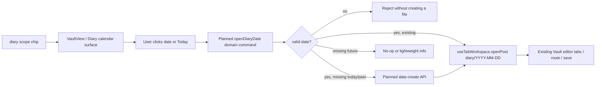
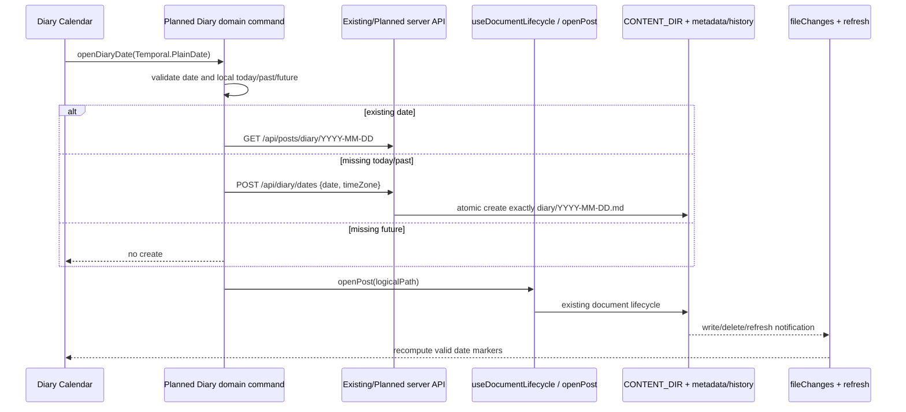
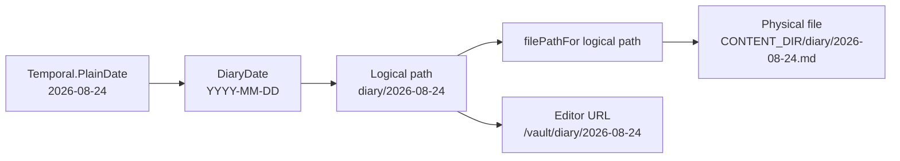

# Diary Calendar PRD

> **Historical planning document — not current runtime authority.** The
> maintained Diary authorities are [Diary Architecture](../architecture/diary.md)
> and [Diary User Guide](../user-guide/diary.md). This PRD records the earlier
> Diary planning and review lineage; it contains superseded VCalendar and
> pre-Mood/pre-encryption statements.

状态：`REVIEW-CLOSED`（PRD 本身已关闭；VCalendar `3.1.2` exact-stack gate = `PASS / REVIEW-CLOSED`；D3.0 post-closure compatibility regression follow-up = `REVIEW-CLOSED`；D3.2 Calendar-first surface、D4 editor/lifecycle integration 已完成实现并分别 `REVIEW-CLOSED`；D5 = `REVIEW-CLOSED`，base implementation/test commit 为 `adfd010e914c6572f33eceb5a5ea778ef0014c39`，responsive P1 fix 为 `05906f9`，docs follow-up 为 `f64c4ac`，final independent re-review P0/P1/P2 = 0/0/0；Diary Calendar MVP = `COMPLETE / REVIEW-CLOSED`）

PRD review status：`P0 = 0`、`P1 = 0`、`P2 = 0`。PRD contract 与 D3.0 compatibility evidence 已分开记录；D3.0 gate result 为 `PASS`，D3.0 closure 已完成。

当前实施状态：`D0 = REVIEW-CLOSED`；`D1 = REVIEW-CLOSED`（implementation commit：`d0a5d4e82e930445bd9e549e27d39e8c18b30819`；独立 review：P0 = 0、P1 = 0、P2 = 0）；`D2 = REVIEW-CLOSED`（implementation commit：`bb32349247914061e6ad71989538c995028faeea`；generic recovery provenance follow-up：`acaf548c048c2948de726208ea4d2a1c1c9b3be3`；ordinary-content → `diary/*` destination regression follow-up：`e971440ef5da8df16e9604d2bd4244f31da8e8e9`；独立复审最终 P0 = 0、P1 = 0、P2 = 0）；`D3.0 = REVIEW-CLOSED`（Implementation commit：`106e9ac601c4949a692dd4b11401786602d1a33c`；exact candidate：`v-calendar@3.1.2`；gate result：`PASS`；独立 review：P0 = 0、P1 = 0、P2 = 0；证据见 [`diary-vcalendar-compatibility-report.md`](./diary-vcalendar-compatibility-report.md)）；`D3.0 post-closure compatibility regression follow-up = REVIEW-CLOSED`（fix commit：`ed47c94`；independent re-review：P0 = 0、P1 = 0、P2 = 0）；`VCalendar runtime compatibility gate = PASS / REVIEW-CLOSED`；`D3.1 = REVIEW-CLOSED`（implementation commit：`931828da31166d68cb7897343c695a761bf6fc80`；year 0000–0099 Date bridge follow-up：`67d7858edcd0969b81ff2f6969e029a969526be9`；adapter contract validation PASS；独立 review：P0 = 0、P1 = 0、P2 = 0）；`D3.2 = REVIEW-CLOSED`（implementation commit：`8edeff251e7957f52fd88ae6971f403ebcf353f6`；destination namespace blocker follow-up：`e971440ef5da8df16e9604d2bd4244f31da8e8e9`；self-review P0 = 0、P1 = 0、P2 = 0；independent review PASSED，P0 = 0、P1 = 0、P2 = 0）；`D4 = REVIEW-CLOSED`（implementation commit：`43b41199a188f0c530a20f7ddf739f998e4bb979`；compatibility workaround follow-up：`ed47c94`；code/runtime/docs review：P0 = 0、P1 = 0、P2 = 0）；`D5 = REVIEW-CLOSED`（base implementation/test commit：`adfd010e914c6572f33eceb5a5ea778ef0014c39`；responsive P1 fix：`05906f9`；docs follow-up：`f64c4ac`；final independent re-review P0/P1/P2 = 0/0/0）。Diary Calendar MVP = `COMPLETE / REVIEW-CLOSED`；GitHub status queried; no checks available。D2 server contract 仍 REVIEW-CLOSED；D3.1 adapter、D3.2 Calendar-first surface 与 D4 Vault lifecycle integration 已完成并独立 closure，D5 release evidence 已完成。

日期：2026-08-24
范围：Diary 产品模型、存储协议、日历交互、编辑器复用与实施边界

## 1. 摘要

Diary 不是另一套编辑器，也不是把笔记改造成传统的日记列表。它是 Nuvyn `diary` scope 的日期入口：用户通过一个轻量日历查看哪些日期已经有内容，点击日期后进入现有 Vault 编辑流程。

核心定义：

> Diary 以日期作为文档身份，以日历作为导航，以现有 Markdown 文档生命周期作为唯一的读写、历史与恢复通道。

每个日期最多对应一个 Diary 文档。日期文档使用稳定、可推导的路径：

| 层级 | 约定 |
| --- | --- |
| 日历日期 | `YYYY-MM-DD`，使用 `Temporal.PlainDate` 表达日期值 |
| Nuvyn logical path | `diary/YYYY-MM-DD`，不带 `.md` |
| 磁盘物理路径 | `CONTENT_DIR/diary/YYYY-MM-DD.md` |
| 编辑器 URL | `/vault/diary/YYYY-MM-DD` |
| 日历标记 | 每个有效日期一个 VCalendar attribute/dot；Diary 不是 event calendar |

`diary/` 根目录是 Nuvyn 保留的固定功能根目录；它不能被用户重命名、删除、移动或 re-parent。根目录下的有效内容是日期文档，而不是任意文件夹树。

Diary 的产品限制是日期领域规则，不是新的文件系统权限模型。所有 path traversal、绝对路径、root escape、symlink/junction confinement、auth、CSRF/origin、原子写入、锁、history、draft recovery 等安全与可靠性边界继续由现有 Nuvyn 机制负责。

## 2. 目标与非目标

### 2.1 目标

- 在 `diary` scope 提供 Calendar-first 的日期导航。
- 桌面端和移动端都使用月视图；通过外层布局和紧凑日期单元格适配屏幕宽度。
- 用低干扰的点/标记表示已有 Diary 日期。
- 点击今天、过去日期或已有未来日期时，复用现有编辑器打开逻辑。
- 今天或过去日期没有文档时，可以创建当天/补记文档。
- 缺失的未来日期不创建文档；已有的未来日期仍可打开和编辑。
- 通过严格日期路径保证“一天一个文档”，不使用 `-2`、`-3` 等 collision suffix。
- 让 Diary 文档继续使用现有 editor tabs、save、history、draft recovery、delete 与 selection 生命周期。
- 将 Diary 规则同时落实到 UI、server/API、AI 工具边界，避免只做前端限制。
- 保留文件树作为现有内容的可见和清理入口；Calendar 不吞掉 Nuvyn 原有的文件管理能力。

### 2.2 非目标

- 不实现独立的 `DiaryEditor`、`DiarySave`、Diary history 或 Diary recovery。
- 不引入数据库日记记录、UUID diary entity 或第二套文档身份系统。
- 不实现重复日记、周期日记、提醒、情绪/天气字段、日历 event 编辑、拖拽改期或 resize。
- 不实现 mood picker、emoji picker、MoodKey enum、情绪统计、趋势、AI sentiment 或 mood heatmap；只在 domain model 中预留未来扩展 seam。
- 不实现 `diary/year/month` 或任意嵌套 Diary 文件夹。
- 不把 Markdown 文件扩展名暴露到 Nuvyn logical path 或 URL。
- 不改变 `note` scope；`note` 仍只包含 `inbox`、`literature`、`archive`，`diary` 继续是独立 scope。
- 不改变 Archive Soft-Policy、`useArchiveNote()` 默认目标、archive collision handling 或 protected roots 的既有语义；本 PRD 只新增/明确 Diary 的根目录契约。
- 不放宽现有 filesystem、auth、history、recovery 安全边界。
- 本阶段不安装依赖、不修改生产代码、不修改测试实现；下文的 API、组件和文件名是后续实现提案。

## 3. 仓库现状审计

### 3.1 当前已存在的 Diary 能力

初始审计时仓库没有 Diary domain、日期协议、Calendar 页面或 Diary API；D1/D2 已建立 shared Diary domain 与 server mutation/date-create contract，D3.0 已完成并 REVIEW-CLOSED 的隔离 Calendar compatibility gate，D3.1 已新增并验证纯 presentation adapter，D3.2 Calendar-first production surface 与 D4 editor/lifecycle integration 均已实现并 REVIEW-CLOSED，D5 release evidence 与最终 independent re-review 也已完成。Diary Calendar MVP 当前为 COMPLETE / REVIEW-CLOSED；未来 Diary 方向仍保持 non-MVP / NOT STARTED：

审计确认：`diary` 是独立 scope，`ledger` 也是独立 scope；ledger 不属于 Diary 或 note，本次不改变其语义。

| 位置 | 当前事实 | 对本 PRD 的影响 |
| --- | --- | --- |
| [`shared/scopeProtocol.ts`](../../shared/scopeProtocol.ts) | `diary` scope 已映射到 `['diary']`；`note` 仍映射到 `['inbox', 'literature', 'archive']` | 不需要改变 scopeProtocol；后续只增加 Diary domain 规则 |
| [`src/components/NavBar.vue`](../../src/components/NavBar.vue) | 已有 diary scope chip | 复用现有 scope 入口，不新建平行导航体系 |
| [`src/components/vault/icons.ts`](../../src/components/vault/icons.ts) | 已有 diary icon | 可复用现有视觉系统 |
| [`src/components/vault/FileTree.vue`](../../src/components/vault/FileTree.vue) | 当前 tree 通过 shared root protocol 保护已有系统 roots；root drop、folder re-parent 和 Diary namespace destination 也有 defensive guard | Diary Calendar 不替换 FileTree；Diary UI guard 与 server/domain authority 必须一致执行 |
| `src/components/`、`src/views/`、`src/composables/` | 已有 `DiaryCalendar.vue` adapter、D3.2 `DiaryCalendarSurface.vue`/Vault scope wiring 与 D4 `openDiaryDate` orchestration；没有 Diary-specific editor | D4 复用现有 editor/lifecycle，不复制编辑器生命周期 |
| `src/content/` | 运行时 `CONTENT_DIR` 由统一 startup seed 确保包含 `diary/`；不是依赖静态 content fixture | `diary/` 已纳入固定根目录初始化，dev/prod 复用同一 helper |
| `package.json` / `package-lock.json` | D3.0 已按 exact registry resolution pin `v-calendar@3.1.2` 与 `@popperjs/core@2.11.8`；没有 Schedule-X；Nuvyn resolved stack 为 Vue 3.5.35、Vite 8.0.16、TypeScript 6.0.3 | 兼容性依赖已获 D3.0 gate PASS；D3.1 adapter、D3.2 surface 与 D4 existing lifecycle integration 已完成，未新增 dependency |

### 3.2 路径与文件身份

[`server/paths.ts`](../../server/paths.ts) 已经定义了 Nuvyn 的核心路径边界：

- logical path 必须是相对、无前后 `/`、由合法 slug segment 组成的路径。
- `normalizeLogicalContentPath()` 会去掉一个末尾 `.md`，并继续以 extensionless logical path 作为应用层身份。
- `filePathFor(path)` 将 logical path 映射为磁盘上的 `path + '.md'`。
- `folderPathFor(path)` 映射到目录本身。
- `assertSafePath()` 以及异步 secure resolver 负责 CONTENT_DIR confinement、绝对路径拒绝、`..` 拒绝和 symlink/junction 检查。

因此 Diary 不应绕过这些 helper，也不应把 `diary/YYYY-MM-DD.md` 当作路由、编辑器 tab 或 API path。

[`server/tree.ts`](../../server/tree.ts) 会递归扫描 CONTENT_DIR，仅将 `.md` 文件暴露为 extensionless `PostSummary.path`；现有 `diary/foo.md` 若存在，目前会被当作普通文档返回。Diary 实现必须在此基础上做严格分类，而不是修改全局 `.md` 映射规则。

### 3.3 Scope、路由与编辑器生命周期

- [`src/lib/api.ts`](../../src/lib/api.ts) 的 `PostSummary.path`、`PostDetail.path`、`getPost()`、`createPost()`、`patchPost()`、`deletePost()` 都使用 extensionless logical path。
- [`src/router/index.ts`](../../src/router/index.ts) 使用 `/vault/:pathMatch(.*)*` 承载 logical path，不带 `.md`。
- [`src/views/VaultView.vue`](../../src/views/VaultView.vue) 已创建 `fileChanges`、editor tabs 和 `useDocumentLifecycle`，这些是 Calendar 打开/创建日期文档的正确接入点。
- [`src/composables/vault/editor-tabs/useTabWorkspace.ts`](../../src/composables/vault/editor-tabs/useTabWorkspace.ts) 的 `openPost()`、`refresh()`、路径迁移和 active route 更新可以直接服务 Diary。
- [`src/composables/vault/useDocumentLifecycle.ts`](../../src/composables/vault/useDocumentLifecycle.ts) 已覆盖 create、rename、delete、folder lifecycle、draft/recovery、tab selection 等通用流程。Diary 不应复制这些流程。
- [`src/composables/vault/context/fileChanges.ts`](../../src/composables/vault/context/fileChanges.ts) 已提供 write/delete/rename 通知和 refresh 协作点，Calendar 的日期标记应由现有 refresh/file change 结果驱动。
- [`src/composables/vault/draft-recovery/serverDocumentResolver.ts`](../../src/composables/vault/draft-recovery/serverDocumentResolver.ts) 以稳定 document ID 找回当前 path；Diary 仍然遵守这一约定。

### 3.4 Server、seed 与通用 mutation

| 位置 | 当前事实 | Diary 设计约束 |
| --- | --- | --- |
| [`server/seed.ts`](../../server/seed.ts) | `INITIAL_FOLDERS` 已包含 `inbox`、`literature`、`archive`、`diary`；`ensureInitialFolders()` 幂等创建四个根目录，遇到同名文件保留冲突告警且不覆盖 | 固定根目录初始化已落地，必须继续保持幂等与 no-overwrite |
| [`server/prod.ts`](../../server/prod.ts) | 生产启动在接受请求前调用 `ensureInitialFolders(CONTENT_DIR)` | 生产根目录初始化与 dev 共用同一 helper |
| [`server/vite-plugin.ts`](../../server/vite-plugin.ts) | Vite dev 启动也在 auth、recovery、metadata 扫描前调用同一个 seed helper | dev/prod root initialization 已一致，避免开发环境缺少 `diary/` |
| [`server/documentMutationPolicy.ts`](../../server/documentMutationPolicy.ts) | 共享 policy 按 exact protected root 保护 `inbox`、`literature`、`archive`、`diary`；managed Diary 的 identity-changing mutation、generic create 和无 provenance generic recovery 被拒绝，managed edit/delete 保持普通生命周期；archive descendants 已是普通内容 | Diary root contract 与 Diary domain guard 已由 server authoritative policy 执行；不恢复 archive subtree gate |
| [`shared/archiveProtocol.ts`](../../shared/archiveProtocol.ts) | `PROTECTED_ROOTS` 已包含 `inbox`、`literature`、`archive`、`diary`；`isInArchive()` 不代表 readonly；`canMove()` 是 root-policy predicate，不是实体 move capability | 保持四个 system roots；不改变 archive soft-policy，也不把 ledger 加入 note scope |
| [`server/routes/diary.ts`](../../server/routes/diary.ts) | `POST /api/diary/dates` 是唯一 Diary date-create command，按严格日期、local timezone、one/day、future/no-suffix 和 atomic concurrency contract 工作 | Diary identity 必须由 date command 推导，不能由 generic path/title/API 绕过 |
| [`server/routes/posts.ts`](../../server/routes/posts.ts) | 通用 POST/PUT/PATCH/DELETE/recover 仍复用普通文档生命周期，但共享 policy 会阻止 Diary generic create、managed rename/move 和无 prior-identity proof 的 generic recovery；History Restore 仅在 Git historical content provenance 成立后恢复 exact path | Diary 允许 managed edit/delete，身份变更和旁路创建/恢复必须 server-side 拒绝 |
| [`server/routes/folders.ts`](../../server/routes/folders.ts) | 创建文件夹、同父目录 rename、递归删除和现有 transaction 保持不变；Diary 下 nested folder create 被拒绝；不支持通用跨父目录 folder re-parent | Diary root 仍不可 rename/delete/move，Diary 不建立文件夹树 |
| [`server/ai/tools.ts`](../../server/ai/tools.ts) | AI document mutation tools 复用共享 path/mutation policy；没有 folder mutation 工具，也没有 Diary identity 绕过入口 | generic AI 工具不得成为 Diary domain guard 的旁路 |

当前 `archive` root 的保护仍由 [`shared/archiveProtocol.ts`](../../shared/archiveProtocol.ts) 等现有规则负责；本 PRD 不改变 Archive Soft-Policy 的结果：archive descendants 仍按普通用户内容处理，Archive action 仍默认写入 `archive/<filename>`。

当前 D2 已将 `diary/` 纳入既有 root initialization，并由 server-authoritative root/mutation policy 阻止 generic folder/document/recovery API 绕过 Diary date identity；History Restore 只有在 Git historical content provenance 成立后才能恢复缺失的 managed path。Diary root 仍是保留 system root。D3.0 compatibility gate 已通过并 REVIEW-CLOSED；D3.1 adapter 与 D3.2 Calendar UI surface 已完成并独立 closure；D3.2 = REVIEW-CLOSED；D4 editor/lifecycle integration 已实现并独立复审关闭为 `REVIEW-CLOSED`；D5 = `REVIEW-CLOSED`（base implementation/test commit：`adfd010e914c6572f33eceb5a5ea778ef0014c39`；responsive P1 fix：`05906f9`；docs follow-up：`f64c4ac`；final independent re-review P0/P1/P2 = 0/0/0）；Diary Calendar MVP = `COMPLETE / REVIEW-CLOSED`。

### 3.5 文档与现有生命周期契约

- [`docs/user-guide/vault.md`](../user-guide/vault.md) 已明确 `.md` 只存在于磁盘，Nuvyn path/URL 不带扩展名，并记录 protected roots、Archive soft policy 与 folder re-parent 当前不支持。
- [`docs/architecture/document-lifecycle.md`](../architecture/document-lifecycle.md) 已将 mutation、metadata stable ID、folder rename journal、history、recovery 和 archive protocol 定义为现有生命周期契约。
- [`docs/architecture/storage.md`](../architecture/storage.md)、[`docs/architecture/edit-and-save.md`](../architecture/edit-and-save.md)、[`docs/architecture/security.md`](../architecture/security.md) 分别约束 Markdown/SQLite/Git storage、保存与 draft recovery、auth/path/atomic safety。

Diary 应作为这些架构的一个领域入口，而不是创建第二套持久化和编辑生命周期。

## 4. 产品模型

### 4.1 Diary 根目录

`diary/` 是固定的 Nuvyn system root：

| Operation | `diary/` root |
| --- | --- |
| list/read | YES |
| Calendar date command 创建有效日期文档 | YES |
| generic New File | NO |
| generic New Folder | NO |
| rename root | NO |
| delete root | NO |
| move/re-parent root | NO |
| 作为任意普通文件夹被移入/移出 | NO |

禁止 generic New File/New Folder 是为了保证 `diary/` 下不会重新出现不满足日期协议的内容；这不是 filesystem readonly，也不影响通过 Calendar 创建日期文档。

### 4.2 Diary Day domain model

Calendar 展示的不是 Event，而是日期状态。Nuvyn domain 应保持一个不依赖 UI library 的概念模型：

| Domain field | MVP | Future-compatible |
| --- | --- | --- |
| `date: DiaryDate` | YES | YES |
| `hasDiary: boolean` | YES | YES |
| `mood?: MoodKey` | NO | reserved only |
| `moodAsset?` | NO | reserved only |
| `summary?` | NO | reserved only |
| `wordCount?` | NO | reserved only |

可用概念类型表示为 `DiaryDay = { date: DiaryDate, hasDiary: boolean, mood?: MoodKey }`。这不是当前实现接口；它用于说明 domain 与 Calendar adapter 的边界。MVP 只计算 `date` 和 `hasDiary`，未来字段不能扩大当前实现范围。

### 4.3 有效 Diary 日期文档

有效 managed Diary document 的 path 必须严格满足：

`diary/YYYY-MM-DD`

其中：

- `YYYY` 为四位年份。
- `MM` 为两位月份，范围 `01`–`12`。
- `DD` 为两位日期，必须是该月实际存在的日期。
- 必须通过 `Temporal.PlainDate` 的日历日期解析与 round-trip 校验；例如 `2026-02-31`、`2026-2-3`、`diary/foo`、`diary/2026-08-24-extra` 均无效。
- `diary/2026-08-24.md` 在应用层应规范化为 `diary/2026-08-24`，但 UI、URL、API response 和 editor tab 不显示 `.md`。
- `diary` 下不允许 `year/month` 子目录或日期之外的 nested folder。

日期是文档身份；Markdown title、frontmatter title、summary、tags 等元数据可以编辑，但不能改变该文档对应的日期 path。

### 4.4 有效文档的能力矩阵

| Operation | `diary/YYYY-MM-DD` |
| --- | --- |
| read/open | YES |
| edit content | YES |
| edit title/summary/tags metadata | YES；不能改变日期 path |
| delete | YES；走普通 delete、history、draft recovery 和 current-selection 流程 |
| rename | NO |
| move within `diary` | NO |
| move into/out of `diary` | NO |
| create child file/folder | NO |
| drag/re-parent | NO |
| 通过 Calendar 创建 | 仅 today/past 的缺失日期 YES |

这里的 rename/move 禁止是 Diary 的日期身份约束，不是 archive-style subtree readonly。Diary 文档仍可读、写、删，仍是普通 Markdown 文档，且必须保留现有 editor/history/recovery 安全边界。

### 4.5 无效或外部遗留内容

如果在实现前或实现后，磁盘上已有 `diary/` 下不满足日期 schema 的文件，例如 `diary/legacy.md` 或 `diary/2026/08/24.md`：

- 不自动删除、不自动重命名、不自动归并、不自动改造成日期文档。
- 不自动追加 `-2`、`-3`，也不让它覆盖有效日期文档。
- 文件树/通用 posts listing 可以继续显示它，保证数据可见和可清理。
- Calendar 只把严格有效的 `diary/YYYY-MM-DD` 纳入日期标记；无效内容不应污染日历。
- 后续 domain guard 不得把无效遗留文件静默“提升”为 managed Diary document。
- 是否在 Diary UI 显示低噪音的“未归档 schema 内容”计数/入口，列为实现阶段的产品选择；不做 modal 或阻断式迁移。

这使 schema 迁移具有可逆性，也避免为了得到干净日历而破坏用户已有文件。

### 4.6 Future Enhancements：Mood Diary

未来可让一个日期同时表达“是否写过 Diary”和“当天是什么心情”，形成 date-centric 的 monthly emotional timeline：

```text
DiaryDate
  └── Diary Document
        └── Metadata
              └── MoodKey
```

例如：

```text
2026-08-24
  path: diary/2026-08-24
  hasDiary: true
  mood: happy
```

未来日历单元格可以从：

```text
24 ●
```

升级为：

```text
24 😊
```

但 Mood identity 与 Diary identity 必须分离：

- Diary identity 永远来自 `DiaryDate` 和 `diary/YYYY-MM-DD`。
- 禁止把 mood 写入 filename，例如 `diary/2026-08-24-happy.md`。
- storage value 推荐使用稳定的 `MoodKey`，例如 `happy`、`calm`、`sad`、`angry`、`tired`，不要把 emoji 本身作为业务身份。
- UI 可以将 `happy` 映射为 `😊`，未来也可以换成 SVG、主题图标、自定义表情或多语言文案，而无需迁移 Diary path。
- Mood storage location 暂不定案；实现时优先复用 Nuvyn 现有 metadata architecture，不建立独立 Mood DB。

Mood picker、emoji selection、custom mood、统计、趋势、sentiment AI 和 heatmap 都不属于当前 MVP，也不进入 D1–D5 的实现验收。

## 5. 日期状态与创建规则

### 5.1 日期来源

Diary 是 date-only 产品，不是带时区的时间事件：

- 用户当前日期取浏览器/客户端本地 civil date。
- 使用 `Temporal.Now.plainDateISO()` 或等价的本地 `Temporal.PlainDate` 获取“今天”。
- 禁止通过 `new Date().toISOString().slice(0, 10)` 推导用户的今天；UTC 日界线可能把内容创建到错误日期。
- 日历显示和 path identity 均使用 `Temporal.PlainDate`/`YYYY-MM-DD`，不做 midnight timestamp 转换。
- 创建请求应携带浏览器的 IANA time zone，例如 `Asia/Shanghai`，供 server 判断 future；time zone 是产品输入，不是 auth 或 filesystem security 边界。

### 5.2 状态机

| 用户动作 | 日期状态 | 结果 |
| --- | --- | --- |
| 点击今天 | 文档已存在 | 打开 `diary/YYYY-MM-DD` 对应 path |
| 点击今天 | 文档不存在 | 创建一次并打开 |
| 点击过去日期 | 文档已存在 | 打开 |
| 点击过去日期 | 文档不存在 | 创建一次并打开，作为补记 |
| 点击未来日期 | 文档已存在 | 允许打开、编辑或删除；不因 future 身份冻结 |
| 点击未来日期 | 文档不存在 | 不创建；轻量提示或无操作，不弹确认 modal |
| 重复点击已有日期/并发创建 | 文档已存在或 create race | 打开同一个 `diary/YYYY-MM-DD`；不产生第二个文件、不加 suffix |

`openDiaryDate(date)` 是后续实现中建议的单一入口。它先将 `PlainDate` 转换为 logical path，查询/创建符合上述状态，然后调用现有 `openPost()`。任何 Calendar slot、日期单元格、agenda row 或 Today 控件都不得各自复制一份创建判断。

### 5.3 创建内容与幂等性

当前通用 `POST /api/posts` 的默认 body 是 `# ${title}\n`。Diary MVP 建议沿用这一既有行为，以 `# YYYY-MM-DD\n` 作为新日期文档的初始内容，不另建 template engine；空文档作为替代方案留在实现评审中。

Diary 创建必须是 create-only：

- 目标固定为 `diary/YYYY-MM-DD`。
- 已存在时返回该文档，不创建新文件。
- 并发请求只有一个物理 create；失败方重新读取同一 logical path 后打开。
- 不使用 Archive 的 `uniqueMoveTarget` 或 `-2`/`-3` collision suffix。
- invalid date、future missing date、nested path 和任意 filename 都应在 domain 层明确拒绝，不退化为普通 generic create。

## 6. Calendar 交互方案

### 6.1 视图选择

Diary 选择 VCalendar 作为 MVP 的 Calendar presentation library。Diary 不是 Event Calendar，Calendar 只需要表达：

- month navigation
- day cells
- day click
- today state
- existing Diary indicator
- optional future custom day rendering

桌面端和移动端都使用 VCalendar 的 monthly view：

- Desktop：按月展示，日期格显示一个轻量 `●`。
- Mobile：仍是月视图，通过外层宽度、`expanded`/单列布局、紧凑日期 cell 和 touch target 适配，不人为引入第二种 agenda 视图。
- MVP 不需要 time slots、duration、recurrence、drag scheduling、resize 或 event card。

VCalendar v3 官方文档说明内置 `$screens` 响应式 helper 已移除；后续应由 Nuvyn 外层 CSS/media query 或已有 screen utility 决定 `expanded`、rows/columns 和容器宽度。当前不新增 responsive plugin 依赖。日期 cell 的最小触控区域由 Nuvyn UI contract 负责，目标为至少 44×44 CSS px；如果实际布局无法满足，应优先收缩装饰而不是把点击区域做小。

### 6.2 Domain、view model 与 Calendar adapter

Calendar library 只能存在于 presentation adapter 层：

```text
Diary domain
  └── DiaryDate / DiaryDay
        └── Diary Calendar view model
              └── DiaryCalendar.vue
                    └── VCalendar
```

建议的 `DiaryCalendar.vue` 职责：

- 接收 `DiaryDay[]`、当前本地日期和 locale/display settings。
- 将 `DiaryDay` 映射为 VCalendar `attributes`。
- 用 `dot` 表示 `hasDiary: true`，用独立的 today presentation 表示今天。
- 负责 month navigation、today control、VCalendar `dayclick` 适配和 `date-selected` emit。
- 允许未来通过 `day-content` 或当时官方等价 slot 增加 Mood/summary 内容。

它不负责：

- create Diary
- save/delete Diary
- filesystem、metadata、history、recovery
- Editor tabs、route 或 active document
- future 判断或权限判断

它只向上层发出经过本地日期 adapter 处理的 `date-selected(DiaryDate)`。Calendar library 是可替换的 presentation infrastructure；未来换成 Nuvyn 自研 Calendar 不应修改 Diary filename protocol、DiaryDate、open/create workflow、server invariant 或 Editor lifecycle。

### 6.3 Attributes、dots 与数据来源

Calendar 的 source of truth 仍是 Nuvyn posts/tree 数据，而不是 VCalendar 自己的存储：

1. 通过现有 `listPosts()`/tree refresh 获得所有 logical paths。
2. 过滤严格合法的 `diary/YYYY-MM-DD`，构造 `Set<DiaryDate>`。
3. 生成 `DiaryDay[]`；MVP 只填充 `date` 与 `hasDiary`。
4. `DiaryCalendar.vue` 将每个 `hasDiary` 日期映射为一个 VCalendar attribute：`dates` 指向对应的本地 calendar date，`dot` 使用轻量颜色/样式，`customData` 保存 `DiaryDay` 供 adapter 事件和未来 slot 使用。
5. today highlight 是独立的 presentation attribute，不改变 `hasDiary` 语义。
6. MVP 优先使用 VCalendar 原生 `dot`/attribute，不直接重写整个 day cell；未来 Mood 才评估 `day-content` custom rendering。

MVP 的视觉语义是：

```text
没有 Diary：24
有 Diary： 24 ●
未来 Mood：24 😊（仅架构预留，不在 MVP）
```

不显示 `[Diary]` event card，也不把一个 Diary 映射成 all-day event。VCalendar 官方 attributes 支持 `dot`、`highlight`、`content`、`customData`、`dates` 和 `order`，足以表达当前的日期状态。

当 Nuvyn refresh 或 `fileChanges` 反映有效 Diary 文档创建/删除后，只需重新计算 `DiaryDay[]`/attributes。Calendar adapter 不拥有第二份 Diary state，也不新增 event bus。

### 6.4 Date adapter、Today 与日期导航

- Diary domain 继续推荐 `Temporal.PlainDate` 或严格的 `DiaryDate` abstraction；VCalendar 的 `CalendarDay`/attribute API 当前使用 JavaScript `Date`、string 或 number，因此必须存在显式 Calendar date → DiaryDate adapter。
- adapter 从 VCalendar 回调的本地 calendar fields 生成 `YYYY-MM-DD`，再进行 DiaryDate validation；禁止通过 `Date.toISOString()` 或 UTC serialization 转换。
- Today 控件使用本地 civil date，调用 VCalendar instance 的 `move(localDate)`/`focusDate(localDate)` 或等价的当前官方 API；它只移动/聚焦日历，不创建文档。
- URL 只有用户打开文档后才进入现有 `/vault/diary/YYYY-MM-DD` editor route；单纯浏览月份不应制造文档或改写 active document。
- VCalendar 的 `dayclick`、dot/attribute 所在日期和 day-content 未来自定义区域最终都归一到同一个 `date-selected(DiaryDate)`。
- 点击没有文档的 today/past 日期才触发 domain create；浏览月份、点击导航箭头或切换页面不触发 create。
- VCalendar 的 `did-move`/`update:pages` 只用于视图状态或可选的性能优化；MVP 不需要单独的 `/api/diary/range`。

### 6.5 Locale、navigation 与 accessibility

- 使用 VCalendar 的 `locale`、`first-day-of-week` 和 `masks` 与 Nuvyn 当前 locale 设置对齐；不要在 domain 中存储展示语言。
- month navigation 使用 VCalendar 原生 header/navigation；Today 是 Nuvyn 提供的明确 action，可放在 Calendar footer 或外部 toolbar。
- 保留 VCalendar 的 day focus/keyboard navigation，并确保 `●` 不承担唯一语义：day cell 应有“YYYY 年 M 月 D 日，已写日记/无日记”的可访问名称。
- Calendar wrapper 应提供稳定宽度；mobile 端使用单月、单列、expanded 的布局策略，避免横向滚动和过小的触控目标。
- 上述产品与 presentation 设计不等于 VCalendar 已获 runtime approval；完整 Calendar integration 必须先通过第 9.3 节的 exact-stack compatibility gate。

## 7. 编辑器与生命周期集成

Diary 的实现边界应是：Calendar 提供日期导航，Vault 提供文档生命周期。



后续实现建议复用以下 seam：

- Calendar surface 放入现有 `VaultView`/scope 工作流，或作为 diary scope 的子视图；不建立平行 editor shell。
- 日期 command 最终调用 `useTabWorkspace.openPost(logicalPath)`，让 route、active tab、document metadata 与 refresh 走现有逻辑。
- 创建可通过 `useDocumentLifecycle.createFile()` 参与现有 fileChanges、refresh、history/recovery；若 server domain endpoint 返回已创建/已存在的 post，客户端仍只调用一次生命周期入口。
- 编辑直接使用现有 Monaco/document save、compare-base、lock、atomic write、metadata stable ID。
- 删除使用 `useDocumentLifecycle.deleteFile()`，保留 draft recovery、history/quarantine、关闭当前 tab 和 active selection 更新。
- 不增加 Diary 专属 rename/move UI；有效 Diary path 的 path identity 不可变。
- 文件树继续可以显示和清理内容；Calendar 是日期导航，不是另一份内容列表。

典型数据流如下：



日历 attributes 更新必须服从 fileChanges/refresh 的真实结果；不能在 create API 请求发出后就乐观地永久添加 marker，也不能绕过 history/recovery。

## 8. Proposed domain protocol 与 API

本阶段只写协议，不实现。后续实现应将日期规则集中在 `shared/diaryProtocol.ts`（名称可在 implementation plan 中微调）并与现有 path/root policy 叠加：

### 8.1 Diary protocol 职责

- 判断 `diary` root、valid managed date path、invalid/unmanaged descendant。
- 将 `Temporal.PlainDate` 与 logical path 双向映射。
- 验证严格 `YYYY-MM-DD` 和真实 calendar date。
- 判断 root、managed date、nested folder/invalid child 的操作边界。
- 提供 domain reason/code，供 server/UI 生成清晰的非 archive-specific 错误。
- 不代替 `server/paths.ts` 的 confinement、secure resolver 或 `documentMutationPolicy` 的 auth/security checks。

建议的概念映射：



### 8.2 推荐的日期创建 API

推荐新增一个小的 domain endpoint，而不是把 Calendar 的创建语义伪装成通用 `POST /api/posts`：

`POST /api/diary/dates`

request 概念字段：

- `date`: `YYYY-MM-DD`。
- `timeZone`: 浏览器当前 IANA timezone，例如 `Asia/Shanghai`。

行为约定：

- valid today/past 且不存在：原子创建并返回 `201`、`created: true` 与 `PostSummary`。
- valid today/past 且已存在：返回 `200`、`created: false` 与现有 `PostSummary`。
- 两个请求并发创建同一天：只允许一个物理文件；竞争失败的一方重新读取并按“已存在”返回，不产生 suffix。
- valid future 且不存在：返回可区分的业务错误，例如 `422`/明确 reason；不创建。
- invalid date、nested path 或非日期输入：返回 `400`/明确 validation reason。
- root、auth、path confinement、CSRF/origin、atomic create 和 metadata/history 等仍由现有 server boundary 负责。

> `GET /api/posts` 仍可作为 MVP 的日期标记数据源。只有在 posts 数量或 range performance 证明需要时，才增加 `GET /api/diary/range?from=...&to=...`；不要在第一版同时维护两套列表一致性。

### 8.3 通用 API 的防旁路规则

后续 server 实现需在 mutation route 和共享 validation 层落实，而不能只隐藏菜单：

| Entry point | Diary 规则 |
| --- | --- |
| generic `POST /api/posts` | 拒绝在 `diary/` 下创建任意 filename；有效日期创建走 domain endpoint |
| `PUT /api/posts/diary/YYYY-MM-DD` | 允许内容编辑；path 不变 |
| `PATCH /api/posts/diary/YYYY-MM-DD` with `name` | 拒绝；日期是 identity |
| `PATCH /api/posts/diary/YYYY-MM-DD` with `targetPath` | 拒绝；不允许 move in/out 或 within diary |
| `DELETE /api/posts/diary/YYYY-MM-DD` | 允许，走现有 delete lifecycle |
| `POST /api/folders` under `diary` | 拒绝新建子文件夹 |
| folder root rename/delete/move | `diary` root 与现有 protected roots 一样拒绝 |
| AI generic create/rename/move | 不得成为旁路；复用同一 domain validation |
| AI edit/delete existing managed date | 可以按普通文档生命周期允许，继续经过 tool safety/auth/locks |

如果后续要让 AI “写今天日记”，应新增一个复用同一 Diary domain service 的高层命令，而不是放宽 generic `create_file`。

## 9. Calendar Library Evaluation

### 9.1 ADR 决策

**Decision：VCalendar 是 MVP 的 preferred candidate；`v-calendar@3.1.2` 的 D3.0 mandatory exact-stack compatibility gate 已通过且 REVIEW-CLOSED；D3.0 post-closure compatibility regression 已通过 presentation ownership workaround 修复并 REVIEW-CLOSED；D3.1 presentation adapter、D3.2 production surface 与 D4 lifecycle integration 均已 REVIEW-CLOSED；D5 首轮 responsive P1 已由 `05906f9` 修复，最终 independent re-review P0/P1/P2 = 0/0/0，D5 = `REVIEW-CLOSED`；Diary Calendar MVP = `COMPLETE / REVIEW-CLOSED`。**

Diary 的数据模型是 Date → Diary exists?，不是带 start/end/duration/resize/recurrence 的 Event。VCalendar 的 date-centric attributes 更贴合某天是否存在内容的状态表达，也更自然地为未来 Mood day-cell rendering 留出空间。

| Library | Fit | Trade-off | Decision |
| --- | --- | --- | --- |
| VCalendar | Date attributes、dots、customData、day-content 和月视图直接对应 DiaryDay | VCalendar 使用 JavaScript Date/string；需要本地日期 adapter，响应式布局由外层负责；D3.0 已在 Nuvyn exact stack 验证通过并 REVIEW-CLOSED；D3.1 adapter 已完成独立 review closure | Preferred candidate for MVP; gate PASS, D3.1 REVIEW-CLOSED |
| Schedule-X | 技术上可实现 Calendar 导航 | Event scheduling abstraction 超出 MVP；不需要 time slots、duration、drag、recurrence；未来 Mood 更需要 date-cell rendering | Rejected / not selected for MVP |
| FullCalendar | 成熟的日历与事件生态 | 同样偏 event-centric，产品表面积和事件语义超过 Diary 需要 | Not selected |
| Custom Nuvyn Calendar | 可完全控制 EMMO/Mood cell、视觉和交互 | 当前没有必要承担自研 Calendar 的实现与可访问性成本 | Future possibility |

Schedule-X 不是技术不可行，而是当前 Diary MVP 的 abstraction 偏重。若 Diary 将来演化成 Daily Planner 或 full Event Calendar，再重新评估 Schedule-X 等 event-oriented library。

### 9.2 当前官方 VCalendar 能力核对

本审计以当前官方文档为准，不锁死易过期的 package version。这里必须区分 package peer compatibility 与 runtime compatibility：

- Vue compatibility：官方安装页要求 Vue.js 3.2+；这只能说明 Vue peer/dependency-resolution 方向覆盖 Vue 3.5，不能证明 Nuvyn 当前 Vue 3.5.x + Vite 8 + TypeScript 6 的 runtime、build 或 test 已兼容。
- Package requirements：官方安装页列出 v-calendar 与 @popperjs/core，并要求显式导入 v-calendar/style.css。D3.0 已核对 registry dist-tags、Vue 3 line、peerDependencies 和 maintenance 信息，并明确 pin `v-calendar@3.1.2` + `@popperjs/core@2.11.8`；没有执行无版本 `npm install v-calendar`。
- Calendar API：VCalendar 支持 monthly view、attributes、locale、timezone、initial-page、rows、columns、expanded 和 trim-weeks 等 props。
- Date click：dayclick 事件提供 CalendarDay 与鼠标事件；adapter 从 CalendarDay 的本地 fields 生成并校验 DiaryDate。
- Attributes：attribute 可使用 dates、dot、highlight、content、customData 和 order，正好覆盖 Diary existence marker 与未来 day-state 扩展。
- Custom rendering：day-content slot 可接收 day、该日 attributes 和 locale；MVP 不依赖它，未来 Mood/summary 才评估使用。
- Navigation：原生 header、prev/next buttons、move、moveBy、focusDate、did-move 和 update:pages 足以支持 month navigation 与 Today。
- Locale：locale、first-day-of-week 和 masks 可对齐 Nuvyn locale；不把 locale 复制进 Diary domain。
- Timezone：官方默认使用 browser local timezone；Diary 仍必须以 local date/DiaryDate 为身份，不能使用 UTC serialization。
- License：官方项目页面标注 MIT；实现时不引入 premium 功能或额外的事件调度层。

参考官方资料：[Installation](https://vcalendar.io/getting-started/installation.html)、[Calendar API](https://vcalendar.io/calendar/api.html)、[Attributes](https://vcalendar.io/calendar/attributes)、[Navigation](https://vcalendar.io/calendar/navigation)、[Locales](https://vcalendar.io/i18n/locales.html)、[Layouts](https://vcalendar.io/calendar/layouts) 和 [VCalendar homepage](https://vcalendar.io/)。D3.0 的实际结果与环境证据见 [`diary-vcalendar-compatibility-report.md`](./diary-vcalendar-compatibility-report.md)。

### 9.3 VCalendar Compatibility Gate

VCalendar `3.1.2` 的 D3.0 exact-stack compatibility gate 已通过且 REVIEW-CLOSED，成为 D3.1 的 approved candidate；D3.1 adapter 已实现并 REVIEW-CLOSED，独立 review P0 = 0、P1 = 0、P2 = 0。D3.0 只验证 compatibility；D3.1 只实现正式 presentation adapter，不实现 Calendar-first surface、Vault、Editor 或 lifecycle。

#### D3.0 — Exact-stack validation

进入 D3 时，必须从当时实际的 `package.json` 与 lockfile 解析 Nuvyn 的精确技术栈，而不能只写“Vue 3”：

| Toolchain | D3.0 执行时 resolved version | Evidence |
| --- | --- | --- |
| Vue | `3.5.35` | mount/runtime PASS |
| Vite | `8.0.16` | production build PASS |
| TypeScript | `6.0.3` | client typecheck PASS |
| `@vitejs/plugin-vue` | `6.0.7` | SFC transform/build PASS |
| `vue-tsc` | `3.3.3` | probe typecheck PASS |
| Vitest / jsdom | `4.1.8` / `29.1.1` | mount/unmount/reactivity PASS |

以上是 D3.0 执行 evidence；若 Nuvyn 或 VCalendar 后续升级，必须以新的 exact resolution 重新执行 gate。

在任何安装或集成动作前，D3 必须依次完成：

1. 确认官方当前 Vue 3 package line，而不是沿用 legacy Vue 2 line 或模糊 tag。
2. 检查当前 npm dist-tags 与 release 信息。
3. 检查 candidate 的 `peerDependencies`，并与上表 exact Nuvyn stack 对照。
4. 检查 candidate 的 package maintenance status 和官方安装要求。
5. 明确 candidate version/tag，并记录选择依据。
6. 只安装已明确的 candidate，例如 `npm install v-calendar@<verified-vue3-version>`；禁止执行无版本的 `npm install v-calendar`，不能让 npm 默认 dist-tag 决定 architecture。
7. 只有 candidate 需要时才按该版本官方要求加入 `@popperjs/core`；不能从旧版文档推断所有版本依赖完全相同。

随后创建一个最小、可丢弃的 compatibility spike。它不是完整 D3，也不应改变 Diary domain、server contract、editor lifecycle 或 Mood MVP 范围。Spike 至少验证：

- Calendar component mount。
- basic monthly view render。
- previous month 和 next month。
- attributes、dot indicator、customData。
- day click，以及 Calendar date → local `DiaryDate` adapter。
- `day-content` 或当时官方等价的 custom day rendering seam。
- locale、first-day-of-week/masks 所需的 locale integration。
- mobile/narrow-width render。
- dark/light appearance integration。
- Vue unmount/remount。
- reactive attributes update。
- production build。
- client typecheck。
- Vitest/jsdom component test。
- browser smoke test。

`day-content` 不是 Diary MVP 首屏 dot 的必要依赖，但它是未来 Mood day-cell rendering 的架构依据。因此，basic Calendar 能工作而 custom day rendering seam 崩溃或不可用，不能被记录为最终 `PASS`。

#### Gate result

**PASS**：candidate 能在当前 Nuvyn exact stack 稳定 mount；monthly navigation、attributes/dot、dayclick、reactive indicator、locale、narrow/mobile render、typecheck、production build、Vitest/jsdom component test 和 browser smoke 均通过；custom day rendering seam 可用；没有 blocker-level runtime crash。D3.0 本次为 `PASS / REVIEW-CLOSED`；D3.1 adapter 与 D3.2 surface 已 REVIEW-CLOSED；D3.2 独立 review 已通过，本 gate 结论不自动开始 D4。

**CONDITIONAL PASS**：基础 Calendar 与 MVP 所需能力通过，但存在已知、可界定的非 MVP 限制。只有当该限制不影响 MVP，也不破坏未来 Mood architecture 时才允许；必须记录 exact limitation、workaround 和 future impact，不能静默忽略。

**FAIL**：出现 Vue 3.5 runtime crash、mount 不稳定、attributes/dayclick 失效、custom rendering seam 不可用、typecheck integration 根本不兼容、production build blocker 或 production runtime blocker。此时停止完整 D3，新增 Calendar ADR follow-up 并重新评估候选，不为了保住 VCalendar 默认 downgrade Vue/Vite/TypeScript。

Fallback 评估顺序只能作为后续 ADR 的候选顺序，不在本 PRD 预先选 winner：

1. 当前仍在维护且与 exact stack 兼容的 VCalendar line/fork。
2. 轻量 Vue date-calendar alternative。
3. Custom Nuvyn Diary Calendar。
4. 只有 Diary 产品演化为 event/calendar scheduling 时，才重新评估 Schedule-X。

官方 repository 或 issue tracker 中关于 Vue 3.5、`day-content`、`dayIndex`、DatePicker 或 range 的报告，应先记录为 `Known Compatibility Risk` 并由 spike 复现。历史 D3.0 exact Calendar/day-content probe 未复现 upstream 报告；但 D4 production integration 后续在 click-triggered synchronous parent unmount 下复现了同类 `dayIndex` failure。该证据确认 compatibility risk class，而不武断声明与 upstream issue 具有完全相同的内部 root cause。

当前 VCalendar runtime compatibility gate 状态：`PASS / REVIEW-CLOSED`（`v-calendar@3.1.2`）。D3.0 compatibility report 已记录 exact stack、registry resolution、spike matrix、browser/timezone evidence 与 known risk；D3.0 独立 review：P0 = 0、P1 = 0、P2 = 0。D4 browser closure 后发现的 synchronous-unmount compatibility regression 已由 `ed47c94` 修复：Diary scope 内保持 Calendar mounted、workspace tab 出现时只切换 visibility；follow-up = `REVIEW-CLOSED`，独立复审 P0 = 0、P1 = 0、P2 = 0；不改变 `openDiaryDate`、tab/router/editor lifecycle、server/shared contract 或 dependency versions。GitHub status queried; no checks available；不宣称 CI PASS。

### 9.4 Compatibility validation matrix

以下是 D3.0 gate matrix；逐项执行结果见 [`diary-vcalendar-compatibility-report.md`](./diary-vcalendar-compatibility-report.md)。

| Capability | Required for MVP | Required for future Mood | Gate |
| --- | --- | --- | --- |
| Monthly render | YES | YES | PASS required |
| Prev/next month | YES | YES | PASS required |
| Day click | YES | YES | PASS required |
| Attributes | YES | YES | PASS required |
| Dot indicator | YES | NO | PASS required |
| `customData` | Preferred | YES | Validate |
| `day-content` / custom rendering | NO for first MVP | YES | PASS required before final library approval |
| Locale | YES | YES | PASS required |
| Narrow/mobile render | YES | YES | PASS required |
| Typecheck/build | YES | YES | PASS required |

### 9.5 Responsive 决策

VCalendar 的 monthly view 在 desktop 和 mobile 保持同一产品模型，不新增 Month Agenda：

- Desktop：单月 monthly view，日期 cell 有足够留白显示日期和 `●`。
- Mobile：单列、`expanded` 容器、紧凑 cell；由 Nuvyn CSS/media query 控制宽度和 typography。
- VCalendar v3 已移除内置 `$screens` helper；当前 PRD 不新增 `vue-screen-utils`，除非实现时已有 Nuvyn layout utility 无法满足需要。
- 目标 touch target 至少 44×44 CSS px；通过实际设备检查 cell、prev/next、Today 和 date click。
- 禁止横向滚动和依赖 hover 才可见的 Diary indicator。

### 9.6 计划中的依赖

D3.0 已按第 9.3 节 gate 完成依赖 resolution 并锁定：

- `v-calendar@3.1.2`
- `@popperjs/core@2.11.8`（该 candidate 的 peer dependency）

样式需要显式导入 `v-calendar/style.css`。VCalendar import 只能出现在 Calendar adapter/presentation 层；Diary domain、server、API、path protocol 和 domain tests 不得 import VCalendar。

### 9.7 风险与缓解

| 风险 | 影响 | 缓解 |
| --- | --- | --- |
| VCalendar / Vue 3.5 compatibility | Vue peer range 只说明 dependency resolution 方向；VCalendar v3.1.2 维护时间较早，且存在 Vue 3.5/dayIndex upstream reports | D3.0 exact-stack gate 已 PASS / REVIEW-CLOSED；保留 issues #1498、#1514 与 maintenance date 作为 non-blocking Known Risks；不为 Calendar integration 降级 Nuvyn core stack |
| VCalendar 使用 JavaScript Date/string | 可能发生 UTC 或本地日界线偏移 | 明确 Calendar date → local fields → DiaryDate adapter；禁止 `toISOString()` |
| v3 没有内置 `$screens` | mobile layout 不能靠 library 自动完成 | Nuvyn CSS/media query、expanded 和 touch target contract；实现阶段做真实 viewport 检查 |
| attributes 与 fileChanges 不同步 | dot 状态过期 | 以 `listPosts()`/tree refresh/fileChanges 重新生成 DiaryDay[]，不维护第二份事实源 |
| day-content 过早自定义 | MVP 复杂度和可访问性风险 | MVP 使用原生 dot；Mood 再引入 slot adapter |
| 全量 `listPosts()` 规模增长 | 月份切换与首屏成本 | MVP 复用现有 source；以真实数据量为依据再引入 range API |
| 外部 invalid diary files | 日历与文件树不一致 | 严格过滤、保留原文件、非阻断诊断 |
| generic API/AI 绕过 | 日期身份和 one/day 被破坏 | server/shared domain guard 覆盖所有 mutation entry points |
| dev/prod seed 不一致 | 开发环境无法进入 Diary | 统一调用 `ensureInitialFolders()` |

## 10. 文档、文案与可访问性

Diary 的用户文案应解释“按日期进入文档”，而不是制造第二种笔记类型：

- scope label：沿用现有 diary 文案/图标。
- 空日期或 missing today/past：可使用简短的“创建这一天的日记”文案。
- missing future：不弹确认；可使用一次性的轻量说明“未来日期尚未创建”。
- invalid unmanaged content：如果提供提示，应是低噪音诊断，不得阻塞打开、编辑或清理。
- 日历日期单元格、dot、Today、prev/next controls 都必须有可访问名称；dot 不能是唯一语义来源。
- 不为每次打开日期、保存或删除发送 advisory toast；成功/错误反馈沿用现有 Vault lifecycle。

后续实现文档应在用户指南中说明：

- Diary root 是 Nuvyn 保留目录。
- 一个有效日期对应一个 Markdown 文档。
- Nuvyn logical path 不带 `.md`，磁盘文件带 `.md`。
- 今天/过去缺失日期可从 Calendar 创建；未来缺失日期不会预创建。
- Diary 内容仍使用普通编辑、历史、draft recovery 和删除安全流程。
- 日期文档不能 rename/move，因为日期 path 是身份；这不是 archive readonly。

## 11. 分阶段实施计划

### D0 — PRD、审计与评审（本阶段）

- 完成仓库现状审计与 VCalendar 官方能力确认。
- 固化路径、日期、root、创建、future、invalid-file 和 editor reuse 契约。
- 不改生产代码、不改测试、不安装依赖。

### D1 — Diary domain protocol

- 新增共享 Diary date/path validation 与 classification。
- 扩展 protected-root contract 到 `diary`，不改变 note scope。
- 补协议测试：valid/invalid date、logical/physical mapping、root/managed/unmanaged classification。

### D2 — Seed、server contract 与 mutation guards

- `ensureInitialFolders()` 增加 `diary`，并让 prod/dev 使用同一初始化路径。
- 新增 date create domain endpoint，保证 today/past、one/day、no suffix、race idempotence。
- 在 posts/folders/AI mutation entry points 统一应用 Diary guard。
- 允许 valid date 的 edit/delete；拒绝 managed date rename/move、generic create、nested folder create。
- 保留现有 path/auth/atomic/history/recovery checks。

D2 已保持 `REVIEW-CLOSED`。本次 independent review 发现的 ordinary-content → `diary/*` generic move gap 由 `e971440ef5da8df16e9604d2bd4244f31da8e8e9` 作为 closed D2 contract 的 regression follow-up 修复，没有重开 D2 architecture：server 对 generic document rename/move 的 destination `diary` 或 `diary/*` fail-closed；managed source identity guard 保持不变；已有 unmanaged `diary/foo` 仍可通过既有 generic cleanup path move out/delete，不自动清理或重写。

### D3 — Calendar surface（gated）

D3 已从 compatibility spike 开始并完成 D3.0；D3.0 closure 已完成，D3.1 presentation adapter、D3.2 Calendar-first surface 与 D4 editor/lifecycle integration 也已完成实现并独立 closure；D3.2 = REVIEW-CLOSED，D4 = REVIEW-CLOSED，D5 release evidence 与最终 independent review 已完成，D5 = `REVIEW-CLOSED`（base implementation/test commit：`adfd010e914c6572f33eceb5a5ea778ef0014c39`；responsive P1 fix：`05906f9`；docs follow-up：`f64c4ac`；P0/P1/P2 = 0/0/0）：

- **D3.0 — VCalendar Compatibility Gate**：已按实际 `package.json`/lockfile 解析 exact Nuvyn stack，pin `v-calendar@3.1.2` 与 `@popperjs/core@2.11.8`，完成 isolated spike；未使用无版本 `npm install v-calendar`；结果 `PASS / REVIEW-CLOSED`；Implementation commit 为 `106e9ac601c4949a692dd4b11401786602d1a33c`。
- **D3.1 — Calendar adapter integration**：已使用 approved exact candidate 建立 `DiaryCalendar` presentation adapter；implementation commit 为 `931828da31166d68cb7897343c695a761bf6fc80`，follow-up commit `67d7858edcd0969b81ff2f6969e029a969526be9` 修复 year 0000–0099 local Date bridge 并补齐 round-trip boundary tests；adapter contract validation PASS；independent review P0 = 0、P1 = 0、P2 = 0；当前为 `REVIEW-CLOSED`。
- **D3.2 — Monthly Diary surface**：implementation commit 为 `8edeff251e7957f52fd88ae6971f403ebcf353f6`；通过现有 full `tree` projection 加载有效 Diary dates，使用 attributes/dot，接 Today、month navigation、day click；保留 local date normalization，不把 Diary 映射为 event card，也不引入 event scheduling 能力。Diary scope 在无 workspace tabs 时显示 Calendar-first primary surface，FileTree 继续可见；loading/error/empty、invalid/unmanaged filtering、generic create/managed rename-move presentation guards 和 narrow/mobile layout 已实现；本 follow-up `e971440ef5da8df16e9604d2bd4244f31da8e8e9` 补齐 ordinary document destination entering `diary/*` 的 server authority、FileTree final-path guard 和 invalid drop-target presentation；task-scoped self-review 与 independent review 均为 P0 = 0、P1 = 0、P2 = 0；independent review PASSED；D3.2 = REVIEW-CLOSED。

### D4 — Vault editor/lifecycle integration

- implementation commit：`43b41199a188f0c530a20f7ddf739f998e4bb979`（`feat(diary): integrate diary dates with vault lifecycle`）。
- 已定义唯一 `openDiaryDate(date)` command；Calendar `date-selected` 与 Today 共用该入口，presentation surface 不直接拥有 API/editor lifecycle。
- existing exact Diary 通过现有 `openPost()` 打开；missing today/past 只复用 D2 `POST /api/diary/dates`，创建后通过 generic `fileChanges`、`refresh()` 和既有 route/tab/editor lifecycle 完成打开与 marker projection 更新。
- missing future 不创建、不打开不存在的 route；existing future 仍可打开、编辑、保存和删除；exact-path mutation lock 与 in-flight deduplication 防止重复创建/重复 tab。
- D1 date contract、D2 date-create semantics、D3.2 props/emits、VCalendar/Popper、History/Recovery/Draft pipeline 与普通 note/archive/ledger lifecycle 未改变。
- focused D4/Diary/Vault regression 241 tests、History integration 173 tests、Recovery integration 193 tests、full typecheck、production build 和 diff check PASS；Recovery 首次沙箱运行曾遇到 `tsx` IPC `listen EPERM`，提升权限重跑后全量 PASS。
- D4 implementation 与 compatibility follow-up independent review：P0 = 0、P1 = 0、P2 = 0；`ed47c94` 后 real D4 browser lifecycle 5/5 PASS，pageerror = 0；代码、runtime 与 docs evidence 已通过独立复审；D4 = `REVIEW-CLOSED`。

### D5 — Responsive、可访问性与 release gate

- 验证桌面/移动端 monthly view、紧凑 cell、touch target、键盘/屏幕阅读器、Today 和空日期。
- 处理 invalid unmanaged content 的低噪音诊断（若评审选定）。
- 执行 typecheck、build、定向 unit/integration/E2E、path/auth/history/recovery 回归。
- 更新用户指南、架构文档、CHANGELOG；发布前检查 Archive、note scope 与普通 Markdown lifecycle 未回归。

D5 release evidence 已在 implementation/test commit `adfd010e914c6572f33eceb5a5ea778ef0014c39` 中完成：

- Diary-specific responsive validation 覆盖 1280、768、375 和 320 宽度；无横向溢出，Calendar host 与日期控件保持可用尺寸；仅收紧 Diary compact layout，不改变全局产品模型。
- Keyboard/focus、ARIA labels、Today/date navigation、hidden-but-attached Calendar、Diary → note → Diary scope restoration、marker create/delete 和既有 Diary lifecycle repetition 均通过；Diary release browser lane 7/7 PASS，VCalendar compatibility lane 1/1 PASS，合并运行 8/8 PASS。
- focused Diary/Vault Vitest lane 13 files / 178 tests PASS；full unit lane 3388 passed、6 skipped，4 个 Windows symlink `EPERM` 为既有环境限制；typecheck、build 和 diff check PASS。
- History integration 因 Windows 环境运行无结果并被安全中断，标记 `BASELINE-LIMITED`；Recovery integration 为 188/193 PASS，5 个 symlink replacement `EPERM` 标记 `BASELINE-LIMITED`，没有未归因的 D5 feature failure。
- README、中文 README、Vault/user guide、storage/document-lifecycle/security architecture docs 与 CHANGELOG 已同步；未修改 Diary domain、server contract、D4 lifecycle command、package/lockfile 或依赖。GitHub status 未验证，不能宣称 CI PASS。

D5 first independent review：`P0 = 0`、`P1 = 1`、`P2 = 0`；唯一 P1 为 320/375px 日期 touch width，已由 `05906f9` 修复。该历史结果保留在 review trail 中，不改写为一次通过。

D5 responsive follow-up（implementation/test commit：`05906f9`）已收口 independent review 发现的唯一 P1：320/375px 日期按钮横向 touch target 过窄。`max-width: 420px` 的 Diary Calendar-first mode 隐藏 Diary 模式 FileTree/左 splitter，保留 `40px ActivityBar + Calendar` 主区域；打开 Diary 文档或切换到 note 后恢复普通 Vault/FileTree layout，768/1280 不隐藏 FileTree。真实 Chromium 最小日期按钮为：1280 `71.703125 × 44`、768 `47.671875 × 44`、375 `47.84375 × 44`、320 `40 × 44`；Today `69.109375 × 44`；Previous/Next `40 × 40`；四档均无横向溢出。D5 browser 合并 lane 8/8 PASS，focused Vitest 13 files / 178 tests PASS，client/full typecheck、build、diff check PASS。

### D5 final independent review and Diary MVP closure

- D5 base implementation/test commit：`adfd010e914c6572f33eceb5a5ea778ef0014c39`。
- D5 responsive P1 fix：`05906f90b59d9e2fe30a26dee6cd6c5eee46b6c7`。
- D5 responsive docs follow-up：`f64c4acd79e31dd63bc91f571cb6b8727ae3c046`。
- Final independent re-review：`P0 = 0`、`P1 = 0`、`P2 = 0`；`D5 independent re-review PASSED`，因此 `D5 = REVIEW-CLOSED`。
- Accessibility evidence：keyboard navigation、Today/date keyboard activation、ARIA labels、non-color-only Diary-exists semantics、hidden Calendar focus safety、Calendar restoration、Diary → note → Diary scope restoration 均 PASS；这不是完整 WCAG certification。
- Browser/build evidence：Diary surface 3/3、D5 release 4/4、VCalendar compatibility 1/1、combined 8/8 PASS；existing Diary lifecycle 5/5 PASS；pageerror = 0；focused Vitest 13 files / 178 tests、client/full typecheck、build、diff check PASS。
- Full unit `3388 passed / 6 skipped` with 4 Windows symlink `EPERM`、History integration 无有效结果后安全中断、Recovery integration `188 / 193 PASS` with 5 symlink replacement `EPERM` remain `BASELINE-LIMITED`。这些 limitation 已被最终 independent review 接受，且不是 D5 blocker；D5 未修改 History/Recovery lifecycle。
- Closure date：2026-08-25 (Asia/Shanghai)。All Diary MVP phases D0–D5 are independently review-closed；Diary Calendar MVP = `COMPLETE / REVIEW-CLOSED`。Mood、Photo、Diary-specific Tags、Summary、Timeline、Search、Year view 和 Agenda 仍为 future/non-MVP，不自动开启 D6。

## 12. 测试与验收标准（后续实现必须满足）

### 12.1 Protocol 与 path tests

- `diary` 是 protected root；rename/delete/move/re-parent root 均失败。
- `diary/YYYY-MM-DD` 是有效 managed path；错误月份、错误日期、大小写/格式错误和 nested path 均失败。
- logical path、URL 和 API path 不含 `.md`；physical `filePathFor()` 只在磁盘映射时追加 `.md`。
- 日期 round-trip 稳定；不得因本地时区或 UTC 把日期改写。
- 一个 date 只能映射到一个 logical/physical file。

### 12.2 Server/API tests

- today missing 创建成功并返回单一文档。
- past missing 创建成功，可用于补记。
- future missing 被拒绝且不产生文件。
- existing future 可以 GET、PUT、delete。
- duplicate/concurrent create 不产生 suffix 或第二个文件。
- managed date content edit 成功。
- managed date rename、move-in、move-out、within-diary move 失败。
- generic document rename/move 的 destination 为 `diary` 或 `diary/*` 时失败；ordinary roots 与 Archive descendants 的既有 move behavior 不变。
- generic post create under `diary`、arbitrary filename 和 folder create 失败。
- invalid external file 不被自动删除、覆盖或重命名；calendar filter 忽略它。
- protected root rename/delete/move 仍失败。
- auth、CSRF/origin、path traversal、absolute path、symlink/junction、root escape regression 保持通过。

### 12.3 VCalendar Compatibility Gate tests（D3.0 execution evidence）

以下 checkbox 是 D3.0 gate evidence；D3.2 implementation 已另行记录为 `REVIEW-CLOSED`，D4 lifecycle integration 已实现并独立复审关闭为 `REVIEW-CLOSED`：

- [x] VCalendar Vue 3 candidate version/tag 在安装前已明确解析并记录依据。
- [x] 未执行无版本的 `npm install v-calendar`。
- [x] candidate `peerDependencies` 已检查，并与 Nuvyn exact Vue/Vite/TypeScript stack 对照。
- [x] official Vue 3 package line、npm dist-tags/release 和 maintenance status 已核对。
- [x] exact Nuvyn stack compatibility 已通过 isolated spike 验证。
- [x] basic monthly Calendar mount/render 通过。
- [x] previous/next month 通过。
- [x] attributes、dot indicator 和 `customData` 通过。
- [x] dayclick 与 local `DiaryDate` adapter 通过。
- [x] reactive Diary indicator update 通过。
- [x] `day-content` 或当时官方等价的 custom day rendering seam 通过。
- [x] locale、narrow/mobile render 和 dark/light appearance integration 通过。
- [x] Vue unmount/remount 通过。
- [x] client typecheck、production build、Vitest/jsdom component test 和 browser smoke test 通过。
- [x] 没有 blocker-level runtime exception。
- [x] 没有为了 VCalendar 降级 Nuvyn core Vue/Vite/TypeScript stack。
- [x] Known Vue 3.5/dayIndex issues #1498/#1514 已记录为 non-blocking risks，未被静默忽略。

### 12.4 Calendar/UI tests

- 已有日期显示 marker；没有文档的日期不显示 marker。
- 点击 existing/today/past/future 四种状态进入正确 state machine。
- future missing 不发 create request。
- Today 使用本地 civil date，不使用 UTC slice。
- marker/day click 均打开同一 logical path。
- Calendar 复用现有 `openPost`，不会创建 DiaryEditor 或平行 tab/save state。
- create/delete/refresh/fileChanges 会增删 marker，且当前 tab/route/selection 正确。
- desktop/mobile monthly view 可用；日期 cell、dot、Today、prev/next 可通过键盘和辅助技术理解。
- Calendar library = VCalendar preferred candidate subject to Compatibility Gate；Schedule-X not used in MVP。
- Diary domain 与 server/domain tests 不 import VCalendar；VCalendar 只存在于 Calendar wrapper/adapter。
- `hasDiary` 映射为轻量 date indicator，不渲染 event cards。
- `dayclick` 经过 local date adapter 后 emit validated `DiaryDate`。
- date conversion 不经过 UTC ISO serialization。
- future Mood rendering 可以在不改变 Diary identity 的情况下加入；Mood 不在 MVP 实现。

### 12.5 回归 tests

- `note` scope 仍只包含 inbox/literature/archive；`diary` scope 仍独立。
- Archive action、archive collision suffix、archive file CRUD/move 和 protected roots 不变。
- 普通文档 editor、folder same-parent rename/delete、history、recovery、draft recovery、AI tool safety 不回归。

## 13. Open questions（带推荐决策）

这些是需要评审确认的实现选择，不是当前实现阻塞：

1. **VCalendar 的 responsive layout 需要多少外层逻辑？** 推荐 MVP 只保留 monthly view，用 Nuvyn CSS/media query、expanded、单列布局和至少 44×44 CSS px touch target 适配移动端；不引入 Month Agenda 或额外 screen plugin。若真实设备验证发现不足，再单独评审 responsive utility。
2. **invalid unmanaged content 如何提示？** 推荐在 Diary scope 提供低噪音计数/跳转入口，不弹 modal、不自动迁移；若产品更重视简洁，首期只保留文件树可见性和文档说明。
3. **Calendar 与文件树关系？** 推荐 Calendar 作为 diary scope 的主导航，同时保留现有 FileTree 作为内容清理和 invalid 文件可见入口；不建议以日历替换通用树。
4. **future 判定由谁提供 timezone？** 推荐客户端提交浏览器 IANA timezone，server 只负责一致性校验；替代方案是固定 server timezone，优点是实现简单，缺点是跨时区用户会看到错误的“今天/未来”。
5. **新日期初始 Markdown？** 推荐沿用现有 `POST /api/posts` 的 `# YYYY-MM-DD\n` 行为，避免新增 template engine；替代方案是空文档，优点是更安静，缺点是与当前 create semantics 不一致。
6. **是否首期增加 range API？** 推荐不增加，先复用 `listPosts()` 并按严格 Diary path 过滤；只有数据规模证明全量 posts 不足时再新增 range endpoint。
7. **Future Mood 的 storage location？** 推荐未来优先复用 Nuvyn 现有 metadata architecture；frontmatter 可作为兼容方案，但不建立独立 Mood DB。本问题不阻塞当前 MVP。
8. **Which exact VCalendar Vue-3 release should D3 pin？** D3.0 已基于 official docs、npm dist-tags、candidate `peerDependencies`、maintenance status 与 Nuvyn exact stack 选择并 pin `v-calendar@3.1.2`；后续升级必须重新执行 gate，不得改用 legacy `latest` 或无版本安装。

## 14. 完成定义

本 PRD 进入实现评审的条件：

- [x] 已确认当前 `diary` 只有 scope 预留，没有现成 Diary domain/calendar/API。
- [x] 已确认 Nuvyn logical path 不带 `.md`，物理文件由 `filePathFor()` 映射为 `.md`。
- [x] 已确认 `note` scope 不应包含 diary。
- [x] 已定义 `diary/` root、valid managed date、invalid unmanaged content 三类边界。
- [x] 已定义 one/day、no suffix、today/past/future 和 local date 规则。
- [x] 已定义 Calendar 与现有 editor/history/recovery 的复用边界。
- [x] 已核实 VCalendar 官方 API 方向、monthly API、dayclick、attributes/dots/customData、day-content、locale、navigation、responsive 限制与 MIT 许可；没有把文档能力核对写成 runtime compatibility 通过。
- [x] 已明确 package peer/dependency-resolution compatibility 不等于 Nuvyn exact-stack runtime/build/test compatibility。
- [x] 已定义 D3.0 VCalendar Compatibility Gate、isolated spike、PASS/CONDITIONAL PASS/FAIL 与失败后的 Calendar ADR 流程。
- [x] 已明确禁止无版本 `npm install v-calendar`，并要求在 D3 entry 解析、核对和 pin candidate version/tag。
- [x] 已明确 Schedule-X 仅作为 rejected/not selected for MVP 记录，没有残留其 implementation API 或 event model。
- [x] 已定义 Diary domain 与 VCalendar 解耦，VCalendar 只存在于 DiaryCalendar adapter。
- [x] 已预留 DiaryDay 的 future Mood 字段与 day-cell rendering seam，但没有把 Mood 放入 MVP。
- [x] 已定义 generic API、folder API、AI 工具不能绕过 Diary domain guard。
- [x] 已列出实施阶段、测试矩阵、风险与 open questions。
- [x] D3.0 已使用显式 exact candidate，完成 compatibility spike、typecheck、build、Vitest/jsdom、browser 和 timezone evidence；未执行无版本 `npm install v-calendar`。
- [x] VCalendar candidate 已在 D3 entry 通过 exact-stack compatibility gate；D3.0 = `REVIEW-CLOSED`，Gate = `PASS`；independent review P0 = 0、P1 = 0、P2 = 0。
- [x] D3.1 production presentation adapter、VCalendar isolation、local DiaryDate adapter（含 year 0000–0099 round-trip）、marker/navigation/accessibility contract 和 component tests 已实现并验证；Implementation commit、early-year follow-up 与独立 review P0 = 0、P1 = 0、P2 = 0 已记录；D3.1 = `REVIEW-CLOSED`。
- [x] D3.2 monthly Diary surface、FileTree relationship、mobile/accessibility presentation states 已实现并验证；destination namespace follow-up 已收口，independent review PASSED，P0 = 0、P1 = 0、P2 = 0；D3.2 = `REVIEW-CLOSED`。
- [x] D4 single `openDiaryDate`、D2 date-create reuse、existing Vault editor/tab/route/save/delete/History/Recovery/Draft integration、marker refresh 和 duplicate-click protection 已实现并独立复审关闭；implementation commit `43b41199a188f0c530a20f7ddf739f998e4bb979`；`ed47c94` 修复 D4 browser closure 发现的 VCalendar synchronous-unmount compatibility regression；P0 = 0、P1 = 0、P2 = 0；D4 = `REVIEW-CLOSED`。

## 15. 评审结论

Diary 在当前 Nuvyn 架构中产品与架构上可行，最小正确路径是“新增日期领域规则 + 复用现有 Markdown lifecycle + 通过 exact-stack gate 后使用 VCalendar adapter 作为可替换的导航 UI”。关键不可妥协的边界是：

1. `diary/` root 固定保留，但不把整个 subtree 做成 filesystem readonly。
2. 日期文档的 logical path 是 `diary/YYYY-MM-DD`，physical file 才是 `.md`。
3. Calendar 创建只允许 today/past 缺失日期；future 只允许打开已有文档。
4. 日期 path 是 identity，因此 managed date 不 rename/move，但仍可 edit/delete。
5. one/day 使用固定 path 和 create-only 原子语义，不使用 collision suffix。
6. 所有入口（UI、server、AI）共享同一个 domain contract。
7. Archive、note scope、filesystem/auth/history/recovery 和现有 Vault lifecycle 不因 Diary 设计被放宽或重写。
8. VCalendar 只负责绘制日期状态；未来 Mood 可从 `24 ●` 演进到 `24 😊`，但不改变 Diary filename identity。
9. VCalendar 只有在当前 Nuvyn exact Vue/Vite/TypeScript stack 的 compatibility gate 通过后，才能从 preferred candidate 进入 D3 implementation dependency；失败时必须走 Calendar ADR，不得降级 Nuvyn core stack 迁就它。

本文件完成的是设计、审计、compatibility gate contract 以及 D3.1/D3.2/D4 implementation status mirror，并同步 D5 release evidence、responsive P1 fix 与最终 closure；D2 ordinary-content → `diary/*` destination regression follow-up 已由 `e971440ef5da8df16e9604d2bd4244f31da8e8e9` 收口且 D2 仍 `REVIEW-CLOSED`；D3.0 runtime compatibility gate 已 `PASS / REVIEW-CLOSED`，D3.0 compatibility follow-up、D3.1、D3.2、D4 与 D5 均为 `REVIEW-CLOSED`；D5 base `adfd010e914c6572f33eceb5a5ea778ef0014c39`、responsive fix `05906f9`、docs follow-up `f64c4ac`，final independent re-review P0/P1/P2 = 0/0/0。Diary Calendar MVP = `COMPLETE / REVIEW-CLOSED`；future Diary work remains non-MVP / NOT STARTED；GitHub status queried; no checks available。
