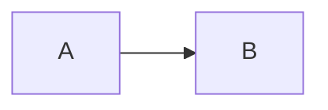
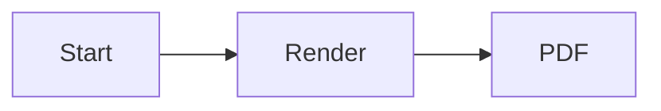

# Nuvyn PDF Export PRD

## 1. 文档信息

| 项目 | 内容 |
| --- | --- |
| Status | PDF Export V1 — Implemented and Verified |
| Date | 2026-08-21 |
| Owner | Nuvyn Markdown / Reader platform |
| Phase | PDF Export V1 |
| Target | Nuvyn Personal OS 的 Markdown / Reader 能力 |
| Scope | Markdown 文档 PDF 导出、渲染一致性、异步组件收敛、下载交互、错误处理与验证 |
| Current implementation | `main` at `390791da4acefcdc58f110e66f469224c18feeeb`；本文继续作为产品行为和 acceptance criteria 的约束 |
| Implementation constraint | 不因现有代码已经存在而降低验收标准；实现与本文冲突时，以本文定义的用户行为和 acceptance criteria 为准 |

本文定义 Nuvyn PDF Export V1 的产品行为。

现有 `html2pdf.js`、`PdfExportSurface`、`pdfExport.ts`、File Tree 导出入口以及相关测试属于当前 implementation baseline，不自动代表 PDF Export V1 已完成。

除非另立 RFC，后续 Implementation Plan、测试和 Code Review 应以本文为约束来源。

---

## 2. Executive Summary

Nuvyn 需要允许用户将 Markdown 文档直接导出为可下载的 PDF。

第一版采用：

```text
Markdown source
→ Nuvyn Markdown renderer
→ 完整 rendered article
→ 等待异步内容 ready
→ 构建独立 PDF render surface
→ html2pdf.js / html2canvas / jsPDF
→ A4 PDF
→ Browser Download
```

核心产品原则是：

> **PDF 应当是“Nuvyn 阅读结果的稳定文档化输出”，而不是源 Markdown 的简单文本转换，也不是浏览器页面截图。**

PDF Export V1 必须满足：

* 导出当前 Markdown 文档；
* 直接触发 `.pdf` 文件下载；
* 不打开浏览器 Print Dialog；
* 导出的正文语义应与 Nuvyn Read Mode 保持一致；
* 支持中文和 Unicode；
* 支持标题、段落、列表、代码、表格、图片；
* 支持 Nuvyn Markdown 扩展；
* 支持 KaTeX；
* 支持 Mermaid；
* 支持 MarkMap；
* 已打开文档存在未保存编辑时，应导出当前 live buffer；
* 导出过程中不能修改用户当前编辑状态、滚动状态或交互式图表状态；
* 异步 Markdown widget 未完成时不得提前截取；
* 导出失败时不能生成“看似成功但内容残缺”的文件；
* 默认文件名应与文档的人类可读标题一致；
* 第一版使用浏览器端生成，不要求后端 PDF 服务。

PDF Export V1 不以“下载事件发生”为成功标准。

成功标准必须是：

> **用户得到的 PDF 中存在预期的完整内容，并且没有因为异步渲染、布局、主题或临时 UI 状态产生明显缺失。**

---

# 3. 背景与问题定义

Nuvyn 的 Markdown / Reader 能力是 Personal OS 中 Note 内容的基础；本文只定义这条能力的 PDF 导出行为。

当前 Markdown 阅读链路不仅包含标准 Markdown，还包含：

* Frontmatter；
* Heading anchor；
* Task List；
* Footnote；
* Definition List；
* Highlight；
* Wiki Link；
* Callout；
* Emoji；
* KaTeX；
* Mermaid；
* MarkMap；
* Syntax Highlight；
* 图片；
* 表格；
* DOMPurify 安全边界。

因此 PDF Export 不能只做：

```text
Markdown → plain HTML → PDF
```

否则 PDF 与用户实际看到的 Nuvyn 文档会出现两套语义。

例如：

````markdown

````

用户在 Read Mode 中看到的是 Mermaid 图，而不是代码文本。

同样：

```markdown
$$
E = mc^2
$$
```

用户期望 PDF 中出现公式结果，而不是原始 TeX。

PDF Export 的本质问题因此是：

> 如何将 Nuvyn 已经完成渲染的文档结果，以稳定、可下载、可重复的方式快照为 PDF。

---

# 4. 当前系统现状

## 4.1 当前基础实现

当前 `main` 已存在：

* `html2pdf.js`；
* `src/lib/pdfExport.ts`；
* `src/components/vault/PdfExportSurface.vue`；
* File Tree PDF context-menu action；
* `VaultView` PDF orchestration；
* PDF 专用样式；
* Mermaid static export normalization；
* PDF helper tests；
* PDF browser E2E。

当前默认导出链路已经是：

```text
File Tree context menu
→ exportPdfDocument(path)
→ resolve source authority
→ capture immutable PdfExportRequest
→ PdfExportSurface
→ RenderedMarkdown
→ waitForPdfWidgets
→ waitForPdfImages
→ preparePdfArticleHtml
→ html2pdf.js
→ browser download
→ finally cleanup
```

这套结构应作为 V1 baseline 延续。

除非发现无法满足本 PRD 的技术阻塞，第一版不重新引入另一套 Markdown renderer。

---

## 4.2 Live buffer

Nuvyn 每个已打开文档拥有自己的编辑 buffer。

PDF 导出目标文件如果已经打开：

```text
export source = 当前 tab.raw
```

而不是：

```text
export source = 最近一次磁盘保存内容
```

因此：

> PDF Export 是对用户“当前文档状态”的导出，而不是强制 save-then-export。

PDF Export：

* 不应为了导出强制保存；
* 不应触发 Git commit；
* 不应改变 dirty 状态；
* 不应改变 autosave timing；
* 不应造成外部文件冲突；
* 不应要求用户先保存。

---

## 4.3 未打开文件

如果目标文件没有打开：

```text
File Tree
→ request document from authoritative server source
→ render
→ export
```

导出过程不得为了读取文件而创建可见 workspace tab。

---

## 4.4 Historical hardening risks

以下风险来自早期 PDF Export baseline，已由 H1–H9 hardening work packages 处理；本节作为历史设计背景保留。

至少包括：

1. 异步 widget ready contract；
2. MarkMap ready 判断；
3. PDF 最终内容没有被真正进行 browser-level validation；
4. 远程图片 CORS；
5. 超长文档；
6. 页面断行；
7. 超宽表格；
8. 超宽代码；
9. 字体与中文；
10. 导出时用户继续修改文档；
11. 快速连续点击；
12. widget error 的导出行为。

因此基础实现完成后仍需要正式 PDF Export Hardening Phase。

---

# 5. 产品目标

## 5.1 Goal 1 — 一键获得 PDF

用户应能够从 Nuvyn 中对 Markdown 文档执行：

```text
Export PDF
```

随后直接得到：

```text
<document-title>.pdf
```

无需：

* 打开系统打印窗口；
* 选择打印机；
* 手工选择“另存为 PDF”；
* 复制 Markdown 到其它应用。

---

## 5.2 Goal 2 — 与 Read Mode 内容一致

PDF 应尽可能保持用户在 Nuvyn Reader 中看到的内容语义。

要求重点保证：

```text
Markdown feature
            ↓
Read Mode output
            ↓
PDF semantic equivalent
```

不要求像素级 1:1。

PDF 是文档媒介，因此允许为了纸张阅读对布局进行适配。

例如：

* 深色主题强制转为适合纸张的浅色背景；
* interactive toolbar 不进入 PDF；
* horizontal scroll 转成 printable layout；
* Mermaid zoom/pan 状态不进入 PDF。

---

## 5.3 Goal 3 — 导出当前真实内容

对已打开文档：

> 当前 live buffer 是导出的 authority。

例如：

```text
Disk:
Hello

Editor unsaved buffer:
Hello World
```

用户点击：

```text
Export PDF
```

PDF 应包含：

```text
Hello World
```

而不是：

```text
Hello
```

---

## 5.4 Goal 4 — 图表和公式可靠

PDF V1 必须正式支持：

* KaTeX；
* Mermaid；
* MarkMap。

支持标准不是“偶尔可以导出”。

必须有可明确等待的：

```text
ready
error
timeout
```

状态。

---

## 5.5 Goal 5 — 不破坏编辑环境

PDF Export 必须是隔离操作。

不能修改：

* 当前 tab；
* 当前 selection；
* Monaco undo stack；
* Reader scroll position；
* Mermaid zoom；
* Mermaid pan；
* MarkMap viewport；
* Sidebar；
* RightRail；
* current theme；
* active workspace mode。

---

# 6. Success Metrics

PDF Export V1 主要采用 correctness metrics，而不是 usage metrics。

必须达到：

### Functional

* 合法 Markdown 文档可以触发 PDF 下载。
* 文件扩展名为 `.pdf`。
* A4 Portrait 为 V1 默认。
* 文件名遵循标题解析规则。
* 未保存内容可以正确导出。
* 非 active document 可以正确导出。

### Rendering

测试文档中：

* 标题存在；
* 正文存在；
* 中文存在；
* code block 可读；
* table 可读；
* task list 可读；
* callout 可读；
* formula 可见；
* Mermaid 可见；
* MarkMap 可见；
* local image 可见。

### Stability

* 连续导出不能留下 hidden DOM。
* 导出失败不能留下 busy 状态。
* timeout 后可以再次导出。
* 不允许生成 0 byte PDF。
* 不允许以仅“文件大于某个字节数”作为完整内容的唯一证明。

---

# 7. Non-Goals

PDF Export V1 明确不做：

* Word / DOCX Export；
* EPUB Export；
* HTML bundle Export；
* Markdown → LaTeX；
* Markdown → native PDF text-layout engine；
* PDF Editor；
* PDF Annotation；
* PDF Import；
* PDF OCR；
* PDF Signing；
* PDF password encryption；
* 自定义页面尺寸；
* Landscape UI；
* 用户自定义 margin UI；
* 自定义 header / footer；
* 水印；
* 页码设置 UI；
* Cover Page Builder；
* Table of Contents page generation；
* Print Preview；
* 浏览器 Print Dialog；
* workspace folder batch PDF；
* 多文档 merge PDF；
* server-side Chromium PDF；
* PDF/A；
* print typography designer。

这些可以作为 V2 或单独 RFC。

---

# 8. 用户场景

## 8.1 文件树导出

用户希望把一篇笔记分享给其他人。

操作：

```text
File Tree
→ Right Click document
→ Export PDF
```

系统：

```text
Rendering…
→ Browser Download
```

得到：

```text
项目计划.pdf
```

---

## 8.2 导出当前未保存内容

用户正在编辑：

```markdown
# Sprint Review

新的修改……
```

尚未 autosave。

此时执行 Export PDF。

PDF 必须包含当前 Monaco buffer。

导出完成后：

```text
document remains dirty
```

如果导出前 dirty：

```text
dirty → dirty
```

不得变成：

```text
dirty → saved
```

---

## 8.3 导出未打开文件

用户在 File Tree 对一个未打开文件执行 Export PDF。

系统不得：

* 打开该文件；
* 切换 active tab；
* 改变当前 workspace。

PDF 应在后台 render surface 中完成。

---

## 8.4 Mermaid 文档

````markdown

````

PDF：

* 有完整图；
* 不显示 zoom toolbar；
* 不使用用户当前 pan offset；
* 不被裁切；
* 根据 diagram 自身 viewBox fit 到页面。

---

## 8.5 MarkMap 文档

````markdown
```markmap
# Project
## Backend
## Frontend
```
````

PDF：

* 必须等待 MarkMap 完成 layout；
* 不允许仅因为 `<svg>` element 已出现就认为 ready；
* 不显示 interactive toolbar；
* 不出现空 SVG；
* 不出现 NaN transform；
* 不使用用户当前 pan/zoom 状态作为 export source。

---

## 8.6 长文档

用户导出几十页内容。

系统应：

* 正确分页；
* 不只生成第一页；
* 不明显重复内容；
* 不截掉最后一页；
* 不造成 browser page freeze 到不可恢复。

---

# 9. 信息架构与入口

## 9.1 V1 Required Entry

PDF Export V1 的唯一正式入口：

```text
File Tree
→ document context menu
→ Export PDF
```

仅 Markdown document 显示。

Folder 不显示。

---

Reading Pane、Editor toolbar、NavBar、Tab bar 和其它阅读/编辑 surface 不显示 PDF Export 控件。

## 9.2 Read Mode Entry（Removed from V1 scope）

Read Mode PDF action 曾在 hardening 期间作为候选入口实现，但与最终的“阅读窗口零污染”产品要求冲突，已从 V1 移除：

```text
Read Mode
→ no PDF Export control
```

Read Mode 不接收 PDF 专用 props，不 emit PDF event，也不显示 PDF busy/loading 状态。共享 `exportPdfDocument(path)` pipeline 仍由 File Tree context menu 使用。

V1 不包含：

```text
Read Mode toolbar PDF action
```

---

## 9.3 Workspace Tab Entry

可作为后续 UI enhancement：

```text
Workspace Tab Context Menu
→ Export PDF
```

同样不能复制 exporter implementation。

---

# 10. 交互规范

## 10.1 正常状态

菜单：

```text
Document
────────────
Export PDF
View History
```

---

## 10.2 Exporting 状态

一次只允许一个 PDF generation transaction。

当正在导出时再次请求：

系统：

* 不启动第二个 exporter；
* 不创建第二套 hidden surface；
* 给出短暂提示：

```text
PDF is being exported…
```

不要求 modal。

---

## 10.3 Success

浏览器 download 启动后：

不要求额外 success toast。

浏览器下载 UI 已经提供明确反馈。

可选：

```text
PDF download started
```

但不是 V1 blocker。

---

## 10.4 Failure

失败必须：

* 清理 hidden render surface；
* reset busy；
* 允许立即重试；
* 不下载空 PDF。

用户提示至少区分：

### Render not ready

```text
PDF content is not ready. Please try again.
```

### General failure

```text
Failed to export PDF.
```

第一版不要求向用户暴露：

```text
PDF_WIDGET_TIMEOUT
PDF_RENDER_TIMEOUT
```

等内部 error code。

---

# 11. Export Source Authority

这是 PDF Export V1 的核心 contract。

## 11.1 Open document

如果存在：

```text
tabs[path]
```

且：

```text
!loading
!loadError
```

则：

```text
sourceRaw = tab.raw
```

---

## 11.2 Closed document

否则：

```text
sourceRaw = authoritative server document raw
```

---

## 11.3 不允许的 authority

禁止使用以下 source 作为默认导出 authority：

* `PostSummary.summary`；
* 文件树 cached snippet；
* stale Markdown HTML；
* 上一次 Read Mode DOM；
* autosave baseline；
* Git HEAD；
* historical revision；
* IndexedDB recovery draft，除非用户当前显式处于该 recovery document 的 export context。

---

# 12. Document Title 与文件名

文件名解析优先级：

```text
1. frontmatter.title
2. Markdown body first H1
3. document metadata title
4. basename
5. nuvyn-document
```

例如：

```yaml
---
title: 项目计划
---
```

输出：

```text
项目计划.pdf
```

---

## 12.1 Filename sanitization

Windows / macOS / Linux 常见非法字符需要处理：

```text
< > : " / \ | ? *
control characters
```

不能把 Unicode 全部 ASCII 化。

以下应合法：

```text
项目计划.pdf
学习笔记 📚.pdf
日本旅行.pdf
```

---

## 12.2 `.pdf` handling

如果解析出的 title 已经：

```text
Report.pdf
```

不能得到：

```text
Report.pdf.pdf
```

---

## 12.3 Length

filename 应设置合理 upper bound。

V1 推荐：

```text
120 characters
```

超出时 truncate。

---

# 13. Markdown Rendering Contract

PDF 不维护独立 Markdown parser。

必须复用：

```text
parseDoc()
→ Nuvyn render()
→ RenderedMarkdown
```

从而保持：

```text
Read Mode semantics == PDF render semantics
```

---

## 13.1 Frontmatter

Frontmatter metadata 本身不打印。

如果存在：

```yaml
title:
```

按照 Read Mode title semantics 生成 H1。

---

## 13.2 Heading

支持：

```text
H1–H6
```

要求：

* hierarchy 清晰；
* heading 后避免直接 page break；
* H1 不应因为 App chrome 而额外缩进。

---

## 13.3 Paragraph

支持 Unicode。

包括：

```text
CJK
Latin
Emoji
mixed text
```

---

## 13.4 Lists

支持：

* unordered list；
* ordered list；
* nested list；
* task list。

Task checkbox 可以是静态视觉结果。

---

## 13.5 Code

Code block：

* 保留 syntax highlighting；
* 不出现横向 UI scrollbar；
* 超长行采用 printable wrapping；
* 不允许整块内容因 overflow 被裁掉。

Inline code 保持可读。

---

## 13.6 Blockquote / Callout

应保持明显视觉层级。

可以为打印主题重新设定：

* background；
* border；
* text color。

不要求和 dark theme 一致。

---

## 13.7 Table

表格要求：

* header 可识别；
* border 可识别；
* 尽可能 fit page width；
* 不直接截断右侧内容。

超宽表格的 V1 policy：

> 优先缩放 / wrap 到页面宽度；无法合理布局时允许降低字号，但不得静默裁切主要列。

---

## 13.8 Footnote

Footnote 必须保留。

internal anchors 能工作则保留。

---

## 13.9 Wiki Link

PDF 中 Wiki Link 应以可读文字存在。

第一版不要求点击后打开 Nuvyn 内部 SPA route。

如果最终 href 无法形成外部可访问链接：

> 可保留文本语义，不要求保留不可用的 Nuvyn internal navigation。

---

# 14. Image Contract

## 14.1 Local image

Nuvyn 可正常显示的本地 / same-origin image：

必须进入 PDF。

---

## 14.2 Image sizing

默认：

```css
max-width: 100%
height: auto
```

不得越过页面正文宽度。

---

## 14.3 Remote image

第一版 best effort 支持远程图片。

如果远程服务器正确提供 CORS：

```text
include image
```

如果没有 CORS：

不能通过：

```text
allowTaint: true
```

来绕过 browser security。

V1 不要求服务器 image proxy。

---

## 14.4 Broken image

远程图片加载失败不能导致：

```text
整个 PDF Export crash
```

推荐保留：

* broken image visual；
* alt text；

或跳过图片。

但其它正文必须继续生成。

---

# 15. KaTeX Contract

PDF 必须等待 KaTeX mount 后再 snapshot。

支持：

* inline math；
* display math；
* 中文与公式混排。

公式：

* 不应变回 TeX source；
* 不应被页面边界裁切；
* 不应因为 dark theme 变成白字白底。

---

# 16. Mermaid Contract

Mermaid 属于 asynchronous interactive widget。

不能直接 snapshot 用户当前 interactive DOM 状态。

导出前必须形成 static export representation。

要求：

```text
interactive Mermaid
       ↓
clone
       ↓
remove toolbar
       ↓
recover original viewBox
       ↓
strip pan/zoom transform
       ↓
static SVG
```

---

## 16.1 Mermaid Ready

只有以下之一成立才视为 settled：

```text
rendered SVG ready
```

或者：

```text
explicit Mermaid error
```

不能仅以：

```text
host exists
```

作为 ready。

---

## 16.2 Pan / Zoom

用户可能在 Reader 中：

```text
zoom 180%
pan left
```

PDF 不继承该交互状态。

PDF 使用 Mermaid diagram 自身 viewport。

---

## 16.3 Mermaid Error

如果 Mermaid source 无效：

PDF 可以保留 error presentation。

不能无限等待。

---

# 17. MarkMap Contract

MarkMap 与 Mermaid 同样属于 asynchronous widget，但必须独立定义 ready contract。

---

## 17.1 P0 Requirement — Explicit Ready State

MarkMap 必须暴露明确状态，例如：

```text
data-markmap-ready="true"
```

或等价的应用级 signal。

只有在：

```text
Transformer transform
→ Markmap instance created
→ setData complete
→ fit complete
```

之后：

```text
ready = true
```

---

## 17.2 禁止 DOM existence 作为 ready

以下判断不合格：

```ts
host.querySelector('.markmap-svg')
```

因为 `<svg>` 可以早于实际 graph layout 出现。

因此：

```text
SVG exists != MarkMap ready
```

这是 PDF Export Hardening 的 P0 requirement。

---

## 17.3 Error

MarkMap explicit error 可以视为 settled。

PDF 不要求等待成功图。

---

## 17.4 Toolbar

以下不进入 PDF：

* Lock；
* Reset；
* Fullscreen；
* zoom/pan UI。

---

## 17.5 Static Layout

PDF 不应依赖 interactive viewport。

必须生成适合 document width 的稳定 snapshot。

---

# 18. Async Render Readiness

PDF Export 必须有一个统一的概念：

```text
document render settled
```

而不是：

```text
HTML element mounted
```

---

## 18.1 Required stages

完整 export transaction：

```text
1. Resolve source raw
2. Render Markdown
3. Mount async enhancements
4. Wait until every required enhancement is settled
5. Clone prepared article
6. Normalize interactive widgets
7. Generate PDF
8. Trigger download
9. Cleanup
```

---

## 18.2 Timeout

异步 widget 不得无限阻塞。

V1 可以使用 bounded timeout。

当前推荐：

```text
5 seconds
```

但 Implementation Plan 可以在测试后调整。

超时：

```text
abort export
→ cleanup
→ reset busy
→ user-visible error
```

不得：

```text
timeout → export incomplete PDF anyway
```

---

# 19. Render Isolation

PDF render 必须发生在与 visible reader 隔离的 surface 中。

例如：

```text
PdfExportSurface
```

它必须：

* 有真实 layout width；
* 不进入视觉 viewport；
* 不接收 pointer；
* 不影响 screen reader；
* 不占 visible layout；
* export 后 remove。

---

## 19.1 为什么不能 `display:none`

Mermaid / MarkMap 等需要 layout dimensions。

因此 hidden export surface 不能使用：

```css
display: none
```

导致：

```text
clientWidth = 0
```

的实现。

允许：

```css
offscreen positioned real layout surface
```

---

# 20. PDF Visual Theme

PDF Export V1 固定采用打印友好的 light document theme。

即使 Nuvyn 当前是：

```text
Dark Mode
```

PDF 仍应该：

```text
white background
dark body text
printable borders
readable code background
```

理由：

* 打印可读；
* 避免 ink-heavy dark pages；
* 结果跨 theme 稳定；
* 导出不是 screenshot。

---

# 21. Page Layout

V1 默认：

```text
Paper: A4
Orientation: Portrait
```

建议 margin：

```text
top:    16mm
right:  18mm
bottom: 18mm
left:   18mm
```

Implementation Plan 可以微调，但不得导致正文贴边。

---

# 22. Pagination Contract

## 22.1 Avoid split

尽可能避免以下内容内部断页：

* heading；
* blockquote；
* code block；
* image；
* Mermaid；
* MarkMap；
* 小型 table。

对于普通且能放入 printable page 的文字块：

* paragraph；
* list item；

应保持 block-level keep-together，避免页面边界从 rendered glyph 或 line box 中间切过。

heading 与其后的 first meaningful content block 也应尽量保持在一起，减少 heading orphan。

---

## 22.2 Exception

对于一个元素自身高于单页：

```text
element height > printable page
```

浏览器必须允许继续分页。

不能因为：

```css
break-inside: avoid
```

造成整个元素消失或 overflow。

Implementation Plan 应专门验证 oversized content。

该 oversized 例外同样适用于 paragraph 和 list item：如果 block 高于 printable A4 page，则允许它继续跨页，而不能用永久的 `break-inside: avoid` 阻止布局。

---

## 22.3 Heading orphan

避免：

```text
Heading
--------- page break ---------
Paragraph
```

应优先：

```text
--------- page break ---------
Heading
Paragraph
```

---

# 23. Links

如果技术栈支持：

```text
enableLinks = true
```

则：

* HTTP link；
* HTTPS link；

应尽可能保留为 PDF hyperlink。

对于：

```text
javascript:
data:
unsafe internal target
```

不得扩大现有 sanitizer policy。

---

# 24. Security

PDF Export 不得建立第二套更宽松的安全边界。

源 HTML 仍来自：

```text
Nuvyn Markdown renderer
→ DOMPurify
```

禁止为了 PDF：

* 开启 raw script；
* 开放 iframe；
* 放宽 event attributes；
* 开放 arbitrary SVG user HTML；
* 开放 dangerous URI；
* 使用 `allowTaint` 绕过 Canvas security；
* 把未 sanitize 用户 HTML 重新注入 independent renderer。

---

# 25. Privacy

PDF generation V1 应完全在 browser client 完成。

默认不将文档内容发送给：

* 第三方 PDF API；
* cloud conversion service；
* external renderer。

远程图片自己的 HTTP 请求属于文档原有资源加载行为。

---

# 26. Concurrency

第一版：

```text
max concurrent exports = 1
```

原因：

* html2canvas 内存开销高；
* Mermaid / MarkMap surface 需要稳定 lifecycle；
* 避免多次用户点击生成重复文件。

再次点击：

```text
do not queue
do not spawn
show exporting feedback
```

---

# 27. Snapshot Consistency

这是一个必须定义的边界。

如果导出过程中用户继续编辑：

```text
T0 click Export PDF
T1 source raw captured
T2 user types more text
T3 PDF generated
```

PDF 使用：

```text
T1 captured snapshot
```

而不是在生成过程中持续跟随最新编辑。

也就是说一次 PDF export transaction 的 input 必须 immutable。

避免：

```text
title = old
body = new
Mermaid = newer
```

这种跨 revision PDF。

---

# 28. Error Handling

内部至少区分：

```text
SOURCE_LOAD_FAILED
MARKDOWN_RENDER_FAILED
PDF_RENDER_TIMEOUT
PDF_WIDGET_TIMEOUT
PDF_GENERATION_FAILED
```

用户界面不要求显示 internal code。

但 console / test 应可以判断 failure stage。

---

# 29. Cleanup Contract

无论：

```text
success
failure
timeout
exception
```

必须执行：

```text
finally:
  remove PDF surface
  disconnect observers
  cancel timeout
  reset busy
  drop request state
```

导出后 DOM 中不得残留：

```text
.pdf-download-host
.pdf-download-root
PdfExportSurface request state
```

---

# 30. Performance

PDF Export 不是 typing-critical path。

因此允许一次较重的 client operation。

但不得影响正常 Nuvyn startup。

---

## 30.1 Lazy loading

PDF stack 是非核心启动依赖。

理想状态：

```text
user invokes PDF
→ load PDF generation dependency
```

而不是：

```text
Nuvyn boot
→ eagerly execute all PDF stack
```

是否在 V1 做 dynamic import 由 bundle analysis 决定。

如果 html2pdf.js 显著增加 initial client chunk：

应提升为 P1 性能 requirement。

---

## 30.2 Scale

默认 html2canvas quality target 可以采用：

```text
scale: 2
```

但需要验证：

* normal laptop；
* 20 page document；
* 50 page document。

不能仅追求清晰度导致浏览器 OOM。

---

# 31. Large Document Policy

PDF V1 至少验证：

```text
1 page
5 pages
20 pages
50 pages
```

100 页属于 stress / P2。

如果浏览器端方案在合理设备上对 50 页明显不可靠：

需要在 Implementation Plan 中记录 browser-side architecture ceiling。

但第一版不因此立即迁移 server Chromium。

---

# 32. Accessibility

Export action：

* 必须可从 keyboard reachable context-menu 流程操作；
* 图标不能成为唯一 accessible label；
* 使用现有 i18n text。

hidden PDF surface：

```text
aria-hidden=true
```

不能污染页面 accessibility tree。

---

# 33. Internationalization

至少提供：

```text
Export PDF
导出 PDF
Exporting PDF…
正在导出 PDF…
Failed to export PDF
PDF 导出失败
PDF content is not ready
PDF 内容尚未准备完成
```

具体词条命名遵循现有 `useI18n` namespace。

---

# 34. Acceptance Criteria

PDF Export V1 只有以下条件全部满足才算完成。

## AC-01 基础下载

Given 一个合法 Markdown document，

When 用户执行 Export PDF，

Then：

* 浏览器触发 PDF download；
* filename 合法；
* `.pdf` extension 正确；
* 不调用 `window.print()`。

---

## AC-02 Title

Given：

```yaml
---
title: 项目计划
---
```

Then：

```text
项目计划.pdf
```

---

## AC-03 H1 fallback

没有 frontmatter title，但有：

```markdown
# Sprint Plan
```

Then：

```text
Sprint Plan.pdf
```

---

## AC-04 Basename fallback

没有 metadata title 和 H1：

```text
inbox/plan.md
```

Then：

```text
plan.pdf
```

---

## AC-05 Unsaved buffer

Given open dirty document，

When export，

Then PDF content 来自当前 `tab.raw`。

不得要求先保存。

---

## AC-06 Closed document

Given 未打开文档，

When File Tree export，

Then：

* PDF 正常生成；
* 当前 active tab 不变；
* 不产生 visible tab。

---

## AC-07 Markdown basics

最终 PDF 可确认包含：

* heading；
* paragraph；
* list；
* task list；
* quote；
* code；
* table。

---

## AC-08 Unicode

PDF 中正确显示：

```text
中文
English
日本語
Emoji 🚀
```

---

## AC-09 KaTeX

PDF 中公式可见，不是 raw TeX。

---

## AC-10 Mermaid

PDF 中 Mermaid graph 可见。

同时：

* toolbar 不存在；
* pan state 不污染；
* graph 不裁切。

---

## AC-11 MarkMap

PDF 中 MarkMap 可见。

并且：

* 必须依赖 explicit ready contract；
* `<svg>` existence 不能作为 ready；
* toolbar 不存在；
* 不出现空白图；
* 不出现 NaN layout。

---

## AC-12 Local image

same-origin image 进入 PDF。

---

## AC-13 Remote image

CORS-compatible image 可进入 PDF。

CORS incompatible image 不允许造成整个 export transaction crash。

---

## AC-14 Dark mode

Given Nuvyn Dark Mode，

Then PDF 仍使用 printable light document theme。

---

## AC-15 Pagination

多页文档：

* 第一页存在；
* 中间页存在；
* 最后一页存在；
* 不明显重复；
* 不整体截断。

普通 short paragraph 和 list item 在能放入 printable page 时不得被 glyph-level 切开；真正 oversized 的文字块可以继续跨页。

---

## AC-16 Failure cleanup

任何失败后：

```text
busy = false
hidden PDF DOM = none
```

用户可以立即再次执行 export。

---

## AC-17 Double click

export 已进行时再次执行：

* 不生成第二个并发 PDF；
* 提示 export in progress。

---

## AC-18 Snapshot consistency

导出 transaction 开始后继续编辑：

PDF 仍来自点击时 captured revision。

---

# 35. Test Strategy

测试必须采用三层。

```text
Unit
Integration
Browser / E2E
```

不能只依赖任何一层。

---

# 36. Unit Tests

`pdfExport` helper 至少覆盖：

### Filename

```text
normal ASCII
CJK
emoji
illegal chars
empty title
.pdf suffix
long title
```

### Document wrapper

验证：

```text
PDF root
A4 style
reader wrapper
light theme
```

### Mermaid normalization

验证：

* toolbar remove；
* width remove；
* height remove；
* pan transform remove；
* viewBox restore；
* `preserveAspectRatio`。

### MarkMap normalization

必须新增专门测试。

验证：

* ready requirement；
* toolbar remove；
* static output；
* no transient mount state。

---

# 37. Integration Tests

`VaultView` / export orchestration 至少覆盖：

```text
open clean tab
open dirty tab
closed document
loading tab fallback behavior
load-error behavior
busy duplicate click
widget timeout
render timeout
generation failure
cleanup
```

---

# 38. Kitchen-Sink Fixture

必须新增一个专用于 PDF regression 的 Markdown fixture。

至少：

````markdown
---
title: PDF Export Kitchen Sink
---

# PDF Export Kitchen Sink

中文 English 🚀

## Paragraph

Regular **bold**, *italic*, `inline code`.

## Task List

- [x] Done
- [ ] Todo

## Code

```java
public static void main(String[] args) {
    System.out.println("Hello PDF");
}
```

## Table

| A | B | C |
| - | - | - |
| 1 | 2 | 3 |

## Math

$$
E = mc^2
$$

## Mermaid



## MarkMap

```markmap
# Root
## Backend
### API
## Frontend
### Vue
```

## Image


````

该 fixture 应成为 PDF Export 的长期 regression contract。

---

# 39. Browser / E2E 验收

当前 E2E 中：

```text
download exists
file size > threshold
window.print not called
```

只能证明 download flow。

不能作为最终视觉正确性的唯一证明。

PDF Hardening 后 Browser Test 至少需要验证：

```text
download happened
+
content actually rendered before generation
+
Mermaid reached ready
+
MarkMap reached explicit ready
+
no render-error
```

如果测试环境支持 PDF parsing / page rendering：

应进一步确认 PDF 中：

* expected text；
* page count；
* rendered visual regions。

如果当前 E2E infrastructure 无法可靠解析 PDF：

至少增加 pre-generation export surface assertions，并保留最终 downloaded PDF artifact 供 CI diagnostics。

---

# 40. Manual Validation Matrix

正式关闭 PDF Export V1 前至少手工检查：

| 场景 | Chrome | Edge | Safari |
| --- | --- | --- | --- |
| Basic Markdown | Required | Required | Best effort |
| 中文 | Required | Required | Best effort |
| Code | Required | Required | Best effort |
| Table | Required | Required | Best effort |
| Local Image | Required | Required | Best effort |
| KaTeX | Required | Required | Best effort |
| Mermaid | Required | Required | Best effort |
| MarkMap | Required | Required | Best effort |
| 20-page doc | Required | Required | Best effort |
| Dark mode export | Required | Required | Best effort |
| Reported paragraph clipping reproduction | Required | Best effort | Best effort |

Nuvyn 当前主要 desktop browser baseline 以 Chromium 系浏览器为 release blocker。

Reported paragraph clipping reproduction 的最终人工检查已在实际生成的 Chromium PDF 上完成；没有观察到 half-glyph clipping。该记录不代表 Edge/Safari 的完整矩阵已重新执行。

---

# 41. Delivery Phases

## Phase PDF-0 — PRD

目标：

* 产品 contract 定稿；
* 不以当前 implementation 反向定义需求。

Status：

```text
This document
```

---

## Phase PDF-1 — Baseline Implementation（Historical baseline）

内容：

* html2pdf.js；
* PdfExportSurface；
* File Tree context action；
* direct download；
* PDF styles；
* filename；
* Mermaid export normalization；
* basic tests。

该阶段描述的是早期 repository baseline，不是当前 release status：

```text
historical baseline; superseded by H1–H9
```

---

## Phase PDF-2 — Hardening（Completed implementation work）

### P0

1. MarkMap explicit ready contract；
2. 修复 MarkMap export race；
3. MarkMap PDF unit tests；
4. Kitchen-sink test fixture；
5. 异步 widget readiness regression；
6. failure cleanup validation。

### P1

7. local image test；
8. remote image behavior test；
9. long document test；
10. pagination test；
11. Unicode / Chinese test；
12. export snapshot consistency test；
13. read mode Export PDF entry（历史候选，已从最终 V1 scope 移除）；
14. bundle lazy-load review。

### P2

15. 50–100 page stress test；
16. oversized Mermaid；
17. oversized MarkMap；
18. extreme-width tables；
19. Safari compatibility investigation。

---

# 42. Definition of Done

PDF Export V1 不以：

```text
feat: add PDF export
```

commit 已存在作为 Done。

真正的 Done 是：

```text
PRD approved
        +
P0 hardening complete
        +
typecheck passes
        +
unit tests pass
        +
integration tests pass
        +
PDF browser E2E passes
        +
Kitchen Sink validated
        +
Mermaid validated
        +
MarkMap validated
        +
failure cleanup validated
        +
short paragraph/list pagination validated
        +
oversized textual blocks remain splittable
        +
reported glyph-clipping reproduction manually re-verified
```

然后才可以：

```text
PDF Export V1 = Done
```

---

# 43. Implementation Guardrails

后续 Implementation Plan 必须遵守：

1. 不创建第二套 Markdown parser。
2. 不为了 PDF 修改用户文档。
3. 不强制保存。
4. 不自动 commit。
5. 不继承 interactive widget pan/zoom 状态。
6. 不通过 arbitrary delay 代替 widget ready contract。
7. 不使用 `<svg> exists` 判断 MarkMap ready。
8. 不放宽 sanitizer。
9. 不使用第三方云 PDF API。
10. 不为了一个边缘布局问题立即迁移 server-side Chromium。
11. 不把“PDF 文件非空”当作内容正确性的充分证明。
12. 不复制多套 exporter 给不同 UI 入口。
13. 所有临时 DOM 和 observer 必须可回收。
14. 一次 export transaction 使用 immutable source snapshot。
15. 所有 P0 acceptance criteria 必须有测试证据。

---

# 44. Future Considerations

以下只有在 V1 稳定后再评估。

## PDF V2

可能包括：

* Export dialog；
* paper size；
* orientation；
* margin；
* header / footer；
* page number；
* document cover；
* generated TOC；
* batch export；
* merge PDF。

---

## Server-side PDF

仅当浏览器端方案出现明确 architecture ceiling，例如：

* 大文档稳定 OOM；
* Canvas size ceiling；
* 浏览器兼容性不可接受；
* 需要 selectable text / precise typography；
* 企业要求 deterministic PDF；

再单独创建 RFC：

```text
Browser html2pdf
vs
Headless Chromium
vs
native document renderer
```

不得在 PDF Export V1 Hardening 中顺带进行这项架构迁移。

---

# 45. Final Product Decision

PDF Export V1 的正式定义是：

> Nuvyn 用户可以把任意 Markdown 文档当前的渲染状态直接下载为一份打印友好的 A4 PDF。导出复用 Nuvyn 自己的 Markdown 语义，支持代码、表格、图片、公式、Mermaid 和 MarkMap；已打开文件以当前 live buffer 为准，导出过程与编辑器隔离，不改变文档状态。所有异步内容必须显式达到 ready 或 error 状态之后才能生成 PDF，不能以 DOM 元素存在或任意 sleep 作为完成依据。

H1–H7、H9 hardening work 和 H10 final documentation audit 已完成；Read Mode PDF action 的历史实现已按最终 V1 scope 移除。

当前 release decision：

```text
PDF Export V1 = DONE
```

最终用户入口约束：

```text
File Tree context menu only
```

Read Mode 保持为纯阅读 surface，不包含 PDF Export UI。

---

# 46. Final Documentation Audit（PDF-H10）

Original H10 audit baseline：

```text
77445cfe415a0e40937c6a00edfd914aae4ca576
```

Final verified PDF Export V1 application baseline：

```text
390791da4acefcdc58f110e66f469224c18feeeb
```

原始 H10 audit 不重新运行 H1–H9 全矩阵；它完成了 H4 focused browser repair 和必要的 typecheck。随后真实 PDF 暴露的 paragraph clipping regression 由 H6 focused follow-up 修复；该 follow-up 通过 focused pagination browser regression、真实 browser download 和实际 reproduction PDF 人工检查，但没有重新执行完整 H1–H9 matrix。H4 现在同时验证 source canonical geometry 与 prepared static geometry，因此最终 acceptance audit 结果为：

```text
PASS: H1–H10 required release evidence
BLOCKED: 0
DECISION: PDF Export V1 = DONE
```

H4 evidence now records `data-mermaid-viewbox` on the source widget and a finite `viewBox` on the prepared static Mermaid SVG. Live interactive `viewBox` remains optional.

H6 final pagination evidence additionally records short paragraph/list-item keep-together, oversized textual fallback, heading + first content block grouping, dedicated browser regression, real PDF download, and manual real-output verification. No half-glyph clipping was observed in the verified reproduction.
