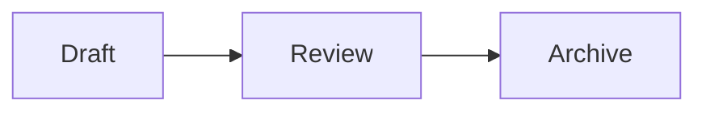

# Markdown, Links, and Diagrams

## Supported Markdown

Nuvyn renders Markdown with `markdown-it` and supports the core syntax plus:

- task lists;
- heading anchors;
- footnotes;
- definition lists;
- `==marked text==`;
- tables and syntax-highlighted code fences;
- automatic links;
- Wiki links;
- GitHub-style Alerts;
- KaTeX inline and block math;
- Mermaid and Markmap fences.

## Callouts

Nuvyn supports five GitHub-style Alerts. A canonical marker at the start of a
blockquote turns that blockquote into a lightweight, typed Alert while the
content inside continues to use normal Markdown.

```md
> [!NOTE]
> This is a note.
```

The supported markers are exactly `NOTE`, `TIP`, `IMPORTANT`, `WARNING`, and
`CAUTION`. Markers are case-sensitive and must occupy the first line of the
blockquote by themselves. Alert titles are localized in the rendered UI:

| Marker | Display title |
| --- | --- |
| `NOTE` | 注意 |
| `TIP` | 提示 |
| `IMPORTANT` | 重要 |
| `WARNING` | 警告 |
| `CAUTION` | 小心 |

For example:

```md
> [!WARNING]
> Back up your data first.
```

Custom titles are not supported, and folded Alerts (`+` / `-` markers) are not
enabled. Legacy, unknown, lowercase, titled, and folded forms remain ordinary
blockquotes; Nuvyn does not silently convert them to canonical Alerts.

## Inline table of contents

Nuvyn does not provide an inline `[[toc]]` Markdown extension. The document's
right-side heading navigation remains available, but no table of contents is
inserted into the Markdown body.

`[[toc]]`, `[[TOC]]`, and `[[Toc]]` all use the normal WikiLink resolver, just
like any other WikiLink. Existing notes that relied on the removed inline
extension should be reviewed manually. See the
[post-MD-EXT compatibility note](../migrations/markdown-post-md-ext-compatibility.md)
for the migration contract.

## Mathematics

Nuvyn renders math with KaTeX. Use single dollar delimiters for an inline
formula:

```md
Euler's identity is $e^{i\pi}+1=0$.
```

Use a `$$` block for a display formula:

```md
$$
\int_0^1 x^2\,dx = \frac{1}{3}
$$
```

Inline formulas stay on one line. Dollars in code spans/fences and escaped
dollars such as `\$100` remain literal text. KaTeX supports a high-performance
subset of LaTeX math syntax; this build does not provide MathJax, equation
numbering, or user-defined global macros.

## Links Between Notes

Use Wiki links or relative Markdown links:

```md
[[inbox/example]]
[[inbox/example|Readable label]]
[[inbox/example#heading]]
[Readable label](../inbox/example.md)
```

Known targets navigate inside the vault. Missing Wiki targets are styled as missing. Links inside inline or fenced code are not indexed.

When renaming a file or folder, Nuvyn can update incoming Wiki and Markdown references. The Links panel shows both outgoing links and backlinks for the current note.

## Diagrams

Use a `mermaid` fence for diagrams and a `markmap` fence for an interactive outline map:

````md


```markmap
# Topic
## Branch
- Detail
```
````

Mermaid runs with `securityLevel: 'strict'`. Both diagram types are mounted only after the sanitized Markdown render completes.

## HTML Safety

Semantic HTML is enabled for compatibility, but the final rendered HTML passes through a DOMPurify allowlist before Vue inserts it. Scripts, event handlers, styles, iframes, embedded objects, SVG, forms, and unsafe URLs are removed. AI chat Markdown is stricter and disables raw HTML entirely.

For the full boundary, see [Deployment Security](../deployment/security.md).
