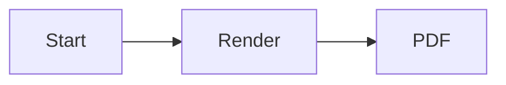

# PDF Export Kitchen Sink

中文 English 日本語 Emoji 🚀

## Paragraph

Regular **bold**, *italic*, `inline code`, and a [safe external link](https://example.com). See the footnote[^note].

## Task List

- [x] Done
- [ ] Todo

## Quote and Callout

> This is a printable blockquote.

> [!NOTE]
> This alert should retain a clear visual hierarchy in the PDF.

> [!TIP]
> This tip should remain readable in the PDF.

> [!IMPORTANT]
> This important information should remain visible in the PDF.

> [!WARNING]
> This warning should remain visually distinct in the PDF.

> [!CAUTION]
> This caution should retain its semantic color in the PDF.

## Containers

::: info Information
This info container should use the same pastel card surface.
:::

::: tip Tip
This tip container should use the same pastel card surface.
:::

::: warning Warning
This warning container should use the same pastel card surface.
:::

::: danger Danger
This danger container should use the same pastel card surface.
:::

::: details Details
This details container should remain printable when closed in the reader.
:::

## Code

```java
public static void main(String[] args) {
    System.out.println("Hello PDF");
}
```

## Table

| A | B | C |
| - | - | - |
| 1 | 2 | 3 |

## Math

Inline $E = mc^2$ and a display formula:

$$
E = mc^2
$$

## Mermaid



## MarkMap

```markmap
# Root
## Backend
### API
## Frontend
### Vue
```

## Image


[^note]: PDF export kitchen-sink regression fixture.
